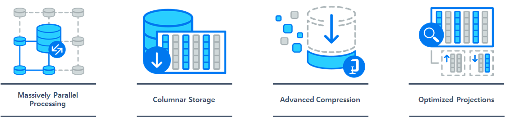
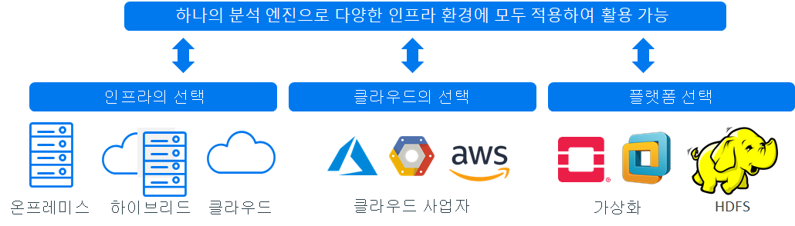
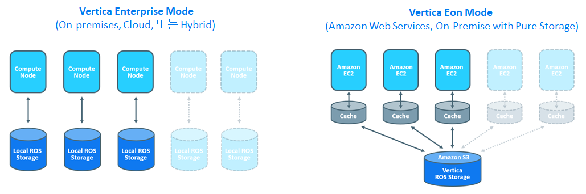

# Vertica 소개
세계적인 데이터베이스 석학인 Michael Stonebraker 교수가 대용량 분석을 위한 DBMS 프로젝트인 [C-Store 연구의 결과물](http://db.csail.mit.edu/projects/cstore/vldb.pdf){:target="_blank"}로 2006년에 처음 시장에 출시되었다.  
기존 Row기반의 DB로는 앞으로 쏟아질 방대한 데이터량을 처리하는 것에 한계를 인식하고 column기반의 완전히 새로 만들어진 데이터베이스 엔진이다.  

## C-Store 연구 결과물인 Vertica 데이터베이스 엔진의 4대 기술 요소

**Massively Parallel Processing(MPP)**  
별도에 마스터 노드 필요 없이 모든 노드에서 병렬로 쿼리 실행.  
선형적으로 scale-out하여 더 빠른 성능 또는 더 많은 사용자를 지원.  

**Columnar Storage**  
필요한 데이터만 읽어 기존 ROW 기반 스토리지 시스템에 비해 쿼리 속도 향상.  

**Advanced Compression**  
컬럼별 고급 압축 알고리즘 및 인코딩을 적용하여 저장시 Disk공간을 최대 90%까지 줄이며 쿼리 수행시에는 디스크 I/O 비용이 감소되어 성능 향상.  

**Optimized Projections**  
Projection이라는 최적화된 형식과 구조로 데이터를 저장하여 인덱스 불필요.  

## 다양한 인프라 환경 지원  
리눅스 기반에 온프레미스, 클라우드, 가상화, HDFS 환경에서 분석 엔진으로 Vertica를 사용할수 있다.  
  

## compute와 storage layer 분리(C/S분리) 가능한 아키텍처  
Vertica는 compute와 storage layer 분리(C/S분리) 여부에 따라 Enterprise mode, Eon mode로 구분되어 지며, 하나에 데이터베이스 엔진으로 각 mode를 구성한다.  
  

**Enterprise mode**
컴퓨팅 엔진과 스토리지가 결합되어 예측 가능한 워크로드를 원하는 기대 시간 내에 빠르게 처리하기 위한 아키텍처  
On-Premise, 클라우드, VM 환경들에서 구성 가능  

**Eon mode**
컴퓨팅 엔진과 스토리지가 분리되어 동적인 워크로드 요구에 빠르게 대응할 수 있도록 필요한 컴퓨팅 리소스만 확장/축소가 가능한 아키텍처  
클라우드 환경에서는 Amazon Web Service에서 지원 가능하며, 추후 Microsoft Azure, Google Cloud에서도 지원될 예정  
On-Premise 환경에서는 Pure Storage의 object storage에서 지원가능. 점진적으로 S3를 지원하는 Object Storage 벤더들을 지원할 예정(Certification Kit제공을 통해)  

