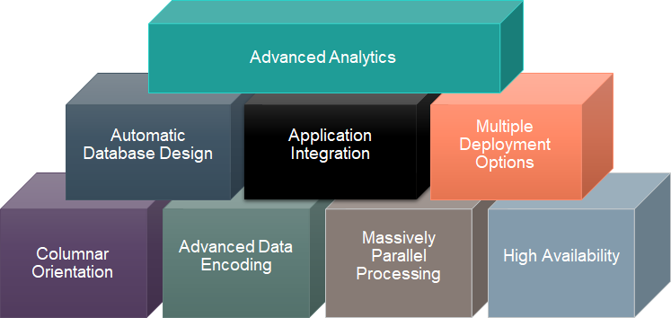
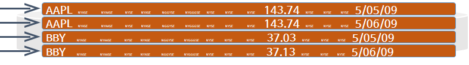
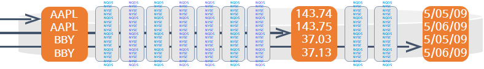
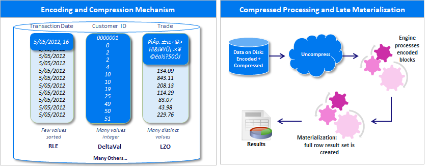
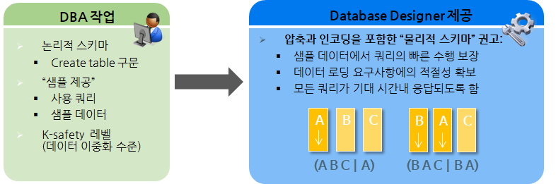
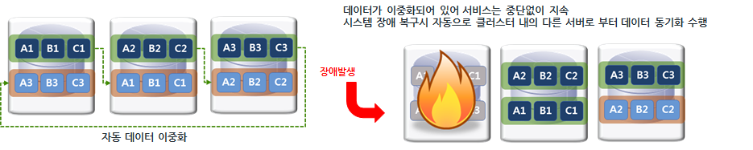
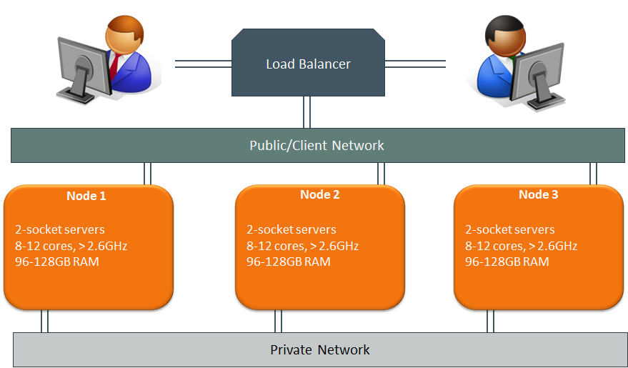
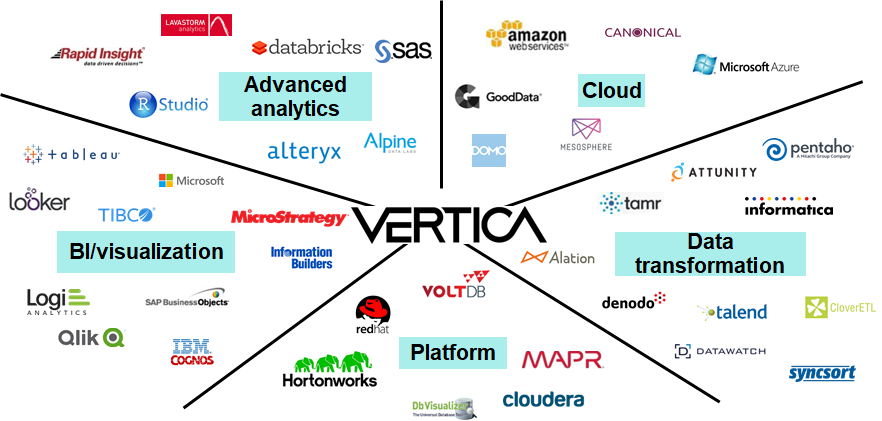
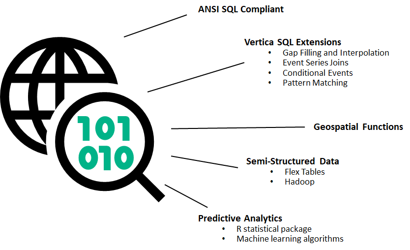
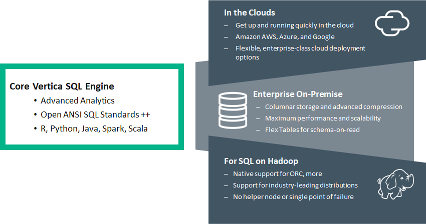

# Vertica 기본 아키텍처


## Vertica 특징


**Columnar Orientation**  
최초 설계부터 columnar 데이터베이스로 만들어졌으며, 모든 데이터는 columnar형식으로 저장하여 보다 효율적인 쿼리 성능을 위해 쿼리에서 참조된 column만 액세스한다.  
**Automatic Database Design**  
데이터베이스 설계에 대한 권장사항을 가이드하는 DBD라는 유틸을 제공한다.  
사용하고 있는 데이터와 쿼리를 기반으로 최적의 쿼리 성능을 위한 물리적 디자인(DDL문)을 생성한다.  
**Advanced Data Encoding**  
데이터를 디코딩 및 압축된 형식으로 디스크에 저장하므로 스토리지 공간을 줄여주며, 디스크 I/O 비용이 감소한다.  
**HA(High Availability)**  
Multi-node cluster 구성(최소 3node)에서 데이터 복제본이 인접하고 있는 node에 저장되고 있으므로 특정 노드에 이상이 발생하여도 서비스는 지속 가능하다.  
**MPP(Massively Parallel Processing)**  
버티카 cluster에는 별도에 마스터 node가 존재하지 않는다.  
모든 node가 peer하며, 각 node들이 동시에 각자의 리소스 및 데이터가지고 처리하는 shared-nothing 아키텍처이다.  
**Application Integration**  
ETL/BI 솔루션과 쉽게 연동 가능하다.(표준 ODBC/JDBC 제공)  
**Advanced Analytics**  
표준 ANSI SQL 함수를 제공하며, 복잡한 데이터 집계, 머신러닝, 통계 분석 등에 고급 함수들도 제공한다.(ANSI SQL 99 지원)  
**Multiple Deployment Options**  
On-Premise / Cloud / VM 환경에서 deployment 가능하다.  
**Massively Parallel Processing(MPP)**  
별도에 마스터 노드 필요 없이 모든 노드에서 병렬로 쿼리 실행 된다.  
선형적으로 scale-out하여 더 빠른 성능 또는 더 많은 사용자를 지원한다.  
**Columnar Storage**  
필요한 데이터만 읽어 기존 ROW 기반 스토리지 시스템에 비해 쿼리 속도 향상된다.  
**Advanced Compression**  
컬럼별 고급 압축 알고리즘 및 인코딩을 적용하여 저장시 Disk공간을 최대 90%까지 줄이며 쿼리 수행시에는 디스크 I/O 비용이 감소되어 성능 향상된다.  
**Optimized Projections**  
Projection이라는 최적화된 형식과 구조로 데이터를 저장하여 인덱스 불필요하다.  


## Vertica 아키텍처 특징
### Columnar Orientation  
기존 row단위로 저장하는 데이터 베이스에서는 데이터가 table에 저장되지만, 버티카는 데이터가 column단위로 저장해서 관리하는 projection에 저장 된다.  
쿼리를 수행하면 기존 row단위로 저장되는 데이터 베이스는 전체 컬럼을 읽어 들이나, 버티카는 필요한 컬럼만 읽어 들이기 때문에 디스크 I/O가 현저하게 감소하므로 쿼리 성능과 응답 속도를 훨씬 빠르게 할 수 있다.  

```sql
SELECT price 
  FROM TICKSTORE
 WHERE symbol = 'BBY'
   AND date = '06-May-2017';

--TICKSTORE 테이블에서 symbol = 'BBY'이고 date = '06-May-2017'인 price 값을 읽어 오기 위해 
--row단위 저장 데이터 베이스 전체 컬럼을 읽어 드려야 하나, 
--버티카는 필요한 컬럼인 symbol, date, price 컬럼만 읽어 드린다.  
```

**row단위 저장 데이터 베이스**  
  
**Vertica 데이터 베이스**  
  


### Advanced Data Encoding  
버티카는 디스크에 저장할 데이터를 최대한 encoding하고 압축하므로 데이터를 보다 효율적으로 저장하여 전체 스토리지 공간을 절약한다.  
데이터에 대한 적절한 인코딩 방법은 데이터 type, 데이터 카디널리티, 데이터 정렬 여부에 따라 결정해야 하며, 버티카는 기본적으로 데이터 type별로 인코딩 방법을 제공하고 있다.(필요에 따라 변경 가능)  
버티카의 컬럼 기반 인코딩과 압축을 통해 최소화 된 데이터 크기로 I/O 수행과 Late Materialization(최대한 늦게 디코딩)을 통해 획기적으로 메모리 사용량 줄일 수 있다.
데이터 처리는 필요한 컬럼만 가지고 와서 압축만 해제한 후 인코딩 된 상태로 수행한다.

  


### Automatic Database Design  
Vertica는 쿼리 성능 및 데이터 loading을 위해 데이터 베이스를 최적화 해야 하는 DBA의 부담을 최소화하기 위해 Database Designer(DBD)를 제공한다.  
DBD를 실행하기 위해서는 샘플 데이터 set(table당 10GB 권장)과 가장 일반적으로 실행되는 쿼리set(최대 100개 쿼리 권장)이 필요하다.  
제공된 데이터 및 쿼리를 기반으로 DBD를 실행하면 최적의 물리적 스키마 구조를 갖는 projection 생성 DDL을 생성한다.  

  


### HA(High Availability)  
Vertica 는 저장 데이터의 이중화 기능을 이용하여 성능 향상과 함께 노드 장애 시에도 중단 없는 서비스를 가능하게 한다.  
데이터베이스 용량 확장을 위한 노드 추가 시나 유지보수를 위한 노드 제거 시에도 서비스 중단 없이 작업이 가능하다.  

  


### MPP(Massively Parallel Processing)  
Vertica는 모든 노드가 동일한 역할을 수행하는 Pure-MPP 구조이며, 범용 하드웨어(x86기반의 리눅스)에 사용할 수 있도록 설계되어 있다.  
또한 별도에 마스터 노드가 존재하지 않으므로 single point of failure가 발생하지 않으며, 클러스터 구성시 별도 비용 없이 손쉽게 구성 할 수 있다.  
소프트웨어 로드 밸런서가 포함되어 있어 client로 부터 요청이 오면 클러스터의 모든 노드에 워크로드를 분산 시킬 수 있다.  
네트워크 구성은 Public network - Vertica 클러스터와 클라이언트, ETL, BI등 외부와의 통신용과 Private network - Vertica 클러스터 node간 통신용으로 구성한다.  

  


### Application Integration  
Vertica는 ODBC/JDBC/OLEDB/ADO.net등 표준 인터페이스를 통해 다양한 환경 및 솔루션들과 연계 가능하다.  

  


### Advanced Analytics  
ANSI SQL Compliant - 표준 ANSI SQL 기능 외에도 고급 분석 함수를 지원한다.  
Vertica SQL Extensions - 시계열 데이터의 공백을 메우거나, join되지 않는 data set간의 시간 기반 조인 처리, 데이터가 명시된 조건과 일치하는지 확인하고 데이터에서 반복되는 패턴을 찾는다.  
Geospatial Functions - 표준 SQL 로 지리정보 데이터 분석할 수 있는 라이브러리가 포함되어 있다.  
Semi-structured Data - Flex 테이블을 사용하거나 hadoop data lake에 액세스하여 정형 데이터와 semi-structured 데이터를 모두 처리 하도록 설계되었다.  
Predictive Analytics - R통계 패키지 또는 내장된 머신러닝 알고리즘을 사용하여 데이터베이스 내에서 예측 분석 기능을 수행 할 수 있다.  

    
  
  
### Multiple Deployment Options  
Vertica는 다양한 deploy 환경을 제공한다.  
On-Premise 환경, Public 클라우드 환경인 Amazon, Azure, Google등의 cloude환경, VM환경에서 deploy가능하다.  
Hadoop 데이터를 가져와서 처리하거나, 데이터 이동없이 hadoop cluster에 vertica를 설치해서 데이터 이동 없이 직접 데이터를 액세스 할 수도 있다.  
이런 다양한 deploy방식을 지원하는 핵심 Vertica엔진(설치파일)은 모두 하나에 설치 파일로 deploy 한다.  

    


