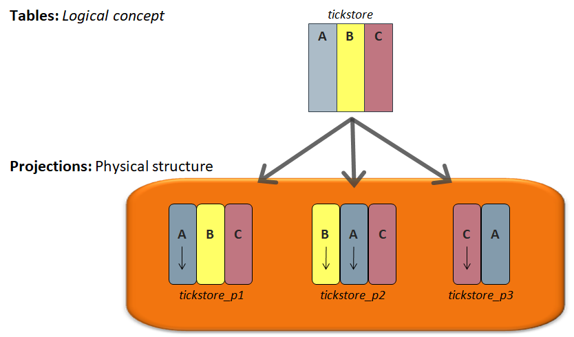
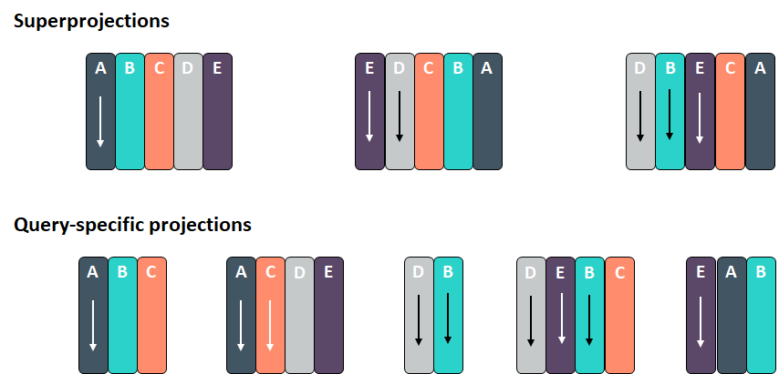
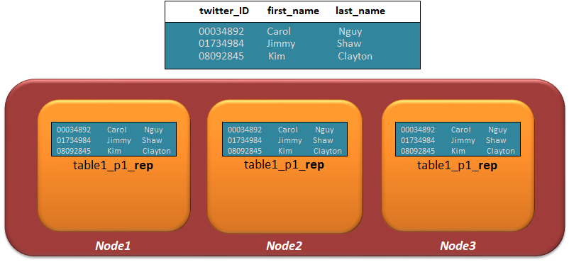
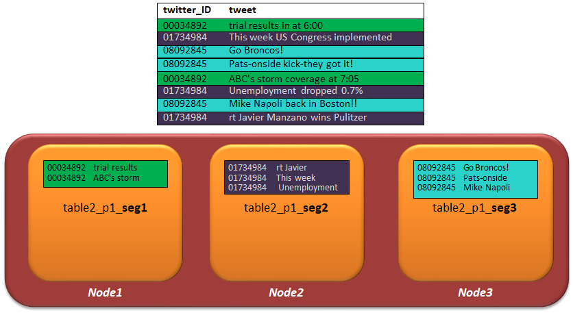
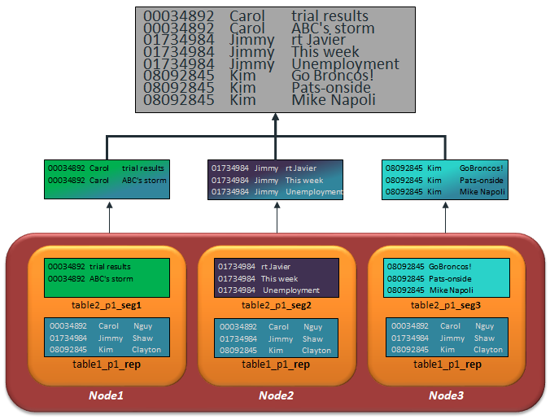
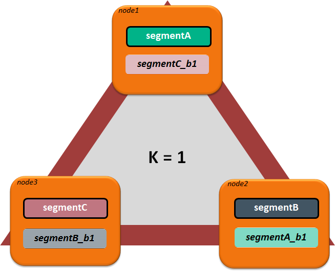

## Projection(프로젝션) 소개  
버티카의 table은 논리적인 구조를 정의 할 뿐 데이터를 저장하고 않으며, 데이터를 저장하는 것은 Projection이라는 물리적인 구조에 저장된다.  
테이블당 복수개의 projection을 생성 할 수 있다.  
전체 컬럼을 가지는 projection이 반드시 하나 존재해야 하며(super projection), 테이블의 컬럼을 일부만 가지고 projection도 생성 할 수 있다.  
또한 projection는 테이블과 다른 정렬순서로 데이터를 저장 할 수 있다.(정렬은 항상 ASC(오름)로 정렬됨)  
버티카에서는 table을 anchor table이라고 부르기도 한다.  


## 기본 Projection 유형

|        projection 유형        |설명|
|:------------------:|:------|
|Super projection|anchor table의 모든 컬럼을 포함하고 있는 프로젝션.<br>반드시 하나 이상 존재해야 한다.|
|Query-specific projection|anchor table의 컬럼들 중 부분 집합을 포함하는 프로젝션.<br>쿼리의 성능을 최적화 하기 위해서 만든다.|
|Aggregate Projections|SUM 및 COUNT와 같은 식 또는 집계 함수가 포함된 쿼리를 이용해서 미리 집계한 데이터를 저장하는 프로젝션.<br>데이터가 적재되면서 부터 집계되어 저장되므로 대량의 데이터에 대한 쿼리의 경우 특히 효율적이다.|
|Buddy projection|프로젝션 속성의 KSAFE로 데이터를 이중화 또는 삼중화할 때 다른 노드에 복제되는 프로젝션.|

버티카에서는 하나의 테이블에 projection 2~4개 이내로 만들 것을 권장한다.(Super projection 1~2개, Query-specific projection 2~3개 이내)  
projection에는 실제 데이터가 저장되므로 무분별한 projection 사용은 적재 속도에 영향을 주며, 디스크 공간을 비효율적으로 사용하게 된다.  


## projection 생성 DDL

```sql
-------------Column list and encodings--------------------
CREATE PROJECTION store_orders_p1 (
  product_number  encoding rle,
  store_number  encoding block_dict,
  vendor_number  encoding rle,
  order_number  encoding deltaval,
  date_ordered  encoding rle
) AS
---------------Base query---------------------------------
SELECT
  product_number, store_number,
  vendor_number, order_number, date_ordered
FROM store_orders
---------------Sort order---------------------------------
ORDER BY
  date_ordered, vendor_number, order_number
---------------Segmentation clause------------------------
SEGMENTED BY hash (
  store_number
)
----------------K-sagety----------------------------------
ALL NODES KSAFE;
```
**Column list and encodings**  
projection에 포함될 컬럼 리스트 및 해당 컬럼을 인코딩 방법 지정. 컬럼 순서는 anchor table의 순서와 동일하지 않아도 된다. 인코딩 방법을 지정하지 않으면 vertica는 데이터 유형에 따라 데이터를 압축하는 AUTO인코딩 방법을 사용한다.  
**Base query**  
anchor table에서 select 하는데 사용되는 쿼리이다.  
**Sort order**  
데이터 저장시 정렬될 컬럼의 목록을 order by 문으로 지정한다.  
**Segmentation clause**  
projection의 데이터를 분산하거나 복제할지 여부 및 분산 키를 지정한다.  
분산(segmentation) - SEGMENTED BY hash( columns )  
복제(replication) - UNSEGMENTED  
**K-safety**  
K-sagety문은 segmented projection일 경우 buddy projection(복제 프로젝션)을 생성하도록 한다.  


## Projection Replication(복제)
Projection Replication이란 클러스터의 모든 노드들이 동일한 데이터 복사본을 가지고 있다는 것이다.  
dimension 테이블과 같은 작은 테이블에 쓰이며, join시 유용하다.  
각 노드에 데이터를 저장하므로 join이 로컬에서 일어나 조인 성능을 높일수 있다.  
한 노드가 중단되더라도 다른 노드에 동일한 데이터가 존재하므로 서비스를 지속 할 수 있다.  



## Projection Segmentation(분산)
Projection Segmentation이란 fact 테이블과 같은 큰 테이블에 대한 데이터를 클러스터 노드 전체에 고르게 분산시킨다. 이렇게 분산시키므로써 각 노드별로 데이터를 고르게 가지고 있으므로 쿼리 실행시 workload를 여러 노드로 분산 시킬 수 있다.  



## Local Join
쿼리가 replication projection과 segmented projections에서 데이터를 추출할때, projection간의 조인은 각 노드에서 로컬로 수행되어 노드의 데이터만 반환된다.  
각 노드에서 조회가 완료되면 결과를 집계하여 사용자에게 반환한다. 이로써 vertica는 쿼리를 신속하게 처리할 수 있게 된다.  
```sql
SELECT t1.twitter_id, t2.f_name, t1.tweet 
  FROM TABLE1 t1 
INNER JOIN TABLE2 t2 ON t1.twitter_id = t2.twitter_id;
```



## K-Safety and Buddy Projections
K-safety는 데이터베이스 클러스터의 내결함성 측정이다. 값 K는 클러스터에 존재하는 projection 세그먼트의 복사 본 수를 나타낸다.  
이러한 복제본(buddy projection)은 장애가 발생한 노드에 대해 다른 노드를 대신할 수 있게 하여 데이터베이스가 계속 실행되면서 데이터 무결성을 보장할 수 있게 한다.  
Vertica에서 K의 값은 0, 1, 2만 될 수 있다.  
K-safety가 1(K=1)인 데이터베이스에서 노드가 하나 down되어도 데이터베이스는 계속 정상적으로 실행된다.  
잠재적으로, 클러스터에서 적어도 하나의 다른 노드가 down된 노드의 데이터 복사본을 가지고 있는 한, 데이터베이스는 계속 실행될 수 있다.  
K=0이면 node 1 or 2로 구성되며, HA구성이 불가능하다.  
K=1이면 node는 3개 이상, K=2이면 node는 5개 이상이 필요하며, HA구성이 가능하다.  


