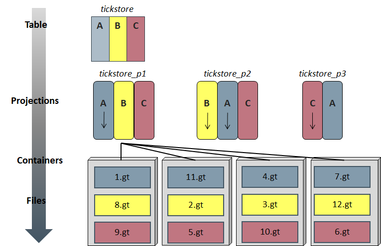
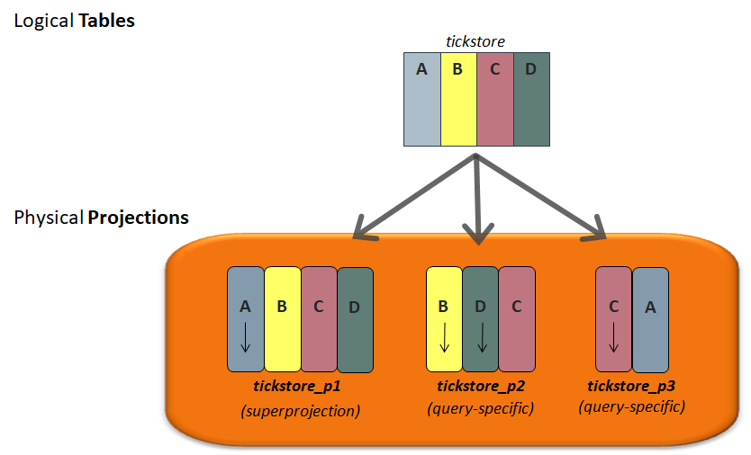
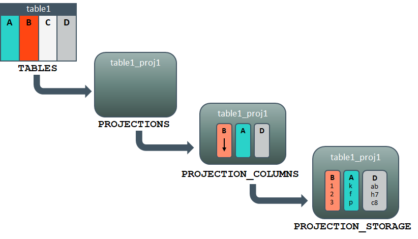

## Vertica table과 projection object 계층 구조
버티카에서는 ANSI SQL 명령(예:seelct, insert, delete, update)을 사용할 수 있도록 테이블 이름을 기준으로 정보를 참조한다.
일반적인 데이터베이스의 테이블과는 다르게 테이블에 데이터를 저장하지 않고 논리 구조로만 사용하고, 그 대신 PROJECTION이라는 버티카만이 가지고 있는 물리적인 구조로 데이터를 저장한다.  
각 테이블은 하나 이상의 projection을 기초로 사용되며, 반드시 테이블의 전체 컬럼을 가지고 있는 projection(super projection)을 가지고 있어야 한다.
또한 테이블의 일부 컬럼만을 포함하고 있는 projection은 필요에 따라 생성할 수 있다. 이처럼 하나의 테이블에 projection을 여러개 만들 수 있으며, 각 projection에는 데이터가 개별적으로 데이터가 저장된다.  
데이터는 projection에 배치되며, 각 projection 컬럼은 데이터 타입에 따라 정렬 및 인코딩/압축된다. 이렇게 저장된 데이터에 대해 실행되는 쿼리는 row기반으로 저장되는 DB에 비해 더 빠르게 실행된다.  
모든 데이터는 디스크에 인코딩/압축되어 디스크에 저장되며 ROS컨테이너에 구성된다. ROS컨테이너는 node별 projection당 최대 1024개지만 700개 정도로 유지하는 것이 좋다.  
데이터 파일은 데이터베이스 생성시 지정한 데이터 보관 위치(예> /data 디렉토리)에 압축된 .gt파일로 디스크에 저장된다.

|object       |설명|
|:-----------:|:-----------|
|TABLE        |버티카에서 테이블은 데이터에 액세스(sql명령)하는 데 사용되는 논리 구조다. 데이터를 테이블에 저장하지 않지만 데이터를 참조하기 위해 sql문에서 사용한다.|
|PROJECTION   |데이터가 저장되는 물리적 구조다. 테이블의 전체 또는 일부 컬럼을 포함하고 있다.|
|ROS Container|projection생성시 지정한 정렬순서로 모든 데이터는 인코딩과 압축되어 디스크에 저장되며, ROS container에 체계화된다.   ROS컨테이너의 제약 조건으로 인해 node별 projection당 최대 1024개 이하로 유지하여야 하며, 700개 정도로 유지하도록 권장한다.|
|Files        |데이터 파일은 데이터베이스 생성시 지정한 데이터 보관 위치(예> /data 디렉토리)에 압축된 .gt파일로 디스크에 저장됨.|

## Table object
버티카는 논리적인 개념으로 table을 제공한다.  
테이블에 대해 쿼리가 실행되면 Vertica는 쿼리를 최적으로 실행하는 projection을 선택한다.  

## table 및 projection 관련 system table
table과 projection 관련 system table들에 대한 설명 및 계층구조를 이미지를 통해 확인 할 수 있다.  

|system table       |설명|
|:-----------------:|:-----------------|
|TABLES             | 논리 table object의 레코드로서 SQL 문을 작성할 때 table 참조.|
|PROJECTIONS        | projection을 정의하는 데 사용되는 TABLE 항목을 포함하여 projection 자체(물리적 객체)를 정의한다.  주어진 table와 관련된 projection을 둘 이상 있을 수 있다.|
|PROJECTION_COLUMNS | 해당 projection에 포함되는 column, projection에서의 위치 및 column 데이터의 정렬 여부를 알려준다.
|PROJECTION_STORAGE | 각 projection에 저장되는 데이터의 양을 알려준다. 하나의 projection에 어떤 데이터가 저장되어 있는지 정확히 알려주지 않는다는 점에 유의하십시오.|
|STORAGE_CONTAINERS | STORAGE_CONTAINERS - projection이 어떤 ROS컨테이너에 어떻게 저장되어 있는지 알려준다.|

