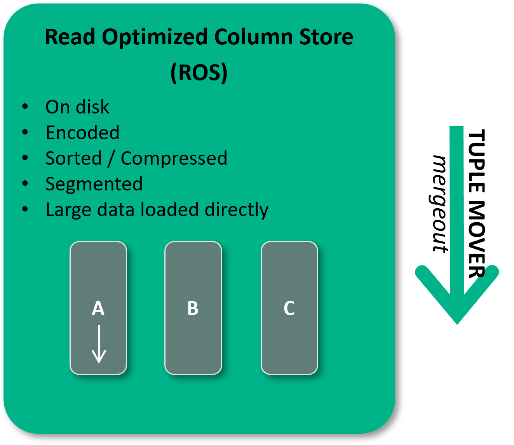

## Vertica Hybrid Storage
버티카는 일반적인 DW 업무의 쿼리 수행과 함께 대량에 데이터 적재 및 쿼리 수행을 지원하기 위해 아래와 같은 WOS/ROS라는 스토리지 모델을 가지고 있다.  

**WOS(Write Optimized Store)**  
WOS는 메모리 상주하는 데이터 저장소다. 일시적으로 메모리에 데이터를 저장하면 적재 프로세스가 빨라지고 디스크의 조각화(ROS 컨테이너)가 감소한다. 물론 데이터는 쿼리에 사용할 수 있다. 소량의 데이터를 지속적으로 적재하는 조직의 경우, 데이터를 먼저 메모리에 적재하는 것이 디스크에 쓰는 것보다 더 빠르며, 데이터에 빠르게 액세스할 수 있다.  
  
**ROS(Read-Optimized Store)**  
ROS는 디스크에 상주하는 데이터 저장소다. 대량에 데이터를 적재할 때 WOS를 사용하는것 보다 ROS에 직접 적재하면 훨씬 속도가 빠르다.  
  


WOS의 데이터를 Tuple Mover의 moveout task을 실행하면 ROS container가 생성되어 데이터를 디스크의 projection으로 구성된다.  
버티카 클러스터의 각 노드별로 WOS와 ROS가 존재하며, 시스템 테이블 중 projection_storage, storage_containers 에서 projection의 데이터가 현재 어느 node의 WOS/ROS로 저장되어 있는지 알 수 있다.  


## Trickle Load and Bulk Load

|데이터 적재 방식    | 설명 |
|:--------------:|:-----|
|Trickle load    |같이 작고 비번한 데이터 적재인 경우 가장 좋은 방법은 데이터를 WOS에 적재 하는 것이다.<br>WOS의 크기는 노드의 메모리의 25% 또는 2GB 중 작은 것으로 제한된며,<br> WOS에 적재된 데이터 양이 이 크기를 초과하면 ROS로 데이터가 자동으로 spill된다.<br>(tuplemover가 moveout task 자동 실행)|
|Bulk load       |초기 데이터 적재 또는 대용량 로드의 경우 데이터를 직접 ROS에 저장 하는 게 좋습니다.<br>직접 ROS에 로드하고자 하는 경우 /*+DIRECT*/힌트를 사용하시면 됩니다.|
  

  
버티카는 별도에 bulk load를 위한 tool 필요 없이 COPY라는 sql문을 사용하면 된다.  
COPY문은 insert문 처럼 레코드 단위로 데이터를 저장하지 않고 대량의 데이터를 한번에 적재하며, 데이터를 병렬로 적재 할 수 있다.  

## Direct DML
버티카에서는 /\*+DIRECT\*/힌트 또는 Direct옵션을 통해 대량의 데이터 적재(COPY), 대량의 데이터 변경(UPDATE, DELETE), 큰 테이블의 데이터 복사(INSERT SELECT)등을 빠르게 할 수 있다.  
DIRECT DML를 수행하면 데이터를 WOS에 쓰지 않고 직접 ROS에 쓰게되므로 적재 속도가 빨라진다. 단 빈번한 Direct DML을 수행하면 ROS 컨테이너가 급증하게 되므로 주의 해야한다.(ROS Pushback현상 발생 원인이 됨)  

```sql
--데이터 입력 또는 테이블 간 데이터 복사
INSERT /*+ DIRECT */ INTO <table> VALUES ~
INSERT /*+ DIRECT */ INTO <table> SELECT ~

--데이터 변경
UPDATE /*+ DIRECT */ <table> SET ~
DELETE /*+ DIRECT */ FROM <table>

--임시테이블 생성
CREATE TEMP TABLE <table> ~ AS /*+ DIRECT */ SELECT ~

--대량 데이터 적재
COPY <table> FROM <data file path> DIRECT
```


## TUPLE MOVER
Tuple Mover(TM)은 버티카의 중요한 컴포넌트중 하나이다.  
Tuple Mover의 주요한 역할은 WOS에서 ROS로 데이터 이동 하는 moveout, 소형 ROS container 들을 합쳐서 큰 ROS container로 결합 하는 mergeout, 삭제된 데이터를 purge하는 기능등을 수행한다.  
Tuple Mover는 백그라운드에서 자동으로 실행되며, configuration parameter에서 지정한 시간 간격으로 작업이 수행된다. default로 설정된 MoveOutInterval은 300sec, MergeOutInterval은 600sec 이다.  
수동으로 실행해야 하는 경우는 DO_TM_TASK()함수를 사용하면 된다.  

### MOVEOUT Task
WOS가 최대 용량에 도달하거나 정기적으로 구성된 간격(default 5분마다)에 도달하면 tuple mover의 moveout task가 디스크(ROS 컨테이너)에 데이터를 기록한다.  
  
WOS에 데이터가 ROW 형태로 존재한다.  

  
WOS의 데이터를 projection에 정의된 컬럼과 인코딩 및 압축해서 temp space로 이동한다.  

  
WOS에 있는 데이터를 삭제하고, temp space에 있는 데이터를 ROS로 이동한다.  

  
temp space를 비운다.  

  
  
### MERGEOUT Task
많은 ros container에서 쿼리를 처리하면 쿼리가 느릴 수 있기 때문에 tuple mover의 mergeout task를 통해 여러 container를 더 적은 수의 container로 병합한다. 
이렇게 하므로써 쿼리가 더 효율적으로 실행 될 수 있다. 수행 간격은 default 10분이다.  
  
처음에는 ROS에 여러 개의 데이터가 로드되어 여러 개의 container가 생성된다.  

  
각 container의 데이터를 병합해서 temp space로 이동시킨다.  

  
병합된 temp space에 있는 데이터를 새로운 ROS container에 구성한다.  

  
temp space를 비운다.  


## 데이터 무결성 검사
버티카는 DW업무 특성상 정제된 데이터가 들어온다고 가정하고 적재를 수행하여, 적재 속도를 빠르게 가져가도록 기본적으로 설정되어 있다.  
그러므로 데이터 무결성 검사가 필요한 경우 아래와 같이 primary, unique key에 대한 무결성 검사를 수행하도록 변경해 주어야 한다.  
  
```sql

ALTER DATABASE <dbname> SET EnableNewPrimaryKeysByDefault = 1;
ALTER DATABASE <dbname> SET EnableNewUniqueKeysByDefault = 1;

select parameter_name, default_value, current_value, description 
from configuration_parameters 
where parameter_name in ('EnableNewPrimaryKeysByDefault', 'EnableNewUniqueKeysByDefault');

parameter_name|default_value|current_value|description
--------------------------------------------------------------------------------------------------------------
EnableNewUniqueKeysByDefault|0|1|Determines whether new unique key constraints will be enabled by default
EnableNewPrimaryKeysByDefault|0|1|Determines whether new primary key constraints will be enabled by default


```
