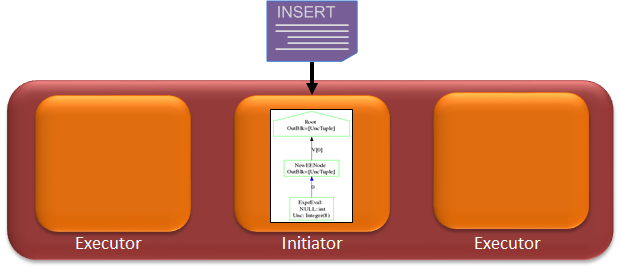
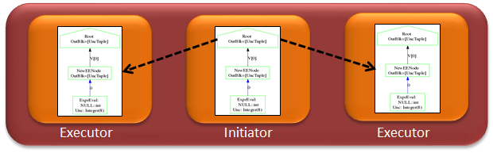
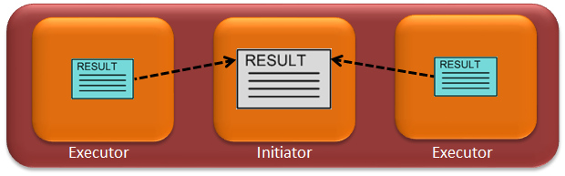
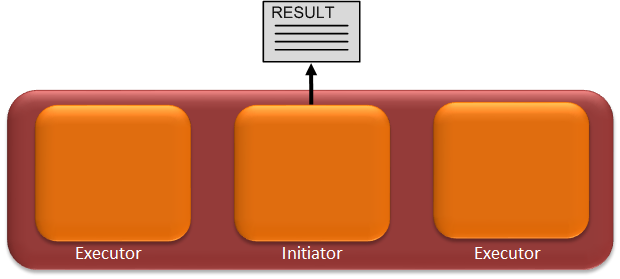

## Query Execution Workflow
버티카는 최초에 쿼리를 접수한 노드가 initiator노드가 되고, 쿼리를 실행하는 노드들이 executor노드가 된며, 모든 노드가 실행계획에 따라 각자의 메모리, CPU, 디스크를 가지고 병렬로 처리 한다. 이 방식이 버티카가 MPP를 구현하는 방법이다.  
또한 버티카 자체에서 제공하는 로드밸런스 기능으로 클러스터 내의 모든 노드가 initiator노드가 될 수 있다.  
아래 이미지를 통해 쿼리가 실행되는 절차를 확인 할 수 있다.  

**[Step 1]**  
initiator노드에서 optimizer는 비용이 가장 적은 쿼리 실행 계획을 수립하며 해당 쿼리를 처리하기 위해 최적에 projection은 선택합니다.  


**[Step 2]**  
initiator노드는 선택한 쿼리 실행 계획을 executor 노드에 배포합니다.  
initiator노드와 executor노드들은 자신의 노드에 들어 있는 데이터를 가지고 자신의 리소스를 이용해서 로컬에서 실행합니다.  


**[Step 3]**  
Executor노드들은 쿼리 수행 결과를 initiator노드로 보내고 initatior노드는 전달 받은 결과를 취합한다.  


**[Step 4]**  
Initiator노드는 취합한 쿼리 결과를 리턴 한다.  



## Query 실행계획
쿼리 실행계획을 확인 하기 위해서는 쿼리문 앞에 **[EXPLAIN]**명령어를 붙여서 실행하면 된다. 실제 쿼리가 실행되지 않고 실행계획만 출력된다.  

```sql
--sample query
EXPLAIN
SELECT sales_quantity, sales_dollar_amount, transaction_type, cc_name
FROM online_sales.ONLINE_SALES_FACT
INNER JOIN online_sales.CALL_CENTER_DIMENSION
ON (online_sales.ONLINE_SALES_FACT.call_center_key = online_sales.CALL_CENTER_DIMENSION.call_center_key AND sale_date_key = 156)
ORDER BY sales_dollar_amount DESC
;

--생성된 실행계획
Access Path:
+-SORT [Cost: 5K, Rows: 10K (NO STATISTICS)] (PATH ID: 1)
|  Order: ONLINE_SALES_FACT.sales_dollar_amount DESC
| +---> JOIN HASH [Cost: 4K, Rows: 10K (NO STATISTICS)] (PATH ID: 2)
| |      Join Cond: (ONLINE_SALES_FACT.call_center_key = CALL_CENTER_DIMENSION.call_center_key)
| |      Materialize at Output: ONLINE_SALES_FACT.sales_quantity, ONLINE_SALES_FACT.sales_dollar_amount, ONLINE_SALES_FACT.transact
ion_type
| | +-- Outer -> STORAGE ACCESS for ONLINE_SALES_FACT [Cost: 1K, Rows: 10K (NO STATISTICS)] (PATH ID: 3)
| | |      Projection: online_sales.online_sales_fact_super
| | |      Materialize: ONLINE_SALES_FACT.call_center_key
| | |      Filter: (ONLINE_SALES_FACT.sale_date_key = 156)
| | |      Runtime Filter: (SIP1(HashJoin): ONLINE_SALES_FACT.call_center_key)
| | +-- Inner -> STORAGE ACCESS for CALL_CENTER_DIMENSION [Cost: 1K, Rows: 10K (NO STATISTICS)] (PATH ID: 4)
| | |      Projection: online_sales.call_center_dimension_super
| | |      Materialize: CALL_CENTER_DIMENSION.call_center_key, CALL_CENTER_DIMENSION.cc_name
```


## Query 수행 시간 확인
버티카에서 제공하는 CLI툴인 vsql에서는 vsql접속후 **[\timing]**명령을 입력하고, 해당 쿼리를 수행하면 실행 결과 마지막에 시간을 확인 할 수 있다.  

```sql
--쿼리 수행 시간을 보기 위한 명령어
dbadmin=> \timing
Timing is on.

dbadmin=> SELECT sales_quantity, sales_dollar_amount, transaction_type, cc_name
dbadmin-> FROM online_sales.ONLINE_SALES_FACT
dbadmin-> INNER JOIN online_sales.CALL_CENTER_DIMENSION
dbadmin-> ON (online_sales.ONLINE_SALES_FACT.call_center_key = online_sales.CALL_CENTER_DIMENSION.call_center_key AND sale_date_key = 156)
dbadmin-> ORDER BY sales_dollar_amount DESC limit 10;


sales_quantity | sales_dollar_amount | transaction_type |     cc_name     
----------------+---------------------+------------------+-----------------
              8 |                 589 | purchase         | South Midwest
              7 |                 589 | purchase         | Central Midwest
              8 |                 589 | purchase         | California
              1 |                 587 | purchase         | New England
              1 |                 586 | purchase         | Other
              4 |                 584 | purchase         | New England
              1 |                 584 | purchase         | New England
              7 |                 581 | purchase         | Mid Atlantic
              5 |                 579 | purchase         | North Midwest
              8 |                 577 | purchase         | North Midwest
(10 rows)

Time: First fetch (10 rows): 76.030 ms. All rows formatted: 76.116 ms
```


## Query Profiling
Explain에서는 SQL쿼리가 실행되는 방법을 보여주지만, **[PROFILE]**에서는 쿼리의 성능을 평가 할 수 있다. 실제 쿼리가 실행된며, 시스템 테이블들에서 transaction_id, statement_id를 통해 다양한 정보를 확인 할 수 있다.  

```sql
--\o 쿼리 실행 결과를 지정된 경로로 보낸다는 의미. 실습을 위해 /dev/null로 보냈음.
dbadmin=> \o /dev/null
dbadmin=> \timing
Timing is off.

--sample query
PROFILE
SELECT sales_quantity, sales_dollar_amount, transaction_type, cc_name
FROM online_sales.ONLINE_SALES_FACT
INNER JOIN online_sales.CALL_CENTER_DIMENSION
ON (online_sales.ONLINE_SALES_FACT.call_center_key = online_sales.CALL_CENTER_DIMENSION.call_center_key AND sale_date_key
= 156)
ORDER BY sales_dollar_amount DESC
;

NOTICE 5077:  Total memory required by query: [687555 KB]
NOTICE 4788:  Statement is being profiled
HINT:  Select * from v_monitor.execution_engine_profiles where transaction_id=45035996273728052 and statement_id=8;
NOTICE 3557:  Initiator memory for query: [on pool general: 687555 KB, minimum: 417229 KB]
NOTICE 5077:  Total memory required by query: [687555 KB]
Time: First fetch (1000 rows): 104.642 ms. All rows formatted: 114.060 ms
```

