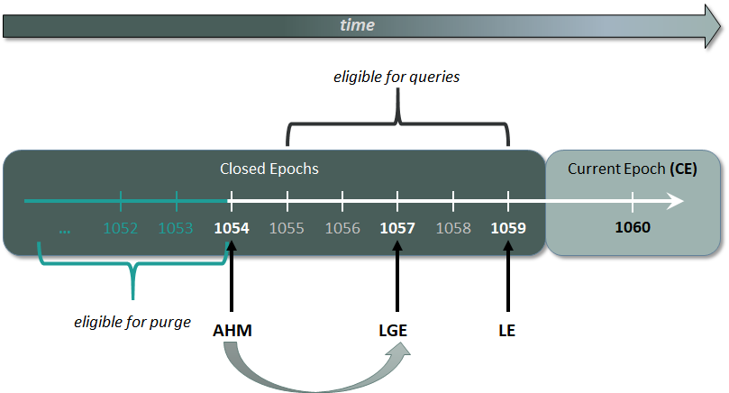

## 에포크(Epoch)
버티카에서는 epoch이라는 데이터의 논리적 타임 스탬프를 나타내는 64bit 숫자를 가지고 있다. commit한 단위를 나타내는 숫자라고 생각하면 된다.  
epoch을 사용하여 다음을 설정 할 수 있다.  
+ Historical한 쿼리(과거쿼리) 조회 (at epoch epoch_number/latest select , at time 'timestamp' select )
+ 데이터베이스를 재설정 할 수 있는 노드 간 시점.
+ Delete vector가 mark된 데이터를 purge할 수 있는 시점.

|epoch 종류   |설명|
|:-------------:|:--------------------------------------|
|current epoch (CE)|현재 데이터가 작성되고 있는 시점|
|latest epoch (LE)|가장 최근에 커밋된 시점|
|last good epoch (LGE)|LGE는 수동복구시 복구 할 수 있는 가장 최신 epoch이다.<br>클러스터가 비정상 종료될시 LGE 이후에 데이터는 손실된다.(ROS에 저장되는 시점, tuplemover의 moveout이 수행되면 LE가 LGE가 됨)|
|ancient history mark (AHM)|purge 할 수 있는 시점|



AHM은 자동으로 3분마다 LGE로 전진한다.
수동으로 설정하기 위해서는 MAKE_AHM_NOW()를 수행한다.

```sql
dbadmin=> create table t(col1 int);
CREATE TABLE

--현 시점에 epoch들
dbadmin=> select current_epoch, ahm_epoch, last_good_epoch from system;
current_epoch | ahm_epoch | last_good_epoch
---------------+-----------+-----------------
           101 |        99 |             100
(1 row)

dbadmin=> select epoch, col1 from t;
epoch | col1
-------+------
(0 rows)

dbadmin=> insert into t values(1);
select epoch, col1 from t;
OUTPUT
--------
      1
(1 row)

--commit전 테이블에 epoch
dbadmin=> select epoch, col1 from t;
epoch | col1
-------+------
       |    1
(1 row)

dbadmin=> commit;
COMMIT

--commit후 테이블에 epoch
dbadmin=> select epoch, col1 from t;
epoch | col1
-------+------
   101 |    1
(1 row)

dbadmin=> insert into t values(2);
OUTPUT
--------
      1
(1 row)

dbadmin=> insert into t values(3);
select epoch, col1 from t;
OUTPUT
--------
      1
(1 row)

--commit전 테이블에 epoch
dbadmin=> select epoch, col1 from t;
epoch | col1
-------+------
   101 |    1
       |    2
       |    3
(3 rows)

dbadmin=> commit;
COMMIT

--commit후 테이블에 epoch
dbadmin=> select epoch, col1 from t;
epoch | col1
-------+------
   101 |    1
   102 |    2
   102 |    3
(3 rows)

--현 시점에 epoch들
dbadmin=> select current_epoch, ahm_epoch, last_good_epoch from system;
current_epoch | ahm_epoch | last_good_epoch
---------------+-----------+-----------------
           103 |        99 |             102
(1 row)

--epoch 101시점의 쿼리
dbadmin=> at epoch 101 select epoch, col1 from t;
epoch | col1
-------+------
   101 |    1
(1 row)

--current epoch 이전 시점의 쿼리
dbadmin=> at epoch latest select epoch, col1 from t;
epoch | col1
-------+------
   101 |    1
   102 |    2
   102 |    3
(3 rows)

dbadmin=> select epoch, col1 from t;
epoch | col1
-------+------
   101 |    1
   102 |    2
   102 |    3
(3 rows)

--epoch 생성된 시간을 확인
dbadmin=> select * from epochs;
       epoch_close_time        | epoch_number
-------------------------------+--------------
2020-01-21 00:25:11.875115-05 |          101
2020-01-21 00:38:01.595782-05 |          102
(2 rows)

--ahm epoch이 전진한 상태(3분마다 자동으로 전진)
dbadmin=> select current_epoch, ahm_epoch, last_good_epoch from system;
current_epoch | ahm_epoch | last_good_epoch
---------------+-----------+-----------------
           103 |       102 |             102
(1 row)

--epoch이 전진하면서 기존에 101 시점에 대한 쿼리 수행 불가.
dbadmin=> at epoch 101 select epoch, col1 from t;
ERROR 3183:  Epoch number out of range
HINT:  Epochs prior to [102] do not exist. Epochs [103] and later have not yet closed


------------------------------------
--------------purge수행-------------
------------------------------------
dbadmin=> insert into t values(5);
OUTPUT
--------
      1
(1 row)

dbadmin=> commit;
COMMIT

dbadmin=> insert into t values(6);
OUTPUT
--------
      1
(1 row)

dbadmin=> commit;
COMMIT

--데이터 delete
dbadmin=> delete from t where col1 > 4;
OUTPUT
--------
      2
(1 row)

dbadmin=> commit;
COMMIT

--delete vector 상태 확인
dbadmin=> select node_name, schema_name, projection_name, storage_type, deleted_row_count, start_epoch, end_epoch from delete_vectors;
    node_name     | schema_name | projection_name | storage_type | deleted_row_count | start_epoch | end_epoch
------------------+-------------+-----------------+--------------+-------------------+-------------+-----------
v_vmart_node0001 | public      | t_super         | DVROS        |                 1 |         109 |       109
v_vmart_node0001 | public      | t_super         | DVROS        |                 1 |         109 |       109
(2 rows)

--현재 epoch들 
dbadmin=> select current_epoch, ahm_epoch, last_good_epoch from system;
current_epoch | ahm_epoch | last_good_epoch
---------------+-----------+-----------------
           110 |       106 |             109
(1 row)

--ahm epoch을 수동으로 전진시킴
dbadmin=> select make_ahm_now();
select current_epoch, ahm_epoch, last_good_epoch from system;
         make_ahm_now         
------------------------------
AHM set (New AHM Epoch: 110)
(1 row)

--make_ahm_now()수행후 epoch들
dbadmin=> select current_epoch, ahm_epoch, last_good_epoch from system;
current_epoch | ahm_epoch | last_good_epoch
---------------+-----------+-----------------
           111 |       110 |             110
(1 row)

--테이블에 대한 purge 수행
dbadmin=> select purge_table('t');
select node_name, schema_name, projection_name, storage_type, deleted_row_count, start_epoch, end_epoch from delete_vectors;                              purge_table                              
-----------------------------------------------------------------------
Task: purge operation
(Table: public.t) (Projection: public.t_super)

(1 row)

--purge후 delete vector 상태
dbadmin=> select node_name, schema_name, projection_name, storage_type, deleted_row_count, start_epoch, end_epoch from delete_vectors;
node_name | schema_name | projection_name | storage_type | deleted_row_count | start_epoch | end_epoch
-----------+-------------+-----------------+--------------+-------------------+-------------+-----------
(0 rows)
```

