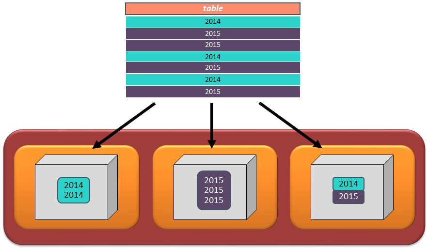
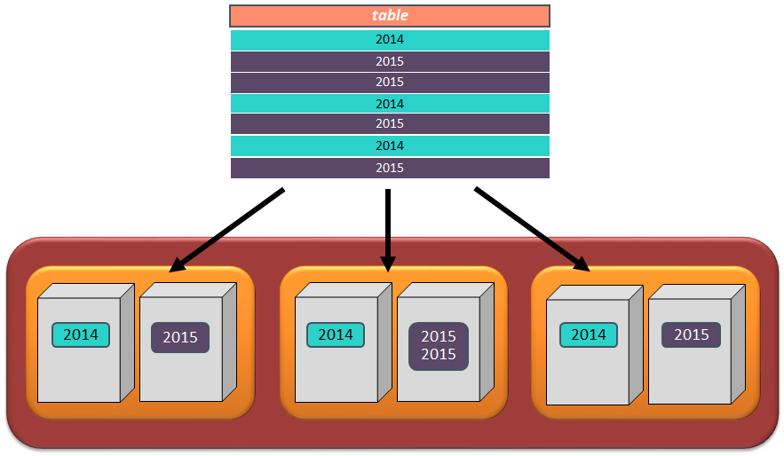
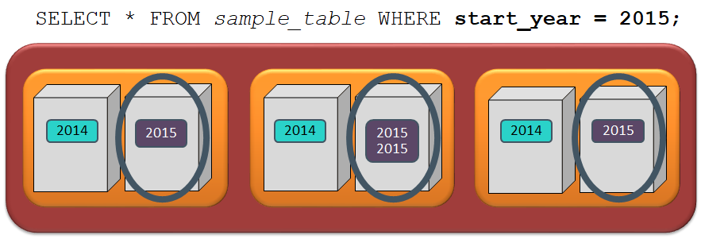
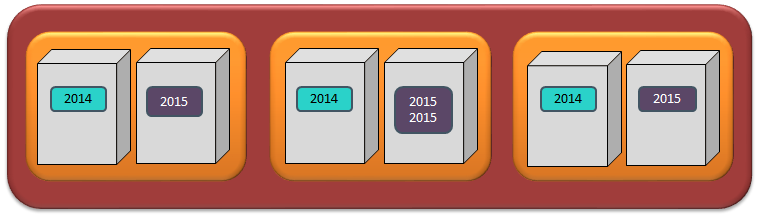
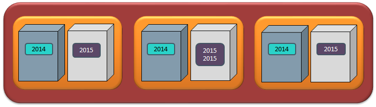
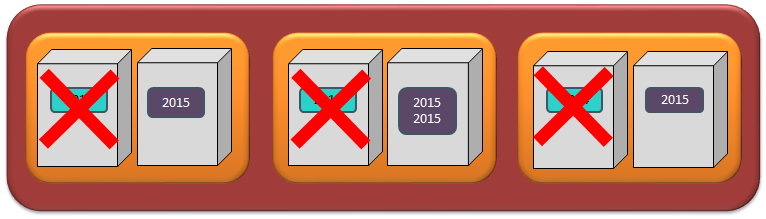
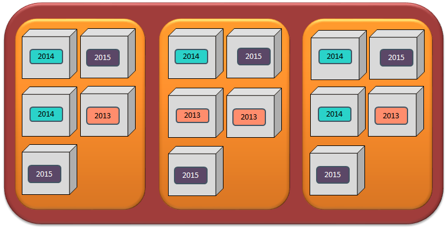
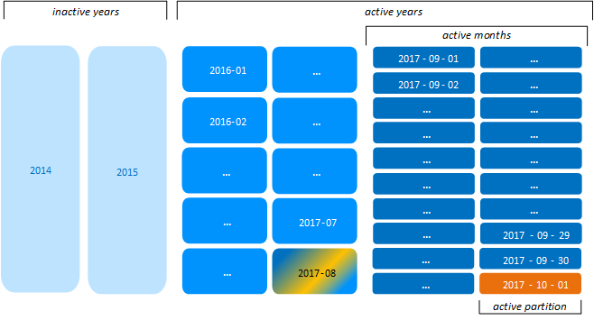
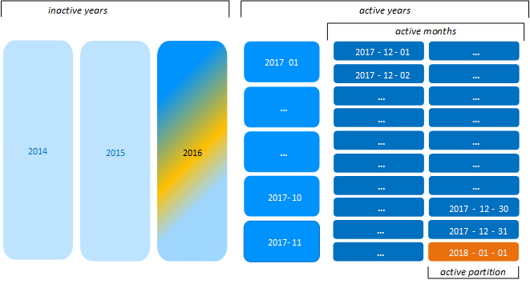

## Partition VS Segmentation
버티카는 최적의 쿼리 성능을 위해 데이터를 구성하는 segmentation(분산), parition을 제공한다.  

### Segmentation
단순히 데이터를 노드 간에 랜덤하고 균일하게 배포하는 것이 아니라 데이터의 일부 특성을 기반으로 데이터를 분산시켜 수 있다.  
일반적으로 데이터가 load되면 projection정의의 segmentation절에 정의된 기준으로 node별로 데이터를 container에 분배한다.  
각 load에 대해 Projection의 ROS container가 생성되며, ROS container에는 projection에서 정의한 정렬 순서를 기준으로 데이터가 저장된다. Segmentation은 projection-level의 속성이다.  



### Partition
데이터가 연도별로 partition(분할)되는 경우 각 노드에 데이터가 분산 될 뿐만 아니라, 노드에 매년 새로운 ROS container가 만들어 진다.  
다른 데이터베이스에서는 파티션에 데이터를 저장하기 전에 파티션을 미리 만들어야 하지만, 버티카는 테이블 생성시 지정한 파티션 키를 가지고 데이터가 저장될 때 파티션을 자동으로 만든다. 별도에 파티션 및 테이블 스페이스에 대한 관리가 불필요하다.  
Partition은 table-level의 속성이다.  



## Paritioning 장점

### Partition Pruning
데이터베이스의 모든 테이블을 partition 처리 할 필요는 없지만, 데이터를 파티션 하면 쿼리에 응답하기 위해 조사 해야 할 ROS 컨테이너를 제한 할 수 있어 쿼리 응답 시간이 향상된다.  
파티셔닝에 사용되는 컬럼이 쿼리의 조건절에 있는 경우 vertica는 해당 파티션에 대한 ROS 컨테이너만 open한다. 이 기능을 partition pruning이라고 한다.  




```sql
CREATE TABLE sample_table (
    customer_id  integer  PRIMARY KEY,
   company_name  varchar(50)  NOT NULL,
   customer_fname  varchar(20),
   customer_lname  varchar(50)  NOT NULL,
   purchase_date  date,
   purchase_amount  float,
   start_year  integer  NOT NULL,
   active  boolean  NOT NULL
) PARTITION BY (start_year);

--기존에 데이터가 들어 있는 테이블에 파티션을 적용할 경우에는 반드시 REORGANIZE를 명시해서 파티션을 재구성하도록 해야한다.
ALTER TABLE sample_table PARTITION BY start_year REORGANIZE ;
```


### 간편한 아카이빙
table에서 사용하지 않는 것으로 판단된 데이터를 이동하여(별도 테이블로 move) 쿼리 응답 시간을 개선 할 수 있다.  

불필요한 데이터(예:오래된 고객 정보)를 다른 table에 쉽게 보관할 수 있도록 하는 MOVE_PARTITIONS_TO_TABLE()이라는 아카이빙 함수가 있다. 아카이빙된 데이터는 여전히 데이터베이스에서 사용할 수 있지만 쿼리에서 참조되는 table의 일부가 아닌, 다른 table의 ROS container로 이동한다.  
  
**Before archiving: 하나의 테이블과 관련된 모든 컨테이너**  


**After archiving: 오래된 데이터가 있는 컨테이너가 아카이브 테이블로 이동**  


```sql
--MOVE_PARTITIONS_TO_TABLE함수를 이용해 source_table에 있는 min_partition_value ~  max_partition_value 까지의 파티션을 target_table로 이동 시킨다.
SELECT MOVE_PARTITIONS_TO_TABLE (
  ‘source_table’,
  ‘min_partition_value’,
  ‘max_partition_value’,
  ‘target_table’
);
```


### 간편한 데이터 제거
예를 들어 특정 년도에 데이터가 더 이상 필요하지 않으면 해당 년도에 파티션 삭제를 통해 데이터 삭제를 간편하게 할 수 있다. 파티션 삭제는 drop partition 기능을 이용하여 Partition된 데이터를 완전히 제거하면 된다.  


```sql
SELECT DROP_PARTITIONS('table_name', 'min_partition_key', 'max_partition_key');
```


## Paritioning 단점
파티션 테이블에 데이터를 load하면 projection을 보관하는 ROS 컨테이너의 수가 증가한다. 버티카의 제약 사항으로 노드별 projection당 ROS 컨테이너의 최대 1024개 까지만 가질 수 있다.
ROS 컨테이너가 1024개를 초과하면 데이터 load 및 쿼리 성능에 문제가 발생할 수 있으며, 이로 인해 ROS pushback현상이 발생하여 더 이상 ROS 컨테이너를 생성하거나 더 많은 데이터를 load 할 수 없게 된다.  
이러한 문제가 발생하지 않도록 partition key 지정시 주의해야 한다.



## Partition 그룹핑(Hierarchical Partitioning)
예를 들어 일별 파티션이 필요해서 day 파티션을 지정하면 ROS 컨테이너의 1024개에 대한 제약사항으로 인해 3년이 되기 전에 ROS pushback현상이 발생하게 된다. 이러한 문제를 해결하기 위해 Vertica 9.0 부터는 CALENDAR_HIERARCHY_DAY 메타 함수를 제공해서 partition grouping을 할 수 있게 되었다. 
CALENDAR_HIERARCHY_DAY는 테이블의 날짜 파티션을 그룹의 계층으로 구성한다. 가장 오래된 날짜 파티션은 연도별로 그룹화되고 최신 파티션은 월별로 그룹화되며 최신 날짜 파티션은 그룹 해제 된 채로 유지된다.  
이러한 파티션 그룹핑은 Tuple Mover에 의해 동적으로 수행되며, 일별 파티션을 월 그룹으로 병합하고 언젠가는 년 그룹으로 병합한다.
+ day 파티션 처리를 하다가 month가 바뀌면 Tuple Mover가 자동으로 day파티션되어 있는 데이터를 month파티션으로 병합
+ month 파티션 처리를 하다가 year가 바뀌면 Tuple Mover가 자동으로 month파티션되어 있는 데이터를 year파티션으로 병합

*예>2017-10-01 데이터가 들어 오면 2017-10-01에 대한 일파티션이 생성되고,  
&nbsp;&nbsp;&nbsp;&nbsp;&nbsp;&nbsp;2017-08에 일별 파티션된 데이터 들이 2017-08로 월별 파티션으로 뭉친다.*

  
  
*예>2018-01-01 데이터가 들어 오면 2018-01-01에 대한 일파티션이 생성되고,  
&nbsp;&nbsp;&nbsp;&nbsp;&nbsp;&nbsp;2016년의 월별 파티션된 데이터 들이 2016년 연별 파티션으로 뭉친다.*



```sql
ALTER TABLE sample_table PARTITION BY partition‑expression 
GROUP BY CALENDAR_HIERARCHY_DAY( partition‑expression [, active‑months[, active‑years] ] );
```
