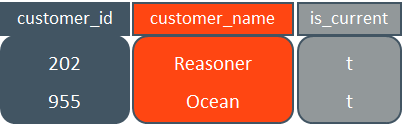

## 버티카에서 데이터 삭제 방법

| 삭제 방법 | 설명 |
|:----------------:|:--------------------------------------|
|DELETE FROM table|데이터를 디스크로 부터 삭제하지 않고 delete vector에 기록하고 삭제할 row에는 삭제되었다고 mark만 한다. <br>물리적으로 데이터 삭제가 이루어 지지 않음. 디스크 공간 회수를 위해서는 purge작업이 필요하며, <br>purge작업은 Tuple mover에 의해 자동으로 수행되거나 명시적으로 purge()함수를 수행해야함.|
|TRUNCATE TABLE table|테이블의 모든 스토리지 및 기록을 삭제함. 물리적으로 데이서 삭제가 이루어 지고, 테이블 구조는 남는다. <br>디스크 공간 즉시 회수.|
|DROP TABLE table|Table정의 및 관련된 projection과 데이터까지 영구적으로 제거함. <br>디스크 공간 즉시 회수.|
|DROP PARTITION|파티션된 테이블에서 영구적으로 파티션을 제거한다. 파티션된 데이터는 효율적으로 삭제 될 수 있으며 쿼리 성능에 이점을 제공한다. <br>디스크 공간 즉시 회수.|

## Drop table과 Truncate Table 비교
버티카에서 drop table은 table와 table의 projection등의 object들을 제거한다.  
truncate table은 table의 projection으로 부터 데이터를 지우기만하고, table와 projection object는 그대로 존제한다.  


```sql
--테이블 생성
dbadmin=> create table t(col1 int);
CREATE TABLE

--projection생성 확인
dbadmin=> select projection_schema, projection_name, anchor_table_name, is_super_projection 
dbadmin=>   from projections 
dbadmin=>  where anchor_table_name = 't';
projection_schema | projection_name | anchor_table_name | is_super_projection
-------------------+-----------------+-------------------+---------------------
(0 rows)

dbadmin=> insert into t values(1);
OUTPUT
--------
      1
(1 row)

--insert후 projection생성 확인
dbadmin=> select projection_schema, projection_name, anchor_table_name, is_super_projection 
dbadmin=>   from projections 
dbadmin=>  where anchor_table_name = 't';
projection_schema | projection_name | anchor_table_name | is_super_projection
-------------------+-----------------+-------------------+---------------------
public            | t_super         | t                 | t
(1 row)

dbadmin=> commit;
COMMIT

--projection_storage 테이블 확인
dbadmin=> select node_name, projection_name, row_count, wos_row_count, ros_row_count, ros_count 
dbadmin=>   from projection_storage 
dbadmin=>  where anchor_table_name = 't';

    node_name     | projection_name | row_count | wos_row_count | ros_row_count | ros_count
------------------+-----------------+-----------+---------------+---------------+-----------
v_vmart_node0001 | t_super         |         1 |             0 |             1 |         1
(1 row)

--storage_containers 테이블 확인
dbadmin=> select node_name, projection_name, storage_type, total_row_count, deleted_row_count, delete_vector_count 
dbadmin=>   from storage_containers 
dbadmin=>  where projection_name = 't_super';
    node_name     | projection_name | storage_type | total_row_count | deleted_row_count | delete_vector_count
------------------+-----------------+--------------+-----------------+-------------------+---------------------
v_vmart_node0001 | t_super         | ROS          |               1 |                 0 |                   0
(1 row)

------------------------------
--truncate table 테스트
------------------------------
dbadmin=> truncate table t;
TRUNCATE TABLE

--projection 확인
dbadmin=> select projection_schema, projection_name, anchor_table_name, is_super_projection 
dbadmin=>   from projections 
dbadmin=>  where anchor_table_name = 't';
projection_schema | projection_name | anchor_table_name | is_super_projection
-------------------+-----------------+-------------------+---------------------
public            | t_super         | t                 | t
(1 row)

--projection_storage 테이블 확인
dbadmin=> select node_name, projection_name, row_count, wos_row_count, ros_row_count, ros_count 
dbadmin=>   from projection_storage 
dbadmin=>  where anchor_table_name = 't';
    node_name     | projection_name | row_count | wos_row_count | ros_row_count | ros_count
------------------+-----------------+-----------+---------------+---------------+-----------
v_vmart_node0001 | t_super         |         0 |             0 |             0 |         0
(1 row)

--storage_containers 테이블 확인
dbadmin=> select node_name, projection_name, storage_type, total_row_count, deleted_row_count, delete_vector_count 
dbadmin=>   from storage_containers 
dbadmin=>  where projection_name = 't_super';
node_name | projection_name | storage_type | total_row_count | deleted_row_count | delete_vector_count
-----------+-----------------+--------------+-----------------+-------------------+---------------------
(0 rows)

dbadmin=> insert into t values(1);
OUTPUT
--------
      1
(1 row)

dbadmin=> commit;
COMMIT

------------------------------
--drop table 테스트
------------------------------
dbadmin=> drop table t;
DROP TABLE

--table 확인
dbadmin=> select table_schema, table_name from tables where table_name = 't';
table_schema | table_name
--------------+------------
(0 rows)

--projections 확인
dbadmin=> select projection_schema, projection_name, anchor_table_name, is_super_projection 
dbadmin=>   from projections 
dbadmin=>  where anchor_table_name = 't';
projection_schema | projection_name | anchor_table_name | is_super_projection
-------------------+-----------------+-------------------+---------------------
(0 rows)

--projection_storage 확인
dbadmin=> select node_name, projection_name, row_count, wos_row_count, ros_row_count, ros_count 
dbadmin=>   from projection_storage 
dbadmin=>  where anchor_table_name = 't';
node_name | projection_name | row_count | wos_row_count | ros_row_count | ros_count
-----------+-----------------+-----------+---------------+---------------+-----------
(0 rows)

--storage_containers 확인
dbadmin=> select node_name, projection_name, storage_type, total_row_count, deleted_row_count, delete_vector_count 
dbadmin=>   from storage_containers 
dbadmin=>  where projection_name = 't_super';
node_name | projection_name | storage_type | total_row_count | deleted_row_count | delete_vector_count
-----------+-----------------+--------------+-----------------+-------------------+---------------------
(0 rows)
```


## delete table 수행 절차
버티카에서는 DELETE명령을 사용하여 레코드를 삭제하면 즉시 제거되지 않고, DELETE_VECTOR에 기록하고 삭제한 레코드에는 삭제되었다고 mark 된다. 물론 데이터 조회시에는 삭제된 데이터는 조회 되지 않는다. DELETE_VECTOR는 데이터가 제거된 장소(데이터파일인 .gt파일의 위치)와 시점(epoch)을 기록하는 튜플집합(여러 개의 요소로 된 집합)이다.  
데이터 삭제시 DELETE_VECTOR 별도 관리와 성능상의 이유로 DELETE문을 사용하여 여러 개의 소량의 데이터 삭제를 권장하지 않는다. 일괄 삭제(bulk delete) 할 것을 권장한다.  
버티카 아키텍처 특성상 한번 기록한 데이터 파일은 변경하지 않는다. 그러므로 UPDATE, MERGE는 [DELETE + INSERT]의 조합으로 취급한다.  


## delete vector가 존재하는 테이블에 대한 select문의 실행 과정
```sql
SELECT customer_id, customer_name 
FROM CUSTOMERS
WHERE is_current = 't';
```
[STEP 1] CUSTOMERS 테이블의 데이터(.gt)파일에는 삭제된 데이터가 mark되어 포함되어 있다.  


[STEP 2] 쿼리에서 필요한 customer_id, customer_name, is_current 컬럼만 읽어 들인다.  


[STEP 3] 삭제된 데이터의 mark가 존재하는 레코드는 최종 결과에서 제외한다.  


이 처럼 삭제 mark된 데이터를 숨겨야 하는 추가 단계는 쿼리 응답 시간을 증가 시킨다.  


## Delete Vector와 Epoch(에포크) 모델 및 Purge 작업
버티카는 데이터를 언제든 삭제 할 수 있지만, 삭제된 데이터는 purge하기 전까지는 데이터베이스로 부터 제거 되지 않는다.  
데이터베이스로 부터 제거(purge) 할 수 있는 시점(epoch)은 AHM보다 오래된 epoch 내에서만 가능하고, 제거하는 방법은 Tuplemover의 mergeout 태스크가 실행되면 delete_vector는 자동으로 purge하거나, Purge()명령을 통해 수동으로 제거할수 있다.  

[step 1] purge를 수행하기 전에 AHM이 1052에 있고, 데이터 파일 및 delete vector는 아래 그림과 같이 존재한다.  


[step 2] MAKE_AHM_NOW()함수를 수행하여 AHM을 LEG인 1057 시점으로 전진시킨다.  


[step 3] PURGE()함수를 수행하여 데이터 파일에서 delete vector의 AHM인 1057 이전 시점의 데이터들을 삭제해서 새로운 데이터 파일을 생성하고, delete vector에서도 제거한다.  


## PURGE를 수행하는 함수들

|PURGE함수|SQL|설명|
|:--------------:|:--------------|:-------------|
|PURGE()         | SELECT PURGE(); | 모든 테이블의 projection purge|
|PURGE_TABLE     | SELECT PURGE_TABLE('[table_name]'); | 지정된 테이블의 모든 projection purge|
|PURGE_PROJECTION| SELECT PURGE_PROJECTION('[projection_name]'); | 지정된 projection purge|
|PURGE_PARTITION | SELECT PURGE_PARTITION('table_name','partition_key'); | 지정된 테이블의 파티션키에 해당하는 projection purge|

```sql
dbadmin=> create table t(col1 int);
CREATE TABLE

dbadmin=> insert into t values(1);commit;
dbadmin=> insert into t values(2);commit;
dbadmin=> insert into t values(3);commit;
dbadmin=> insert into t values(4);commit;
dbadmin=> insert into t values(5);commit;
-- 테이블 insert 결과 생략...

dbadmin=> select do_tm_task('mergeout');
--mergeout 수행 결과 생략

--데이터 삭제
dbadmin=> delete from t where col1 < 3;commit;
OUTPUT
--------
      2
(1 row)

COMMIT

dbadmin=> select epoch, * from t;
epoch | col1
-------+------
   178 |    3
   179 |    4
   180 |    5
(3 rows)

--데이터 저장 컨테이너 id 확인(storage_oid)
dbadmin=> select node_name, projection_name, storage_type, storage_oid, total_row_count, deleted_row_count, delete_vector_count 
dbadmin=>   from storage_containers 
dbadmin=>  where projection_name = 't_super';
    node_name     | projection_name | storage_type |    storage_oid    | total_row_count | deleted_row_count | delete_vector_count
------------------+-----------------+--------------+-------------------+-----------------+-------------------+---------------------
v_vmart_node0001 | t_super         | ROS          | 45035996273861485 |               5 |                 2 |                   1
(1 row)

--delete vector 확인
dbadmin=> select node_name, storage_type, storage_oid, deleted_row_count, start_epoch, end_epoch 
dbadmin=>   from delete_vectors 
dbadmin=>  where projection_name = 't_super';
    node_name     | storage_type |    storage_oid    | deleted_row_count | start_epoch | end_epoch
------------------+--------------+-------------------+-------------------+-------------+-----------
v_vmart_node0001 | DVROS        | 45035996273861485 |                 2 |         181 |       181
(1 row)

--ahm epoch확인
dbadmin=> select current_epoch, ahm_epoch, last_good_epoch from system;
current_epoch | ahm_epoch | last_good_epoch
---------------+-----------+-----------------
           182 |       175 |             181
(1 row)

--최신 ahm 으로 전진
dbadmin=> select make_ahm_now();
select current_epoch, ahm_epoch, last_good_epoch from system;         make_ahm_now         
------------------------------
AHM set (New AHM Epoch: 182)
(1 row)

--  전진한 ahm epoch확인
dbadmin=> select current_epoch, ahm_epoch, last_good_epoch from system;
current_epoch | ahm_epoch | last_good_epoch
---------------+-----------+-----------------
           183 |       182 |             182
(1 row)

-- purge수행
dbadmin=> select purge_table('t');
                              purge_table                              
-----------------------------------------------------------------------
Task: purge operation
(Table: public.t) (Projection: public.t_super)

(1 row)

--purge된 데이터 삭제후 신규로 생성되니 데이터 저장 컨테이너 id 확인(storage_oid)
dbadmin=> select node_name, projection_name, storage_type, storage_oid, total_row_count, deleted_row_count, delete_vector_count 
dbadmin=>   from storage_containers 
dbadmin=>  where projection_name = 't_super';
    node_name     | projection_name | storage_type |    storage_oid    | total_row_count | deleted_row_count | delete_vector_count
------------------+-----------------+--------------+-------------------+-----------------+-------------------+---------------------
v_vmart_node0001 | t_super         | ROS          | 45035996273861517 |               3 |                 0 |                   0
(1 row)

--delete vector purge된 결과 확인
dbadmin=> select node_name, storage_type, storage_oid, deleted_row_count, start_epoch, end_epoch 
dbadmin=>   from delete_vectors 
dbadmin=>  where projection_name = 't_super';
node_name | storage_type | storage_oid | deleted_row_count | start_epoch | end_epoch
-----------+--------------+-------------+-------------------+-------------+-----------
(0 rows)


```
