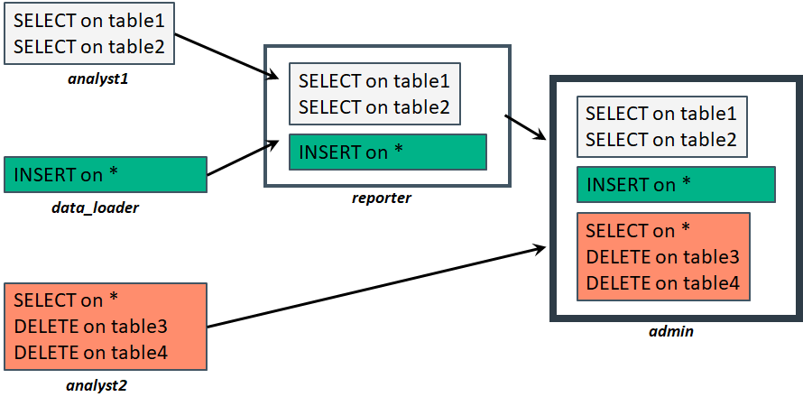

## 데이터베이스 사용자
버티카에는 3가지 유형의 사용자가 있다.  
+ DB admin
+ Object 소유자
+ Public user

**DB admin**  
Vertica를 설치하면 데이터베이스에 super user 권한이 있는 DB admin 사용자가 자동으로 생성된다. 설치 시 명시적으로 이름을 지정하지 않으면 dbadmin사용자로 생성된다. 이 사용자는 DBADMIN/DBDUSER/PSEUDOSUPERUSER 와 같은 3가지 roll을 기본으로 가지고 있으며, 데이터베이스의 모든 object에 액세스하고 제어할 수 있는 권한을 가지고 있다.  

**Object 소유자**  
object 소유자는 특정 데이터베이스 object를 작성하고 해당 object에 대한 작업을 수행 할 수 있는 사용자이다. 기본적으로 소유자 (또는 수퍼 유저) 만 데이터베이스 object에 대해 작업을 할 수 있다. 다른 사용자가 object를 사용할 수 있게 하려면 소유자 또는 수퍼 유저는 GRANT 문을 사용하여 해당 사용자에게 권한을 부여 해야 한다.  

**Public user**  
non-super 유저 또는 object 소유자가 public 사용자이다.  

product환경에 deploy시 제한된 데이터베이스 접근권한을 가지는 사용자를 추가 생성해서 사용해야 한다.  
예를 들어 olap, etl 사용자를 생성하고 사용하는 resource pool을 워크로드를 감안하여 별도로 사용하도록 해야 한다.  


## USERS system table
System table 중 USERS테이블에 DB 사용자를 조회 할 수 있다. 각 사용자는 resource pool과 연결되며(쿼리가 실행될 pool 결정), 하나 이상의 ROLE(쿼리를 실행 할 수 있는 테이블 및 실행할 수 있는 쿼리 유형을 제어)을 할당 할 수 도 있다. 사용자의 프로필은 암호의 형식과 수명을 결정한다.  

```sql
dbadmin=> \x
Expanded display is on.
dbadmin=> select * from users;
-[ RECORD 1 ]---------+-------------------------------------
user_id               | 45035996273704962
user_name             | dbadmin
is_super_user         | t
profile_name          | default
is_locked             | f
lock_time             |
resource_pool         | general
memory_cap_kb         | unlimited
temp_space_cap_kb     | unlimited
run_time_cap          | unlimited
max_connections       | unlimited
connection_limit_mode | database
idle_session_timeout  | unlimited
grace_period          | undefined
all_roles             | dbduser*, dbadmin*, pseudosuperuser*
default_roles         | dbduser*, dbadmin*, pseudosuperuser*
search_path           |
ldap_dn               |
ldap_uri_hash         | 0
is_orphaned_from_ldap | f
```

|컬럼|설명|
|:-------------:|:--------------------|
|user_name      | 사용자명|
|profile_name   | 사용자가 할당되는 프로필 이름. 프로필은 사용자의 암호 정책을 제어 한다.|
|resource_pool  | 사용할 리소스풀.|
|all_roles      | 사용자가 수행 할 수 있는 모든 역할을 표시.|
|default_roles  | 사용자가 처음 로그인 할 때 할당 한 역할이 표시.|


## GRANTS system table
사용자를 생성 한 후에는 사용자에게 데이터베이스 개체에 대한 액세스 권한을 부여 해야 합니다. 객체 액세스 및 액세스 수준은 시스템 테이블 GRANTS에서 유지 관리됩니다.  

```sql
dbadmin=> \x
Expanded display is on.
dbadmin=> select * from grants where object_name = 'public';
-[ RECORD 1 ]----------+------------------
grant_id               | 45035996273704982
grantor_id             | 45035996273704962
grantor                | dbadmin
privileges_description | USAGE
object_schema          |
object_name            | public
object_id              | 45035996273704980
object_type            | SCHEMA
grantee_id             | 45035996273704964
grantee                | public
```

|컬럼|설명|
|:---------------------:|:--------------------|
|grantor                |객체에 대한 액세스 권한을 부여한 사용자. <br>수퍼 유저 또는 객체 소유자는 자신이 제어하는 객체에 대한 권한을 부여 할 수 있다.|
|privileges_description | object_name에 부여 된 액세스 수준.|
|grantee                | 액세스 권한이 부여 된 객체 (일반적으로 다른 사용자).|
|object_name, object_type | 액세스가 부여 된 객체.|


## 데이터베이스 권한
버티카에서는 각 사용자에게 권한들을 수동으로 부여하지 않고 권한을 role로 그룹화 해서 부여 할 수 있다.  
수퍼 유저 또는 object 소유자가 사용자에게 role를 부여하거나 취소 할 수 있습니다. role이 부여되면 사용자는 role에 포함된 권한을 얻을 수 있도록 해야 한다.  
  
버티카는 default로 다음 role을 제공합니다.  

|Role            |설명|
|:--------------:|:--------------|
|DBADMIN         |사용자, 스키마 및 role 관리<br>시스템 테이블 보기<br>사용자 세션 보기 및 종료<br>모든 사용자 생성 데이터에 대한 액세스|
|DBDUSER         |DBD실행|
|PSEUDOSUPERUSER |스키마 생성<br>사용자 암호 관리<br>사용자 권한 관리<br>외부 프로시저, UDF 라이브러리 및 UDF 함수 관리|
|SYSMONITOR      |보안을 손상시키지 않고 중요한 정보를 노출시키지 않으면서 제한된 관리 작업을 위임 할 수 있습니다.|
|PUBLIC          |기본 role, 할당 된 권한 없음|

**PUBLIC role**은 모든 사용자가 작성 될 때 역할이 있어야 하기 때문에 존재합니다. 이 특별한 역할은 DBA가 별도로 결정하지 않는 한 자동으로 새 사용자에게 할당됩니다. 새 사용자는 권한이 할당 될 때까지 아무 것도 할 수 없습니다. 이 역할은 어떤 사용자도 취소 할 수 없습니다.  
  
**DBDUSER role**은 데이터베이스 디자이너를 실행 해야 하는 비수퍼 유저에게 제공 되어야 합니다. 이 역할은 설계중인 스키마 및 테이블에 대한 적절한 특권 이외에 제공 되어야 합니다.  
  
**PSEUDOSUPERUSER role**은 수퍼 유저 권한을 부여합니다. 다른 사용자에게 이 역할을 부여하고 제거 할 수 있습니다. 그러나 사용자 dbadmin에서 수퍼 유저 권한을 제거 할 수는 없습니다.  
  
**SYSMONITOR role**에는 초기에는 특권이 없습니다. 데이터베이스 관리자가 사용자에게 부여 할 수 있는 권한.  
  
사용자에게 권한 할당을 더욱 단순화하기 위해 버티카는 슈퍼유저가 role을 다른 role에 할당하여 role 계층을 만들 수 있도록 한다.  



|role         | 소유권한내역 |
|:-----------:|:------------|
|analyst1     | table1, table2에 select권한|
|data_loader  | table들에 대한 insert권한|
|analyst2     | table들에 대한 select권한, table3, table4에 delete권한|
|reporter     | analyst1, data_loader role의 권한|
|admint       | reporter, analyst2 role의 권한|

```sql
create table table1(col1 int);
create table table2(col1 int);
create table table3(col1 int);
create table table4(col1 int);

--analyst1 role 생성 및 권한 부여
dbadmin=> create role analyst1;
CREATE ROLE

dbadmin=> grant select on table1,table2 to analyst1;
GRANT PRIVILEGE

dbadmin=> select * from roles;
      role_id      |      name       | assigned_roles | ldap_dn | ldap_uri_hash | is_orphaned_from_ldap
-------------------+-----------------+----------------+---------+---------------+-----------------------
45035996273704964 | public          |                |         |             0 | f
45035996273704966 | dbduser         |                |         |             0 | f
45035996273704968 | dbadmin         | dbduser*       |         |             0 | f
45035996273704970 | pseudosuperuser | dbadmin*       |         |             0 | f
45035996273704972 | sysmonitor      |                |         |             0 | f
45035996273864010 | analyst1        |                |         |             0 | f
(6 rows)

dbadmin=> select * from grants where grantee not in ('dbadmin', 'public');
     grant_id      |    grantor_id     | grantor | privileges_description | object_schema | object_name |     object_id     | object_type |    grantee_id     | grantee  
-------------------+-------------------+---------+------------------------+---------------+-------------+-------------------+-------------+-------------------+----------
45035996273864012 | 45035996273704962 | dbadmin | SELECT                 | public        | table1      | 45035996273863452 | TABLE       | 45035996273864010 | analyst1
45035996273864014 | 45035996273704962 | dbadmin | SELECT                 | public        | table2      | 45035996273863454 | TABLE       | 45035996273864010 | analyst1
(2 rows)

--data_loader role 생성 및 권한 부여
dbadmin=> create role data_loader;
CREATE ROLE

dbadmin=> grant insert on table1,table2,table3,table4 to data_loader;
GRANT PRIVILEGE

dbadmin=> select * from grants where grantee not in ('dbadmin', 'public');
     grant_id      |    grantor_id     | grantor | privileges_description | object_schema | object_name |     object_id     | object_type |    grantee_id     |   grantee   
-------------------+-------------------+---------+------------------------+---------------+-------------+-------------------+-------------+-------------------+-------------
45035996273864012 | 45035996273704962 | dbadmin | SELECT                 | public        | table1      | 45035996273863452 | TABLE       | 45035996273864010 | analyst1
45035996273864014 | 45035996273704962 | dbadmin | SELECT                 | public        | table2      | 45035996273863454 | TABLE       | 45035996273864010 | analyst1
45035996273864024 | 45035996273704962 | dbadmin | INSERT                 | public        | table1      | 45035996273863452 | TABLE       | 45035996273864022 | data_loader
45035996273864026 | 45035996273704962 | dbadmin | INSERT                 | public        | table2      | 45035996273863454 | TABLE       | 45035996273864022 | data_loader
45035996273864028 | 45035996273704962 | dbadmin | INSERT                 | public        | table3      | 45035996273863456 | TABLE       | 45035996273864022 | data_loader
45035996273864030 | 45035996273704962 | dbadmin | INSERT                 | public        | table4      | 45035996273863458 | TABLE       | 45035996273864022 | data_loader
(6 rows)

--analyst2 role 생성 및 권한 부여
dbadmin=> create role analyst2;
CREATE ROLE

dbadmin=> grant select on table1,table2,table3,table4 to analyst2;
GRANT PRIVILEGE

dbadmin=> grant delete on table3,table4 to analyst2;
GRANT PRIVILEGE

dbadmin=> select * from grants where grantee not in ('dbadmin', 'public');
     grant_id      |    grantor_id     | grantor | privileges_description | object_schema | object_name |     object_id     | object_type |    grantee_id     |   grantee   
-------------------+-------------------+---------+------------------------+---------------+-------------+-------------------+-------------+-------------------+-------------
45035996273864012 | 45035996273704962 | dbadmin | SELECT                 | public        | table1      | 45035996273863452 | TABLE       | 45035996273864010 | analyst1
45035996273864014 | 45035996273704962 | dbadmin | SELECT                 | public        | table2      | 45035996273863454 | TABLE       | 45035996273864010 | analyst1
45035996273864024 | 45035996273704962 | dbadmin | INSERT                 | public        | table1      | 45035996273863452 | TABLE       | 45035996273864022 | data_loader
45035996273864026 | 45035996273704962 | dbadmin | INSERT                 | public        | table2      | 45035996273863454 | TABLE       | 45035996273864022 | data_loader
45035996273864028 | 45035996273704962 | dbadmin | INSERT                 | public        | table3      | 45035996273863456 | TABLE       | 45035996273864022 | data_loader
45035996273864030 | 45035996273704962 | dbadmin | INSERT                 | public        | table4      | 45035996273863458 | TABLE       | 45035996273864022 | data_loader
45035996273864036 | 45035996273704962 | dbadmin | SELECT                 | public        | table1      | 45035996273863452 | TABLE       | 45035996273864034 | analyst2
45035996273864038 | 45035996273704962 | dbadmin | SELECT                 | public        | table2      | 45035996273863454 | TABLE       | 45035996273864034 | analyst2
45035996273864044 | 45035996273704962 | dbadmin | SELECT, DELETE         | public        | table3      | 45035996273863456 | TABLE       | 45035996273864034 | analyst2
45035996273864046 | 45035996273704962 | dbadmin | SELECT, DELETE         | public        | table4      | 45035996273863458 | TABLE       | 45035996273864034 | analyst2
(10 rows)

--reporter role 생성 및 권한 부여
dbadmin=> create role reporter;
CREATE ROLE

dbadmin=> grant analyst1,data_Loader to reporter;
GRANT ROLE

dbadmin=> select * from grants where grantee not in ('dbadmin', 'public');
     grant_id      |    grantor_id     | grantor | privileges_description | object_schema | object_name |     object_id     | object_type |    grantee_id     |   grantee   
-------------------+-------------------+---------+------------------------+---------------+-------------+-------------------+-------------+-------------------+-------------
45035996273864012 | 45035996273704962 | dbadmin | SELECT                 | public        | table1      | 45035996273863452 | TABLE       | 45035996273864010 | analyst1
45035996273864014 | 45035996273704962 | dbadmin | SELECT                 | public        | table2      | 45035996273863454 | TABLE       | 45035996273864010 | analyst1
45035996273864024 | 45035996273704962 | dbadmin | INSERT                 | public        | table1      | 45035996273863452 | TABLE       | 45035996273864022 | data_loader
45035996273864026 | 45035996273704962 | dbadmin | INSERT                 | public        | table2      | 45035996273863454 | TABLE       | 45035996273864022 | data_loader
45035996273864028 | 45035996273704962 | dbadmin | INSERT                 | public        | table3      | 45035996273863456 | TABLE       | 45035996273864022 | data_loader
45035996273864030 | 45035996273704962 | dbadmin | INSERT                 | public        | table4      | 45035996273863458 | TABLE       | 45035996273864022 | data_loader
45035996273864036 | 45035996273704962 | dbadmin | SELECT                 | public        | table1      | 45035996273863452 | TABLE       | 45035996273864034 | analyst2
45035996273864038 | 45035996273704962 | dbadmin | SELECT                 | public        | table2      | 45035996273863454 | TABLE       | 45035996273864034 | analyst2
45035996273864044 | 45035996273704962 | dbadmin | SELECT, DELETE         | public        | table3      | 45035996273863456 | TABLE       | 45035996273864034 | analyst2
45035996273864046 | 45035996273704962 | dbadmin | SELECT, DELETE         | public        | table4      | 45035996273863458 | TABLE       | 45035996273864034 | analyst2
45035996273864052 | 45035996273704962 | dbadmin |                        |               | analyst1    | 45035996273864010 | ROLE        | 45035996273864050 | reporter
45035996273864054 | 45035996273704962 | dbadmin |                        |               | data_loader | 45035996273864022 | ROLE        | 45035996273864050 | reporter
(12 rows)

--admin role 생성 및 권한 부여
dbadmin=> create role admin;
CREATE ROLE

dbadmin=> grant reporter, analyst2 to admin;
GRANT ROLE

dbadmin=> select * from grants where grantee not in ('dbadmin', 'public');
     grant_id      |    grantor_id     | grantor | privileges_description | object_schema | object_name |     object_id     | object_type |    grantee_id     |   grantee   
-------------------+-------------------+---------+------------------------+---------------+-------------+-------------------+-------------+-------------------+-------------
45035996273864012 | 45035996273704962 | dbadmin | SELECT                 | public        | table1      | 45035996273863452 | TABLE       | 45035996273864010 | analyst1
45035996273864014 | 45035996273704962 | dbadmin | SELECT                 | public        | table2      | 45035996273863454 | TABLE       | 45035996273864010 | analyst1
45035996273864024 | 45035996273704962 | dbadmin | INSERT                 | public        | table1      | 45035996273863452 | TABLE       | 45035996273864022 | data_loader
45035996273864026 | 45035996273704962 | dbadmin | INSERT                 | public        | table2      | 45035996273863454 | TABLE       | 45035996273864022 | data_loader
45035996273864028 | 45035996273704962 | dbadmin | INSERT                 | public        | table3      | 45035996273863456 | TABLE       | 45035996273864022 | data_loader
45035996273864030 | 45035996273704962 | dbadmin | INSERT                 | public        | table4      | 45035996273863458 | TABLE       | 45035996273864022 | data_loader
45035996273864036 | 45035996273704962 | dbadmin | SELECT                 | public        | table1      | 45035996273863452 | TABLE       | 45035996273864034 | analyst2
45035996273864038 | 45035996273704962 | dbadmin | SELECT                 | public        | table2      | 45035996273863454 | TABLE       | 45035996273864034 | analyst2
45035996273864044 | 45035996273704962 | dbadmin | SELECT, DELETE         | public        | table3      | 45035996273863456 | TABLE       | 45035996273864034 | analyst2
45035996273864046 | 45035996273704962 | dbadmin | SELECT, DELETE         | public        | table4      | 45035996273863458 | TABLE       | 45035996273864034 | analyst2
45035996273864052 | 45035996273704962 | dbadmin |                        |               | analyst1    | 45035996273864010 | ROLE        | 45035996273864050 | reporter
45035996273864054 | 45035996273704962 | dbadmin |                        |               | data_loader | 45035996273864022 | ROLE        | 45035996273864050 | reporter
45035996273864060 | 45035996273704962 | dbadmin |                        |               | reporter    | 45035996273864050 | ROLE        | 45035996273864058 | admin
45035996273864062 | 45035996273704962 | dbadmin |                        |               | analyst2    | 45035996273864034 | ROLE        | 45035996273864058 | admin
(14 rows)
```

## ROLES system table
ROLES system table을 조회하면, role들을 확인할수 있으며, assigned_roles컬럼을 통해 상속받은 role들을 확인 할 수 있다.  

```sql
dbadmin=> select * from roles;
      role_id      |      name       | assigned_roles | ldap_dn | ldap_uri_hash | is_orphaned_from_ldap
-------------------+-----------------+----------------+---------+---------------+-----------------------
45035996273704964 | public          |                |         |             0 | f
45035996273704966 | dbduser         |                |         |             0 | f
45035996273704968 | dbadmin         | dbduser*       |         |             0 | f
45035996273704970 | pseudosuperuser | dbadmin*       |         |             0 | f
45035996273704972 | sysmonitor      |                |         |             0 | f
```
