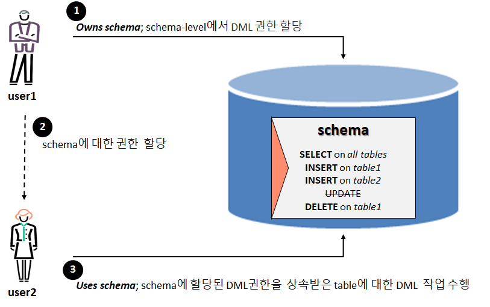
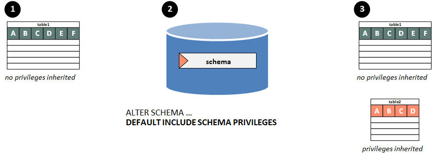
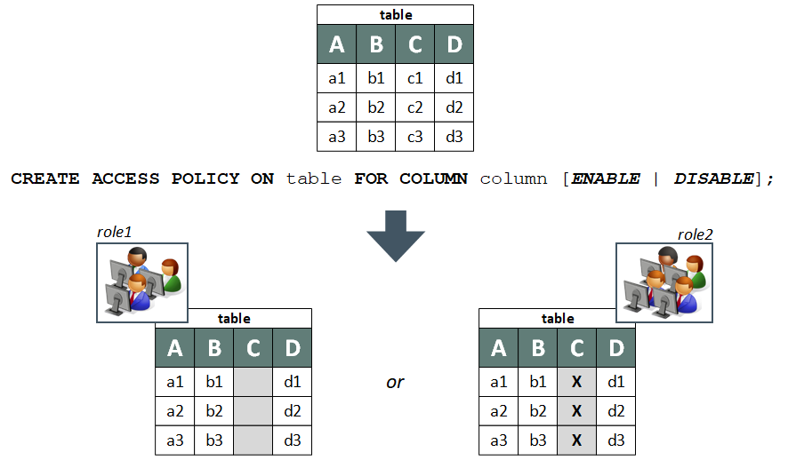
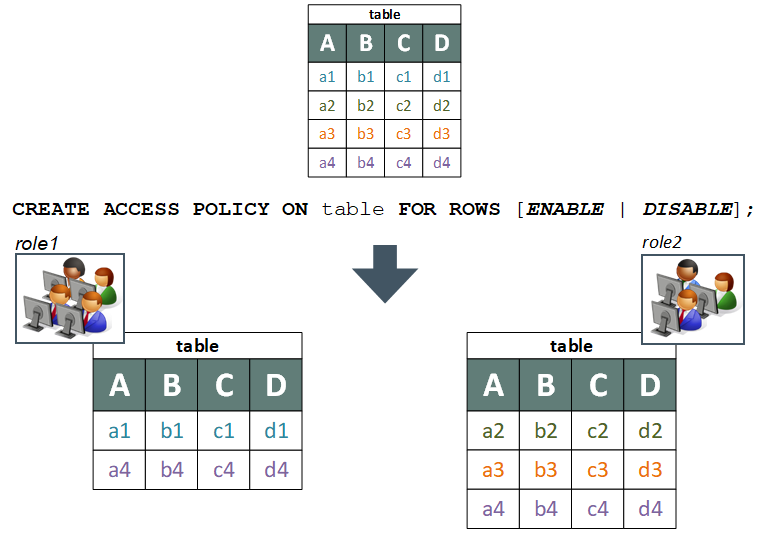

## 상속된 접근 권한
테이블에 대한 DML 권한은 개별 사용자 또는 사용자에게 할당된 role에서 할당 할 수 있지만, 각 테이블에 대해 권한을 개별적으로 설정하면 유지 관리와 보안에 문제가 발생할 수 있다. 그러므로 버티카는 상속된 권한을 허용함으로써 이 과정을 간소화한다. 
데이터베이스 슈퍼 사용자(또는 데이터베이스 스키마의 소유자)는 스키마 수준에서 DML 권한을 한 번에 할당 할 수 있다. 그런 다음 스키마에 액세스할 수 있는 모든 사용자에게 권한을 부여할 수 있다.  
또한 모든 객체(예: 테이블)의 소유자는 객체에 대한 권한을 설정하고 다른 사용자에게 할당 할 수 있다.  




## 상속된 권한과 기존 table
스키마의 새 테이블이 권한을 상속할 수 있도록 하려면 DEFAULT INCLUDE PRIVILEGES 옵션과 함께 ALTER SCHEMA 명령을 사용하십시오. 스키마의 기존 테이블에 대한 권한은 변경되지 않으며, 새 테이블만 권한을 상속한다.  

```sql
ALTER SCHEMA <스키마명> DEFAULT INCLUDE SCHEMA PRIVILEGES ;
```

기존 테이블에 스키마 권한을 할당하려면 INCLUDE SCHEMA PRIVILEGES 옵션과 함께 사용하십시오.  

```sql
ALTER TABLE <테이블명> INCLUDE SCHEMA PRIVILEGES;
```

상위 스키마의 GRANT 문에서 테이블과 뷰로 상속되는 권한에 대한 자세한 내용은 시스템 테이블 INHERITED_PRIVILEGES에서 확인 할 수 있으며, 명시적으로 부여된 권한에 대한 자세한 내용은 시스템 테이블 GRANTS를 확인하면 된다.  



```sql
--사용자 생성
dbadmin=> create user user1;
CREATE USER

--스키마 생성
dbadmin=> create schema schema1;
CREATE SCHEMA

--user1에 스키마 usage, select 권한 부여
dbadmin=> grant usage, select on schema schema1 to user1;
GRANT PRIVILEGE

--schema1에 table1생성
dbadmin=> create table schema1.table1(col1 int);
CREATE TABLE

--user1 접속
dbadmin=> \c - user1
You are now connected as user "user1".

--현재 사용자 확인
dbadmin=> select current_user();
current_user
--------------
user1
(1 row)

--schema1.table1조회(권한 없음으로 에러발생)
dbadmin=> select * from schema1.table1;
ERROR 4367:  Permission denied for relation table1

--dbadmin 접속
dbadmin=> \c - dbadmin
Password:
You are now connected as user "dbadmin".

--현재 사용자 확인
dbadmin=> select current_user();
current_user
--------------
dbadmin
(1 row)

--schema에 부여된 권한 상속
dbadmin=> alter schema schema1 default include schema privileges;
ALTER SCHEMA

--schema1에 table2생성
dbadmin=> create table schema1.table2(col1 int);
WARNING 6978:  Table "table2" will include privileges from schema "schema1"
CREATE TABLE

--user1 접속
dbadmin=> \c - user1
You are now connected as user "user1".

--현재 사용자 확인
dbadmin=> select current_user();
current_user
--------------
user1
(1 row)

--권한 상속 이후에 생성된 table2 조회
dbadmin=> select * from schema1.table2;
col1
------
(0 rows)

--권한 상속 이전에 생성된 table1 조회(권한 없음으로 에러발생)
dbadmin=> select * from schema1.table1;
ERROR 4367:  Permission denied for relation table1

--dbadmin 접속
dbadmin=> \c - dbadmin
Password:
You are now connected as user "dbadmin".

--현재 사용자 확인
dbadmin=> select current_user();
current_user
--------------
dbadmin
(1 row)

--schema1에 부여된 권한을 table1에 상속
dbadmin=> alter table schema1.table1 include schema privileges;
ALTER TABLE

--user1 접속
dbadmin=> \c - user1
You are now connected as user "user1".

--현재 사용자 확인
dbadmin=> select current_user();
current_user
--------------
user1
(1 row)

--schema1에 부여된 권한이 table1에 상속되어서 조회 가능
dbadmin=> select * from schema1.table1;
col1
------
(0 rows)
```


## object별 할당 가능한 권한

|object|ALTER|DROP|CREATE|DELETE|EXECUTE|INSERT|READ|REFERENCES|SELECT|TEMP|TRUNCATE|UPDATE|USAGE|WRITE|
|:---:|:---:|:----:|:----:|:-----:|:----:|:---:|:--------:|:----:|:--:|:------:|:----:|:---:|:---:|:---:|
|Database| | |•| | | | | | |•| | | | |
|Schema  |!|!|•|!| |!| |!|!| |!|!|•| |
|Table   |•|•| |•| |•| |•|•| |•|•| | |
|View    |•|•| | | | | | |•| | | | | |
|Sequence|•|•| | | | | | |•| | | | | |
|Procedure| | | | |•| | | | | | | | | |
|User defined function|•|•| | |•| | | | | | | | | |
|Model           |•|•| | | | | | | | | |•| |
|Library         | | | | | | | | | | | |•| |
|Resource Pool   | | | | | | | | | | | |•| |
|Storage Location| | | | | | |•| | | | | |•|

!는 해당 스키마의 table, view에 상속가능한 권한

## 테이블 데이터에 대한 액세스 제한

### column access 권한
버티카는 사용자가 특정 테이블에 접근할 수 있는 권한을 부여할 뿐만 아니라 사용자가 접근할 수 있는 테이블의 데이터를 제어할 수 있도록 해준다. 모든 데이터베이스 슈퍼 사용자는 열 접근 정책을 생성할 수 있다. 이렇게 하면 사용자가 볼 수 있는 테이블 column과 해당 column에 표시되는 정보가 제어된다.  
액세스 정책은 특정 사용자가 아닌 role에 할당된다.  
Column 접근 정책은 기본적으로 활성화되어 있으며, configuration parameter인 EnableAccessPolicy = 0 으로 비활성화 시킬 수 있다.  

아래 그림에는 다음과 같은 두 가지 액세스 정책이 표시된다.  
• 첫째는 column에 포함된 모든 값을 숨긴다(column 존재 사실을 숨기지 않는다).
• 두 번째 항목은 column에 표시된 값을 변경한다(예, 각 row의 column에 대해 다른 값을 표시하는 SQL을 작성할 수 있다)




### row access 권한
모든 데이터베이스 슈퍼 사용자는 ROW 액세스 정책을 생성할 수 있다.  
이러한 정책을 사용하면 부여된 역할에 따라 사용자가 볼 수 있는 행을 제한할 수 있다.  




