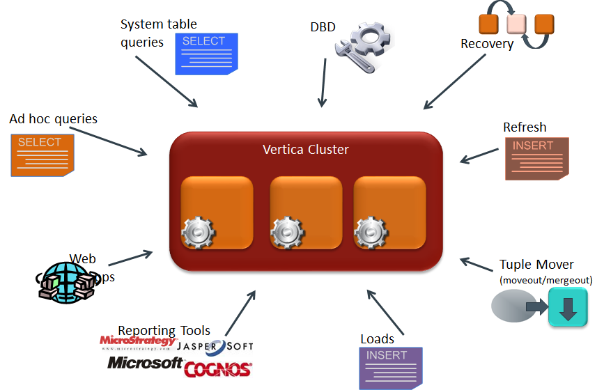
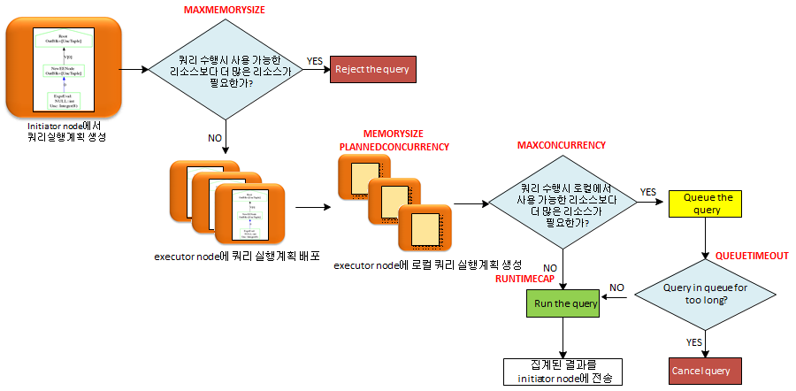
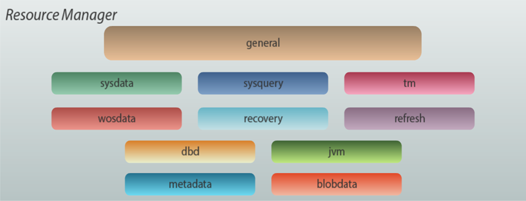
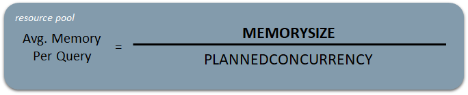
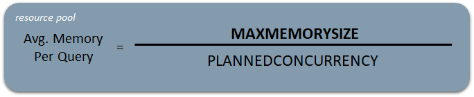
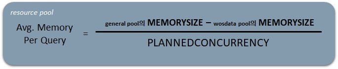
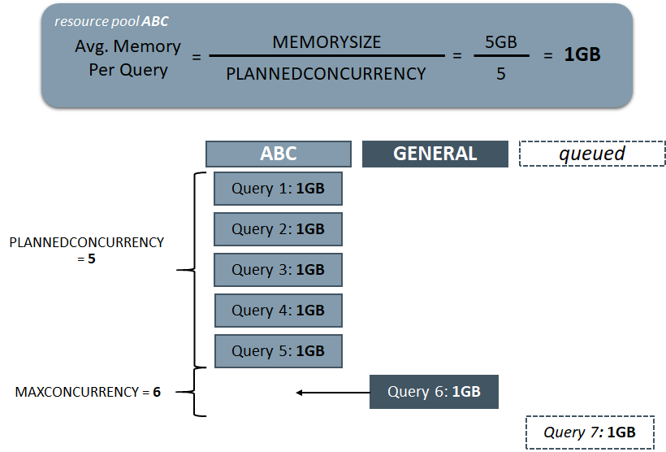

## resource management
모든 데이터베이스 시스템과 마찬가지로, 여러 명의 사용자가 다중 쿼리 조회, 데이터 로드 및 추출, 데이터베이스 안정성을 유지하는 시스템 테이블 조회 등이 동시에 실행 되어서 리소스 요청이 많다. 이러한 리소스 요청들을 버티카는 서로 다른 리소스 풀에서 처리할 수 있게 리소스 관리자가 제어한다.  




## 쿼리 실행 주기
쿼리가 데이터베이스에 제출되면 계획 및 실행 주기를 거친다. 이는 쿼리를 실행할 충분한 리소스가 있는지, 리소스가 부족할 경우 쿼리를 어떻게 처리할지 방법을 결정하기 위해 수행된다.  




## default resource pool
버티카는 조정 가능한 리소스 풀을 사용하여 메모리 할당, 쿼리 동시성, 쿼리 우선 순위, 쿼리 시간 초과 및 거부, 사용자 풀 할당을 제어한다.  



|리소스 풀명   | 설명|
|:-----------:|:----------------------------|
|GENERAL      |사용자 쿼리가 실행되는 기본 풀. 시스템 메모리의 백분율로 캡쳐된 사용 가능한 메모리 크기.|
|SYSQUERY     |v_monitor, v_catalog 및 v_internal 스키마의 테이블에 대해 제출된 쿼리에 대한 리소스를 제어하고, <br>일반적으로 사용 가능한 리소스에 대해 시스템 테이블 쿼리가 경합되지 않도록 유지.|
|SYSDATA      |시스템 테이블에 대한 중간 쿼리 결과의 임시 저장.|
|TM           |모든 Tuple Mover 태스크는 이 풀의 리소스에서 실행.|
|WOSDATA      |디스크로 이동하기 전에 데이터를 메모리에 로드할 때 사용.|
|DBD          |DBD 생성 및 배포를 위한 기본 풀.|
|RECOVERY     |노드 복구를 처리하는 데 사용됨.|
|REFRESH      |projection 새로 고침을 처리하는 데 사용됨|
|JVM          |JVM을 통한 Java UDx 요청에 사용.|
|METADATA     |카탈로그 및 데이터 구조에 대한 메모리 할당 관리.|
|BLOBDATA     |기계 학습 기능에 대한 메모리 할당.|


## 주요 resource pool parameter

|파라미터 명            |설명|
|:------------------:|-----------------------------------------------|
|MEMORYSIZE          |pool의 예약된 메모리 사이즈|
|MAXMEMORYSIZE       |pool에서 사용할 수 있는 최대 예약 메모리 사이즈|
|PLANNEDCONCURRENCY  |예상 동시 쿼리 수|
|MAXCONCURRENCY      |동시 쿼리 최대 수|
|PRIORITY            |대기 중인 쿼리의 경우 이 pool에 대한 요청의 우선 순위|
|QUEUETIMEOUT        |대기 중인 쿼리의 경우, 거부되기 전에 쿼리를 대기할 수 있는 최대 시간(초)|
|CPUAFFINITYSET      |CPU 쿼리의 서브셋이 실행될 것이다.|
|CPUAFFINITYMODE     |모든 노드, 특정 노드 또는 CPUAFFINITY에 의해 정의된 집합에서 쿼리가 실행될 것인가|
|EXECUTIONPARALLELISM|단일 쿼리로 처리하는 데 사용되는 스레드 수 제한|
|RUNTIMEPRIORITY     |pool의 쿼리에 할당된 런타임 리소스 양|
|RUNTIMEPRIORITYHRESHOLD|RUNTIMEPRIORITY가 호출되기까지의 런타임(초)|
|RUNTIMECAP          |pool에서 쿼리가 실행될 최대 시간(초)|
|CASCADETO           | RUNTIMECAP에 도달하면, 지정한 pool이 대신 쿼리를 실행|

**memorysize** : GENERAL 풀의 경우 이 설정은 다른 모든 풀의 예약된 메모리를 뺀 최대 메모리 크기이며, 8GB 노드의 경우 메모리 크기는 7.236GB가 된다.  
**maxmemorysize** : GENERAL 풀의 경우 default로 OS 메모리의 95%로 설정된다. WOSDATA 풀의 경우 이 설정은 사용 가능한 RAM의 25% 또는 2GB 중 더 작은 값으로 설정 된다.  
**plannedconcurrency** : 최소값이 4 이며, 기본값은 노드당 코어 수로 설정된다. AUTO로 설정하면 코어 수 또는 메모리 사이즈/2GB 중 낮은 값으로 설정된다.  
**priority** : 기본 척도는 -110 ~ 110 임.  
**executionparallelism** : 스레드 수가 1개에서 노드의 코어 수 사이.  
**cpuaffinityset, cpuaffinity mode** : 특별한 사용 설정이며, 기술 지원 지침에 따라서만 변경.  
**runtimepriority** : runtimethreshold에 도달한 경우에만 문제.  
**cascade to**: 이 항목은 runtimecap이 초과될 경우 쿼리가 롤오버 되는 보조 리소스 풀을 가리킴.  

resource pool들의 설정 값은 시스템 테이블인 resource_pools을 통해 확인 할 수 있다.  


## MEMORYSIZE와 MAXMEMORYSIZE의 관계
MEMORYSIZE는 resource pool이 기본으로 할당되는 메모리 사이즈 이며, MAXMEMORYSIZE는 resource pool에서 최대로 사용 할 수 있는 메모리 사이즈이다.  
예를 들어 MEMORYSIZE=4G 이고 MAXMEMORYSIZE=5G인 pool에서 쿼리가 필요로 하는 메모리가 6G인 경우 general pool에서 추가적으로 메모리 할당을 1G까지만 받을 수 있기 때문에 쿼리가 필요한 메모리를 확보하지 못해서 쿼리는 reject이 된다. 동일하게 쿼리가 MEMORYSIZE=4G 이고 MAXMEMORYSIZE=8G pool의 경우에는 MEMORYSIZE에서 부족한 2G를 general pool에서 할당 받아 처리 할 수 있게 된다.  
이처럼 MAXMEMORYSIZE는 쿼리 수행시 기본으로 할당 받은 MEMORYSIZE에서 부족한 메모리를 general pool에서 최대한 할당 받을 수 있는 메모리 사이즈이다.(MAXMEMORYSIZE - MEMORYSIZE를 general pool에서 할당 받을 수 있음.)  


## Query Concurrency Planning
PLANNEDCONCURRENCY를 통해 해당 pool에서 동시에 처리 할 수 있는 쿼리 수를 예상 할 수 있다. 명시적으로 설정하지 않으면 노드의 코어수 or 노드의 총메모리를 2GB로 나눈 값 중 작은 값이 된다.  
PLANNEDCONCURRENCY는 실제 메모리 사용이 아니라 메모리 budget에 관한 것이다. 쿼리가 제출되면 budget이 계산되고 예상 메모리가 쿼리에 할당된다. 쿼리가 실행되기 시작하면 실제 메모리 요구 사항을 알 수 있다.  
resource_pool_status 테이블의 query_budget_kb컬럼에 쿼리당 할당되는 메모리 butget을 확인 할 수 있다.  
+ 쿼리에 budget 보다 적은 메모리가 필요한 경우, 추가 메모리는 다른 곳에서 사용 할 수 있도록 해제 되지 않음.
+ 쿼리에 budget 보다 더 많은 메모리가 필요한 경우, 추가 메모리는 현재 풀의 메모리, general 풀의 메모리 순서로 가져온다. 그래도 메모리가 충분하지 않으면 메모리가 충분히 사용할 수 있을 때까지 쿼리가 대기 상태가 된다.

각 pool의 쿼리당 할당되는 평균 메모리 사이즈 계산은 아래와 같다.  
+ MEMORYSIZE를 PLANNEDCONCURRENCY로 나누다.



+ MEMORYSIZE가 설정되지 않은 경우, MAXMEMORYSIZE를 PLANNEDCONCURRENCY로 나눈다.



+ MEMORYSIZE, MAXMEMORYSIZE가 설정되지 않은 경우, general pool과 wosdata pool의 MEMORYSIZE의 차이를 PLANNEDCONCURRENCY로 나눈다.



예를 들어 MEMORYSIZE: 5G / MAXMEMORYSIZE: 6G / PLANNEDCONCURRENCY: 5 / MAXCONCURRENCY: 6 인 ABC 리소스 풀에 할당된 7명의 사용자가 동시네 1GB가 필요한 쿼리를 요청한다고 가정해보자.  



이 pool에 대해 쿼리당 할당된 메모리가 1GB인지 확인하기 위해 계산을 수행한 후:  
+ ABC pool은 한번에 5개의 동시 쿼리를 계획하므로, 처음 5개의 쿼리는 ABC pool에서 메모리를 얻는다.  
+ ABC pool은 최대 6개의 동시 쿼리를 허용하지만 메모리 자체는 충분하지 않다. 그것은 general pool에서 메모리를 빌려온다. 쿼리는 general이 아니라 ABC에서 실행된다.  
+ ABC pool은 동시 쿼리를 6개만 허용하기 때문에 7번째 쿼리는 대기열에 들어간다. 다른 6개의 쿼리 중 하나가 완료되면 ABC pool의 메모리에서 7번째 쿼리가 실행된다.


## resource pool 모니터링 시스템 테이블

|시스템 테이블                    |설명|
|:---------------------------:|:------------------------------------|
|RESOURCE_POOL_DEFAULTS       |기본 제공 및 사용자 정의 풀에 대한 기본 매개 변수 설정 포함. 풀에 값을 명시적으로 설정하지 않은 경우 이 값을 사용한다.|
|RESOURCE_POOL_STATUS         |메모리 사용량을 포함한 리소스 풀의 현재 상태, 동시 쿼리 수|
|RESOURCE_ACQUISITIONS        |실행 중인 쿼리에 부여된 리소스 상태, 완료된 쿼리의 기록 포함|
|RESOURCE_QUEES               |대기열에서 대기 중인 쿼리 목록과 풀 및 우선 순위 정보|
|RESOURCE_REJECTIONS          |중단된 쿼리 및 reject 사유에 대한 통계|
|RESOURCE_REJECTION_DETAILS   |버티카가 reject하는 각 리소스 요청에 대한 항목 기록|


## 사용자 정의 resource pool
모든 버티카 사용자는 한 개의 resource pool에만 할당되며, 모든 쿼리는 해당 pool에서 실행된다. resource pool을 지정하지 않으면 새 사용자는 자동으로 general pool에 할당된다.  
사용자 정의 resource pool을 생성하여 사용자, 어플리케이션, 쿼리등의 다양한 형태의 workload들을 분리해서 리소스 관리를 할 수 있다.  

```sql
--resource pool생성
CREATE RESOURCE POOL pool-name MEMORYSIZE '10G' MAXMEMORYSIZE '20G' [parameter-name setting]...;

--사용자 생성시 resource pool 지정
CREATE USER test RESOURCE POOL pool-name;

--존재하는 사용자에게 resource pool 지정
ALTER USER test RESOURCE POOL pool-name ;
```


