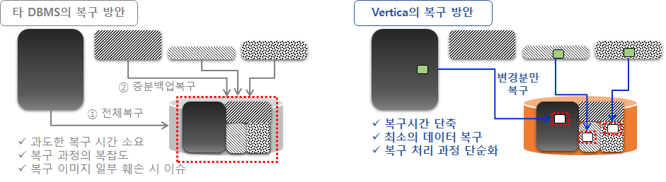

## 백업 및 복원
버티카는 데이터베이스 백업/복원을 위해 vbr이라는 유틸리티를 제공하며, 백업/복원를 관리하기 위해 rsync를 이용한다.
vbr을 실행하기 위해서는 configuration(.ini)파일을 지정해야 하며, 이 파일에는 백업/복원에 대한 모든 구성 매개 변수를 지정한다. 구성 매개 변수에는 백업할 항목(DB, schema, table등), 백업 위치(local, 외부storage등), 보관 주기(백업 본수) 등이 있다. 백업/복원 두 작업 모두 동일한 구성 파일(.ini)을 사용한다.
버티카를 설치하면 /opt/vertica/share/vbr/example_configs/에 샘플 구성파일(.ini)을 제공하고 있다.

vbr 유틸리티를 통해 가능한 작업  
+ 데이터베이스 full 백업/복원
+ object level 백업/복원
+ 데이터베이스를 다른 버티카 cluster에 복사
+ object level의 스키마/테이블 등을 다른 버티카 cluster에 복사


## 데이터베이스 backup level
vbr.py 유틸리티를 사용하여 다양한 Level의 데이터베이스 정보를 백업하고 복원할 수 있다.  
+ Database-level : 데이터베이스의 모든 데이터와 metadata 백업
+ Schema-level : 스키마의 모든 데이터와 metadata 백업
+ Table-level : 참조 무결성 구현에 따라 특정 테이블에 대한 모든 데이터와 metadata 백업, 하나의 구성 파일을 사용하여 데이터를 더 낮은 백업 level로 복원 가능
+ Database-level 백업에서 전체 스키마 또는 개별 테이블 복원(vertica 7.2에서 도입)
+ Schema-level 백업에서 개별 테이블 복원
+ Table-level 백업에서 해당 테이블만 복원


데이터베이스 백업 수행 권장 시점  
+ 정기적인 데이터베이스 유지 관리의 일환으로 정기적인 일정에 수행
+ Vertica 업그레이드 전후 수행
+ 대용량 데이터의 단일 로드 전후 수행
+ 파티션을 삭제하기 전에 수행
+ 노드를 추가, 제거 또는 교체하기 전에 수행
+ crash(충돌)로 부터 클러스터를 리커버리한 후 수행

&nbsp;  
유의 사항
+ 업그레이드 전에 백업하지 않으면 문제가 발생하면 되돌릴 수 없으며 업그레이드 후 백업하지 않으면 이전 버전의 데이터베이스를 새 버전으로 복원할 수 없다.
+ 노드를 추가/제거하기 전에 백업하지 않으면 클러스터 변경에 문제가 있으면 되돌릴 수 없고, 노드를 추가/제거한 후 백업하지 않으면 다른 수의 노드가 있는 데이터베이스로 복원할 수 없다.


## 백업 유형

### full backup
full backup은 데이터베이스 카탈로그, 스키마, 테이블 및 기타 개체의 전체 사본이다. 이 백업 유형은 백업이 발생한 시점의 데이터베이스 이미지를 일관되게 제공한다. 재해 복구를 위해 full backup을 사용하여 손상되거나 불완전한 데이터베이스를 복원 할 수 있다. full backup에서 개별 object를 복원 할 수도 있다. full backup이 존재하면 vbr은 full backup 이후의 연속 백업으로 증분 백업을 만든다. 증분 백업에는 마지막 전체 또는 증분 백업이 발생한 이후에 새 데이터 또는 변경된 데이터가 포함된다.  

### Object-Level backup
하나 이상의 스키마 또는 테이블 또는 이러한 오브젝트 그룹으로 구성 된다.  

### Hard-Link local backup
hard link local backup은 전체 또는 개체 수준의 백업이 될 수 있다. 데이터베이스 카탈로그의 전체 복사본과 해당 데이터 파일에 대한 일련의 hard file link로 구성된다. 카탈로그와 데이터베이스 파일에 사용되는 파일 시스템에 hard link local backup을 저장 해야한다.  


## 버티카 백업 및 복원 아키텍처
버티카의 백업은 최초 전체 백업 이후 부터는 변경된 내역만 백업하는 증분 백업으로 수행된다.  


또한 이전 시점으로 복구 요청 시 버티카는 전체 백업과 그 이후 발생한 모든 증분 백업을 다시 복구하는 과정을 거치지 않고 유실된 데이터에 해당하는 영역에 대해서만 복구하는 아키텍처를 가지고 있습니다. 또한, 전체 백업본에서 특정 스키마 및 객체만 복구할 수 있는 기능이 포함됩니다.  




## 백업을 위한 구성파일(.ini) 샘플
버티카가 설치된 node의 /opt/vertica/share/vbr/example_configs 경로에 각각 다른 백업 및 복원 시나리오에 적합한 샘플 백업 구성 파일을 제공하고 있다.  

|backup 구성파일(.ini)                  | 설명 |
|:-----------------------------------:|:-------------------------------------------------|
|backup_restore_full_local.ini        | 각 데이터베이스 호스트에서 해당 호스트 백업을 위한 전체 데이터베이스 백업|
|backup_restore_full_hardlink.ini     | 각 데이터베이스 호스트에서 하드 링크를 사용한 해당 호스트 백업에 대한 전체 데이터베이스 백업|
|backup_restore_object_local.ini      | 하나 이상의 지정된 스키마를 로컬 Disk에 백업/복원|
|backup_restore_full_external.ini     | 각 데이터베이스 노드에서 고유한 백업 호스트로 병렬 백업/복원|
|replicate.ini                        | UP 데이터베이스 간에 하나 또는 하나 이상의 테이블/스키마 복제|
|copycluster.ini                      | UP 데이터베이스를 DOWN 데이터베이스에 복사|
|restore_to_other_cluster.ini         | 전체 백업을 다른 클러스터에 복원|
|backup_restore_s3.ini                | AWS S3 공유 스토리지에 백업/복원|

### 예시> backup_restore_full_local.ini
샘플로 제공되는 각 구성 파일 내에서 필요한 모든 백업 구성 매개 변수가 정의되어 있다.  

```
vi /opt/vertica/share/vbr/example_configs/backup_restore_full_local.ini
; This is a sample vbr configuration file for backup and restore using a file system on each database host for that host's backup.
; Section headings are enclosed by square brackets.
; Comments have leading semicolons (;) or pound signs (#).
; An equal sign separates options and values.
; Specify arguments marked '!!Mandatory!!' explicitly.
; All commented parameters are set to their default value.

; ------------------------------------------- ;
;;; BASIC PARAMETERS ;;;
; ------------------------------------------- ;

[Mapping]
; !!Mandatory!! For each database node there must be one [Mapping] entry to indicate the directory to store the backup.
; node_name = backup_host:backup_dir
; [] indicates backup to localhost
v_exampledb_node0001 = []:/home/dbadmin/backups
v_exampledb_node0002 = []:/home/dbadmin/backups
v_exampledb_node0003 = []:/home/dbadmin/backups
v_exampledb_node0004 = []:/home/dbadmin/backups

[Misc]
; !!Recommended!! Snapshot name
; Backups with the same snapshotName form a time sequence limited by restorePointLimit.
; SnapshotName is used for naming archives in the backup directory, and for monitoring and troubleshooting.
; Valid values: a-z A-Z 0-9 - _
; snapshotName = backup_snapshot

[Database]
; !!Recommended!! If you have more than one database defined on this Vertica cluster, use this parameter to specify which database to backup/restore.
; dbName = current_database

; If this parameter is True, vbr prompts the user for the database password every time.
; If False, specify the location of password config file in 'passwordFile' parameter in [Misc] section.
; dbPromptForPassword = True
```

|구성파일(.ini) 섹션 |  설명 |
|:------------:|:-----------------------------|
|[Mapping]     | 데이터베이스 노드 이름과 해당 노드의 백업 위치에 대한 전체 경로를 입력
|[Misc]        | snapshotName 필드에는 백업 이름 지정
|[Database]    | dbName 필드에 데이터베이스 이름 입력<br>dbPromptForPassword 필드에서 데이터베이스를 백업 또는 복원하는데 <br>데이터베이스 슈퍼 사용자 암호가 필요한지 확인(기본값은 True, Vertica는 기본값은 변경하지 않도록 권장)|


## 백업/복원 수행 

### backup location 초기화
데이터베이스를 처음 백업하기 전에 vbr --task init를 사용하여 백업이 저장될 디렉터리를 초기화해야 한다. 그러면 빈 manifest파일이 생성되고 백업이 완료된 후 manifest파일이 업데이트 된다.  
데이터베이스를 초기화되지 않은 위치에 백업하려고 하면 오류가 발생한다.  
이 태스크로 생성된 글로벌 manifest파일에는 두 개의 섹션이 있다.  
**[Snapshots]** 모든 백업에 대한 항목.  
**[Object]** 각 고유 객체에 대한 항목이 있다. 객체가 여러 백업(일반적으로 증분)에 의해 공유되는 경우, 이는 제 계산에 의해 표시된다.  

```
--백업 데이터 보관 폴더 생성
[dbadmin@localhost ~]$ mkdir /vertica/backup

[dbadmin@localhost ~]$ pwd
/home/dbadmin

--백업 구성 파일 및 패스워드 파일
[dbadmin@localhost ~]$ ls -a .backup* backup*
backup.ini  .backup_pwd

--백업 구성 파일 내용
[dbadmin@localhost ~]$ cat backup.ini
[Mapping]
v_vmart_node0001 = []:/vertica/backup

[Misc]
snapshotName = vmark_bak
restorePointLimit = 5
passwordFile = /home/dbadmin/DBA/BACKUP/.backup_pwd

[Database]
dbName = VMart
dbUser = dbadmin

--패스워드 파일 
[dbadmin@localhost ~]$ cat .backup_pwd
# password
[Passwords]
dbPassword = password

--backup location 초기화
[dbadmin@localhost ~]$ /opt/vertica/bin/vbr -t init -c /home/dbadmin/backup.ini
Initializing backup locations.
Backup locations initialized.

[dbadmin@localhost ~]$ ls /vertica/backup/
backup_manifest

[dbadmin@localhost ~]$ cat /vertica/backup/backup_manifest
[snapshots]
[objects]
```

### backup 수행
데이터베이스 백업시 vbr --task backup를 사용하여 백업을 수행한다. 백업시에는 모든 노드가 실행되고 있어야 한다. 노드 중 하나라도 중단된 경우 백업이 실패한다.  

```
--backup 수행
[dbadmin@localhost ~]$ /opt/vertica/bin/vbr -t backup -c /home/dbadmin//backup.ini
Starting backup of database VMart.
Participating nodes: v_vmart_node0001.
Snapshotting database.
Snapshot complete.
Approximate bytes to copy: 993812867 of 993812867 total.
[==================================================] 100%
Copying backup metadata.
Finalizing backup.
Backup complete!

--backup 수행 후 생성된 목록
[dbadmin@localhost ~]$ ls /vertica/backup/
backup_manifest  Objects  Snapshots

--Snapshot 생성 파일 목록
[dbadmin@localhost ~]$ ls /vertica/backup/Snapshots/
vmark_bak_20200213_090029

--backup 생성 체크
[dbadmin@localhost ~]$ /opt/vertica/bin/vbr -t full-check -c /home/dbadmin//backup.iniChecking backup consistency.
List all snapshots in backup location:
Snapshot name and restore point: vmark_bak_20200213_090029, nodes:['v_vmart_node0001'].
Regenerating backup manifest for location [127.0.0.1]:/vertica/backup
Snapshots that have missing objects(hint: use 'vbr --task remove' to delete these snapshots):
Backup locations have 0 unreferenced objects
Backup locations have 0 missing objects
Backup consistency check complete.
```

### backup 복원
전체 데이터베이스를 복원하려면 데이터베이스가 중단 되어 있어야 하며, 스키마 또는 테이블을 복원하려면 데이터베이스가 실행 중이어야 한다.  

**테이블 삭제**  
```sql
dbadmin=> select * from t;
c
---
1
(1 row)

dbadmin=> drop table t;
DROP TABLE
dbadmin=> select * from t;
ERROR 4566:  Relation "t" does not exist
```
  
&nbsp;  
***테이블 복원***  
```
[dbadmin@localhost ~]$ /opt/vertica/bin/vbr -t restore -c /home/dbadmin//backup.ini --restore-objects=public.t
Starting object restore of database VMart.
Restoring from restore point: vmark_bak_20200213_090029
Participating nodes: v_vmart_node0001.
Loading snapshot catalog from backup.
Objects to restore: public.t
Preprocessing snapshot...
Preprocessing complete.
Restoring objects: public.t
Approximate bytes to copy: 76.
Syncing data from backup to cluster nodes.
[==================================================] 100%
Finalizing restore.
Restore complete!
```
  
&nbsp;  
***테이블 복원 확인***  
```sql
dbadmin=> select * from t;
c
---
1
(1 row)
```

&nbsp;  
&nbsp;  
자세한 backup 관련 [버티카 매뉴얼](https://www.vertica.com/docs/9.3.x/HTML/Content/Authoring/AdministratorsGuide/BackupRestore/BackingUpAndRestoringTheDatabase.htm?tocpath=Administrator%27s%20Guide%7CBacking%20Up%20and%20Restoring%20the%20Database%7C_____0){:target="_blank"} 을 참고 하기 바란다.
