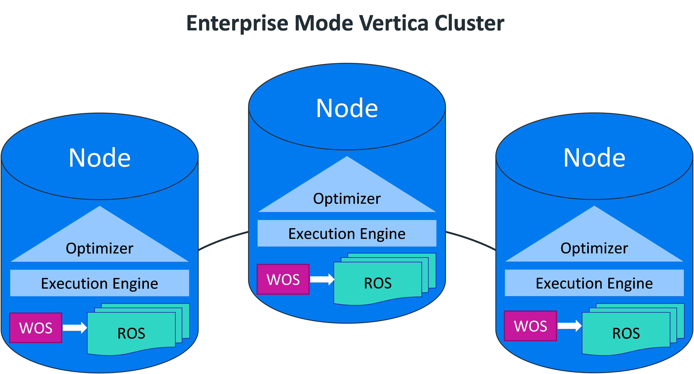
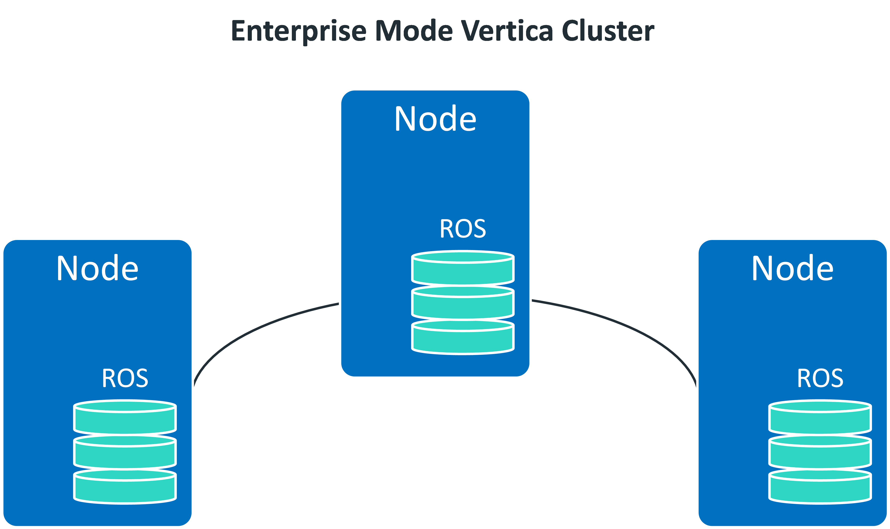

## Enterprise Mode Concepts
Enterprise Mode에서 물리적 아키텍처는 데이터를 컴퓨팅 리소스에 최대한 가깝게 이동하도록 설계된다. 이 아키텍처는 Eon Mode에서 실행되는 클러스터와 다르다.  
Enterprise Mode의 데이터는 데이터베이스의 각 노드에 분산된다. 이상적으로는 각 노드가 동일한 양의 분석 워크로드를 갖도록 데이터가 고르게 분산되어야 한다.  

**Vertica Enterprise mode v9.2까지의 구성**  

**Vertica Enterprise mode v9.3 이후 구성**  

### Hybrid Data Store
Enterprise Mode에서 실행될 때 버티카는 두 개의 컨테이너에 데이터를 저장한다.  
+ WOS(Write Optimized Store) - 압축 또는 인덱싱 없이 메모리에 데이터 저장. INSERT, UPDATE 및 COPY 문을 사용하여 WOS에 데이터를 로드할 수 있다.**(vertica 9.3 부터 WOS가 Deprecated)**
+ ROS(Read Optimized Store) - Disk에 데이터 저장. 데이터는 높은 최적화를 위해 분할, 정렬 및 압축된다. COPY 문구를 사용하여 ROS에 직접 데이터를 로드할 수 있다.
WOS는 Vertica에게 다량의 작은 ROS 컨테이너를 만들도록 강요하는 다량의 작은 데이터 부하(trickle loads)를 방지하기 위해 존재한다. 많은 수의 소형 ROS 컨테이너는 대형 컨테이너보다 효율이 떨어진다.  
  
Tuple Mover는 다음 프로세스를 사용하여 WOS(메모리)에서 ROS(디스크)로 데이터를 이동한다.  
+ Moveout은 데이터를 WOS에서 Tuple Mover로, 그리고 ROS로 복사한다. 데이터는 sort되고, encoded되며, column 파일로 압축된다.
+ Mergeout은 조각화를 줄이기 위해 작은 ROS container를 큰 ROS container로 결합한다.
보통 COPY 문을 사용하여 데이터를 대량으로 로드한다. WOS에 데이터를 로드하거나 ROS에 직접 데이터를 로드할 수 있다.  

### Data Redundancy(이중화)
Enterprise Mode에서 Vertica의 각 노드는 로컬로 데이터를 저장하고 작동한다. 노드의 손실로 인해 일부 데이터를 쿼리 서비스에서 사용할 수 없게 되면 데이터베이스가 강제로 종료됩니다.  
일반적으로 노드가 종료될 경우 데이터 손실과 서비스 중단을 방지하기 위해 Enterprise Mode 데이터베이스가 데이터를 이중으로 저장하도록 K-Safety를 지정하고 있습니다.  

### K-Safety
K-safety는 버티카 클러스터에서 내결함성을 설정한다. 값 K는 버티카 클러스터의 데이터가 복제되는 횟수를 나타낸다. 이러한 복제본은 다른 노드가 down된 노드(장애 노드)에 대한 쿼리 처리를 대신할 수 있도록 한다.  
Vertica에서 K의 값은 0, 1 또는 2가 될 수 있다. K-safety가 1(K=1)인 데이터베이스가 노드가 down되더라도 데이터베이스는 계속 정상적으로 실행된다. 잠재적으로, 클러스터에서 적어도 하나의 다른 노드가 down된 노드의 데이터 복사본을 가지고 있는 한, 추가 노드가 down되더라도 데이터베이스는 계속 실행될 수 있다. K-safety를 2로 증가시키면 두 개의 노드가 down된 경우에도 Vertica가 정상적으로 실행될 수 있다. down된 노드가 복귀하여 복구에 성공하면 다시 데이터베이스 작업에 참여할 수 있다.  

