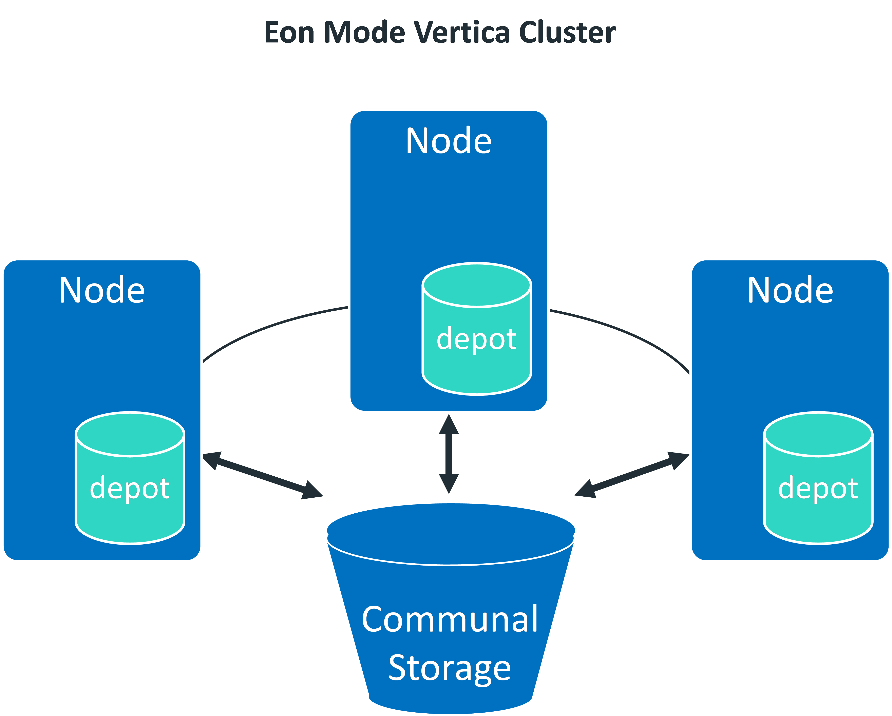
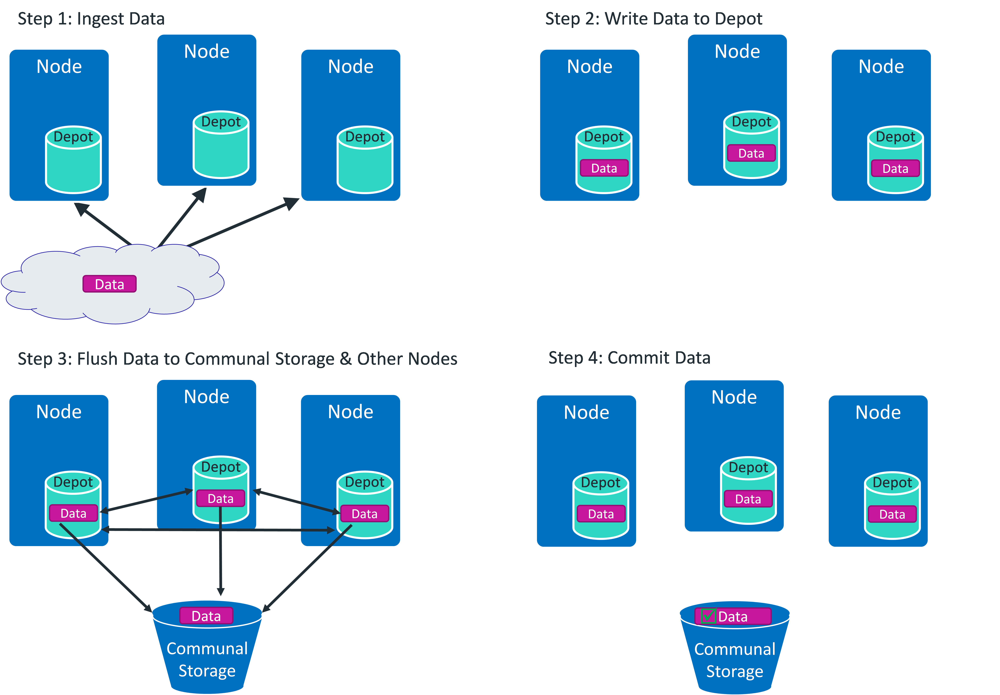
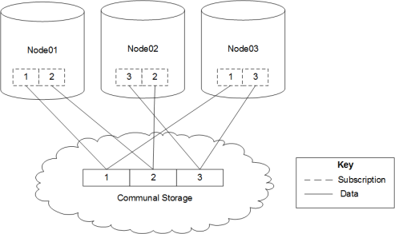
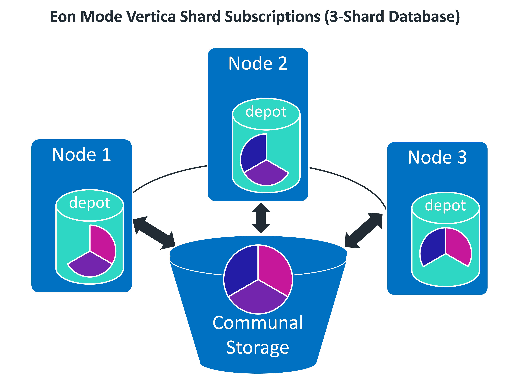
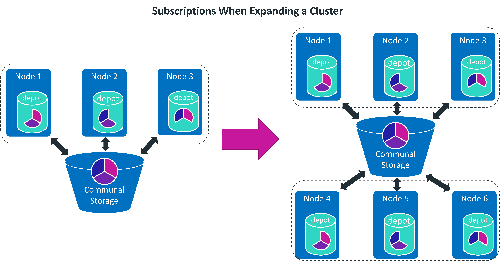

## Eon Mode Architecture
Eon Mode는 데이터베이스의 communal storage layer에서 compute 자원을 분리한다. 이 분리는 데이터를 단일 위치(현재 AWS의 S3와 Pure Storage FlashBlade에만 있음)에 저장할 수 있는 기능을 제공한다. compute 요구에 따라 그 위치에 연결된 노드의 수를 탄력적으로 변화시킬 수 있으며, 클러스터 크기를 조정해도 업무가 중단되지 않는다.  

Eon Mode는 컴퓨팅과 스토리지가 분리되어 있으므로 workload와 데이터 볼륨을 유연하게 확장 및 축소 할 수 있다.  

### Communal Storage
Eon Mode는 데이터를 로컬에 저장하는 대신 모든 데이터와 카탈로그(메타데이터)에 대해 단일 공동 저장(Communal Storage) 위치를 사용한다. Communal Storage는 데이터베이스 노드 간에 공유되는 데이터베이스의 중앙 집중식 스토리지다.  
  
Communal Storage의 속성은 다음과 같다.  
+ 공동 스토리지는 개별 머신의 Disk에 있는 스토리지보다 스토리지 장애로 인한 데이터 복구에 보다 탄력적이고 데이터 손실에 덜 취약하다.
+ 모든 데이터는 동일한 경로를 사용하여 모든 노드에서 읽을 수 있다.
+ 노드의 디스크 공간에 의해 용량이 제한되지 않는다.
+ 데이터는 공동 저장되므로 변화하는 workload에 맞게 클러스터를 탄력적으로 확장할 수 있다. 데이터가 노드에 로컬로 저장된 경우 노드를 추가하거나 제거하려면 노드 간에 상당한 양의 데이터를 이동하여 제거 중인 노드에서 또는 새로 생성된 노드로 이동해야 한다.

버티카는 현재 Amazon S3와 Pure Storage FlashBlade에서 Communal Storage를 지원한다. Communal Storage 위치는 SHARING_TYPE이 COMMUNAL 인 STORAGE_LOCATIONS 시스템 테이블에서 확인 할 수 있다. Communal Storage 내에서 데이터는 shard라고 불리는 부분으로 나뉜다. compute 노드들은 shard를 구독 한다.  

### Depot
Communal Storage의 단점 중 하나는 속도이다. 공유 클라우드 위치에서 데이터에 액세스하면 로컬 디스크에서 데이터를 읽는 것보다 속도가 느리다. 또한 많은 노드가 한 번에 데이터를 읽는 경우 공용 스토리지에 대한 연결에 병목 현상이 발생 할 수 있으므로 데이터 액세스 속도를 향상시키기 위해 Eon Mode의 노드는 Depot라고 하는 로컬 디스크에 데이터를 캐시해서 유지한다. 쿼리를 실행할 때 노드는 먼저 필요한 데이터가 depot에 있는지 확인 하고, 존재하면 depot의 데이터를 사용하여 쿼리를 완료한다. 데이터가 depot에 없으면 노드는 Communal Storage에서 데이터를 가져 와서 depot에 복사본을 저장한다.  
또한 노드는 새로 load된 데이터를 Communal Storage로 보내기 전에 depot에 저장한다. 자세한 내용은 아래 loading data에서 확인 할 수 있다.  
기본적으로 버티카는 depot의 크기를 파일 시스템에 할당된 총 디스크 공간의 60%를 최대 크기를 설정한다. 이 크기는 파일 시스템의 최대 80%로 제한하고 있다. 이 제한은 버티카가 데이터 load중에 생성하는 임시 파일과 같은 다른 용도로 사용할 수 있는 충분한 디스크 공간을 보장하기 위해서 이다. 또한 각 노드에는 데이터베이스 카탈로그의 로컬 복사본도 저장된다.  

### Loading Data
Eon Mode에서 COPY 문은 일반적으로 성능을 개선하기 위해 노드의 depot에 ROS(Read Optimized Store) 파일에 기록한다. COPY 문을 수행하면 최적화를 위해 데이터를 분산, 정렬, 압축한다. commit되기 전에 버티카는 ROS 파일을 communal storage로 전송한다. 참고로 Eon 모드에서는 WOS(Write Optimized Storage)를 사용하지 않는다.  
load를 실행하는 노드의 depot에서 데이터가 버퍼링되기 때문에 depot의 크기는 단일 작업에서 load할 수 있는 데이터의 양을 제한한다. 병렬 세션에서 여러 load를 수행하지 않는 한 이 제한에 직면할 가능성은 거의 없다.  
만약 데이터 load시 depot의 공간 크기를 초과할 경우 버티카에게 depot를 우회하여 communal storage에 직접 데이터를 load하도록 할 수 있다. UseDepotForWrite 구성 매개 변수를 0으로 설정하여 communal storage에 직접 쓰기를 사용하도록 설정 하면 된다. 대용량 데이터 load를 완료했으면 이 매개 변수를 1로 다시 전환하여 depot에 쓰기를 다시 활성화 하면 된다.  
load시 파일은 depot에 기록되고 동시에 communal storage와 데이터가 load되는 shard를 subscribe하는 모든 노드로 전송된다.  
  
아래 그림은 COPY 문 실행 시 데이터의 흐름을 보여준다.  

**[step1]** 데이터 수집  
**[step2]** depot에 데이터 쓰기  
**[step3]** communal storage 및 다른 노드에 데이터 flush  
**[step4]** 데이터 commit  

### Querying Data
버티카는 Eon mode에서 샤딩 메커니즘과 원격 스토리지를 결합하여 쿼리 실행계획을 약간 다른 방법을 사용한다. 버티카는 각 노드에 데이터를 배포하기 위해 고정 세그먼트화 방식을 사용하는 대신 샤딩 메커니즘을 사용하여 데이터를 적어도 하나 이상의 노드가 구독하는 특정 수의 shard로 분할한다. (샤팅 메커니즘이란? 하나의 거대한 데이터베이스나 네트워크 시스템을 여러개의 작은 조각으로 나누어 분산 저장하여 관리하는 것을 말한다.)  
optimizer가 projection을 선택하면 projection 레이아웃은 세션에 대한 참여 구독을 통해 결정된다.  
optimizer는 엔터프라이즈 모드에 해당하는 쿼리 계획을 생성하며, 쿼리 실행에 참여할 각 shard를 구독하는 노드 중 하나를 선택한다.  
버티카는 먼저 depot의 데이터를 사용하여 쿼리를 해결하려고 한다. depot의 데이터가 쿼리를 해결할 수 없을 때 버티카는 communal storage에서 읽는다. 상당수의 쿼리가 communal storage에서 읽힐 때 쿼리 성능에 영향을 줄 수 있다. 만약 그렇다면, 무엇이 이 문제를 야기하는지 더 잘 알기 위해 depot의 크기를 재조정하거나 depot 시스템 테이블을 사용하여 문제의 원인을 파악해야한다. ALTER_LOCATION_SIZE()를 사용하여 depot 크기를 변경할 수 있다.  

### Workload Isolation and Scaling
Eon 모드를 사용하면 노드를 분할하여 워크로드를 서로 분리하는 subcluster를 정의할 수 있다.  

## Shards and Subscriptions
Eon 모드에서 버티카는 공유 데이터 저장 위치(예: AWS에서 실행되는 경우 S3)에 데이터를 공통적으로 저장한다. 모든 노드는 communal storage에 있는 모든 데이터에 액세스할 수 있다. 쿼리 처리 작업을 분할하기 위해서는 버티카가 어떤 식으로든 데이터를 노드 간에 분할해야 한다. 그것은 communal storage의 데이터를 shard로 나뉜다. 데이터베이스의 각 노드는 communal storage의 shard에 가입한다.(subscribe) communal storage 위치의 shard는 엔터프라이즈 모드 데이터베이스의 segmented projection 모음과 유사하다.  
replica shard라고 불리는 특별한 형태의 shard는 unsegmented projection을 위한 메타데이터를 저장하며, 모든 노드에 replica shard가 존재한다.  
K-Safety가 1 이상(고가용성)일 경우, 각 shard에는 이를 subscribe하는 노드가 2개 이상 있다. 이 이중화는 노드가 중단되거나 다른 쿼리에서 사용되고 있는 경우 나머지 노드에서 모든 데이터를 사용하여 쿼리를 처리하도록 보장한다.  

  
shard를 subscribe하는 기본 노드(primary subscriber)가 모두 중단되면 데이터 무결성을 유지를 위해 데이터베이스가 종료된다. shard의 유일한 구독자인 노드는 중요한 노드이며, 해당 노드가 중단되면 데이터베이스가 종료된다.  
replica shard를 포함한 각 shard에는 primary subscriber로 표시된 가입 노드가 정확히 한 개 있다. primary subscriber 노드는 shard에서 tuple mover 작업을 실행한다. 이러한 작업은 저장 컨테이너가 shard에 저장되어 있는 상태를 관리한다.  
    
shard의 수는 데이터베이스를 생성할 때 정의한다. 최상의 성능을 위해 선택한 shard의 수는 노드 수의 2배 이하가 되어야 한다. shard 대 노드 비율을 3:1 이하로 제한해야 한다. 일단 설정되면 shard 카운트는 변경할 수 없다.  
  
노드 수가 shard의 수보다 많을 경우 대시보드 쿼리 처리량이 향상된다. shard 수가 노드 수를 초과하면 향후 클러스터를 확장하여 긴 분석 쿼리의 성능을 향상시킬 수 있다.  

  
버티카는 효율성을 위해 데이터베이스 노드 간에 직접 shard에 대한 메타데이터를 전송한다. 이러한 peer-to-peer 전송은 메타데이터에만 적용된다. 각 노드에 저장된 실제 데이터는 필요에 따라 communal storage에서 노드의 depot로 복사된다.  

### Expanding Cluster
3-노드 3-shard 데이터베이스를 6개 노드로 확장하는 과정을 보여준다. 최대 성능을 보장하기 위해 새 서브클러스터에 새 노드 3개를 추가한다. shard의 수는 그대로 유지되며, 추가 노드는 shard에 대한 구독을 얻는다. admintools를 사용하여 클러스터에 노드를 추가한 후에는 shard를 rebalance 해야 한다.  
클러스터를 축소하면 버티카는 자동으로 데이터를 rebalance한다. 그러나 클러스터를 확장할 때는 rebalance를 수동으로 해야 한다.  

