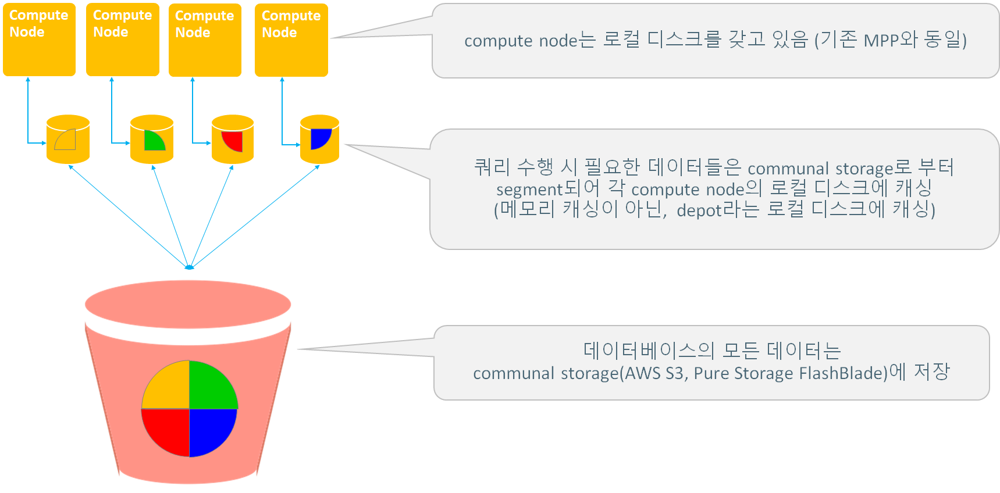
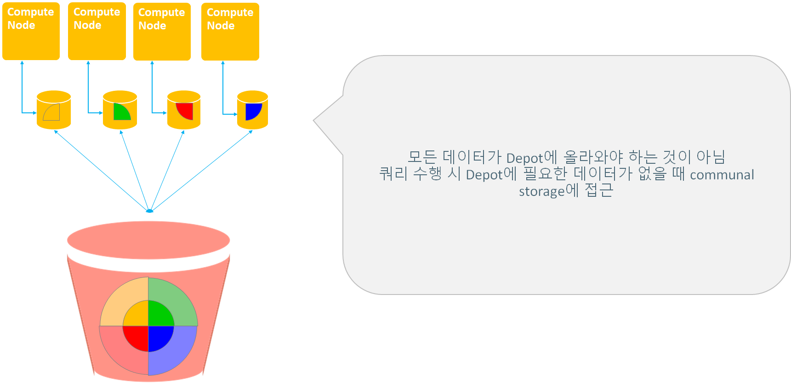
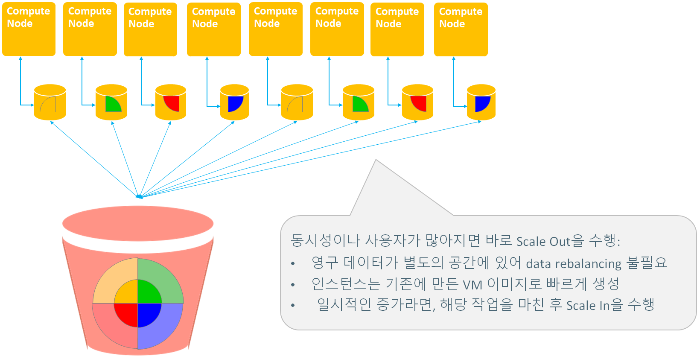
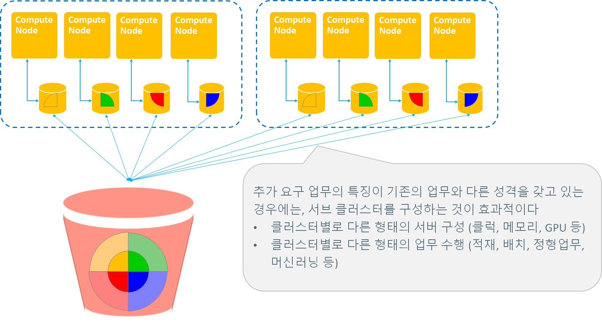
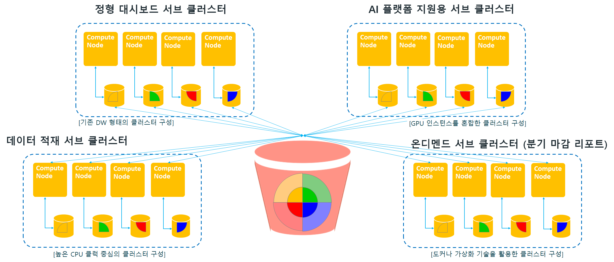
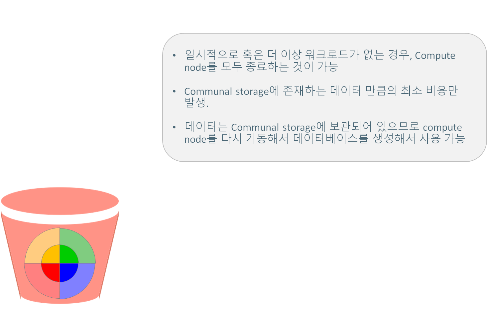

## Eon mode 동작 방식

communal storage의 색깔별로 있는 영역은 shard를 의미하며, depot에는 각 compute node가 subscribe(구독)하는 shard들이 캐싱된다.  
shard는 데이터를 segment하는 영역으로 생각하면 되며, enterprise mode에서 projection의 segment와 유사하다고 생각하면된다.  

## 쉽고 빠른 확장성

## 서브 클러스터를 활용한 워크로드 분리

## 서브 클러스터를 활용한 워크로드 분리 활용 예

## Compute node 제거 후 “동면” 상태로 활용

