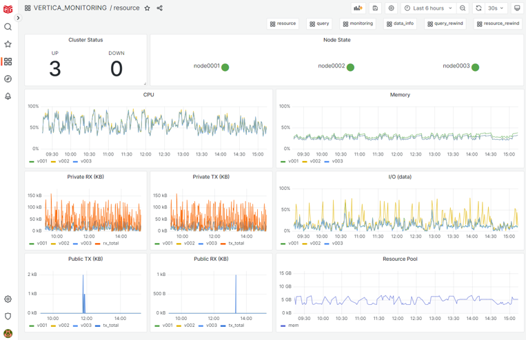
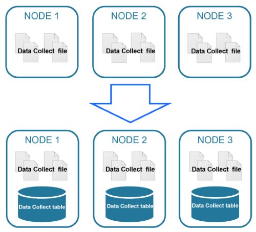
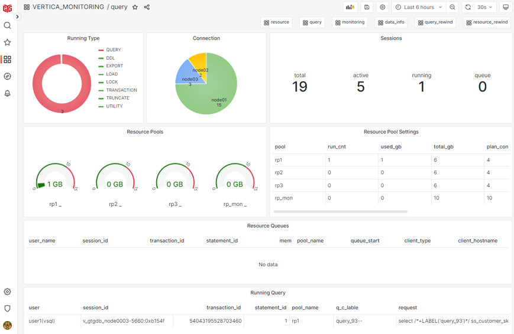

## Vertica 주요 모니터링


## **모니터링 항목**
* **자원 사용 현황**  
Vertica가 사용하는 CPU, Memory, Disk I/O, Network 사용량을 통해 부하 발생 모니터링

* **사용자 session의 load balance 현황**  
 특정 노드로 쿼리가 집중되어 전체 노드가 균등하게 쿼리를 처리하지 못해 성능에 영향을 주는지 모니터링

* **Data Skew 현황**  
 병렬 처리를 하는 Vertica에서 특정 노드가 상대적으로 많은 데이터를 처리하면 성능 저하가 발생하므로 데이터가 고르게 분산되어 저장되고 있는지 모니터링
 
* **OLTP 성격의 빈번한 단건 처리 쿼리 현황**  
 대용량 데이터를 처리하는 데에 최적화되어 있는 Vertica에서 OLTP 성격의 단건 처리를 빈번하게 발생시켜 시스템에 부하를 유발하는 쿼리가 있는지 모니터링

* **사용자 쿼리 분석**  
 장시간 수행되거나 메모리 사용량이 높은 쿼리가 있는지, 실행계획의 COST가 높아 과도한 자원을 사용하는 쿼리가 있는지 모니터링

* **Lock 현황 (Lock Wait Time)**  
 장시간 수행으로 인한 lock time out이 발생할 수 있는 쿼리가 있는지 모니터링

## System Table
Vertica 시스템 테이블은 시스템 리소스, 백그라운드 프로세스, 워크로드 및 성능에 대한 정보를 제공한다.
```sql
select table_schema, table_name, table_description
from system_tables
where table_name in ('nodes', 'tables', 'user_sessions', 'query_requests')
;
 table_schema |   table_name   |     table_description
--------------+----------------+----------------------------
 v_catalog    | tables         | Table information
 v_catalog    | nodes          | Node information
 v_monitor    | user_sessions  | User session history
 v_monitor    | query_requests | User-issued query requests
```  

### 시스템 테이블 유형별 스키마
* **V_CATALOG** : 카탈로그의 영구 개체에 대한 정보 (nodes, tables, projections, grants 등)
* **V_MONITOR** : 일시적인 시스템 상태에 대한 정보 (sessions, query_requests, system_resource_usage 등)  

시스템 테이블 목록은 'SYSTEM_TABLES' 테이블에서 확인 가능하며, 일부는 view 형태로 제공된다.

### ex) v_monitor.user_sessions
```sql
create view "v_monitor"."user_sessions" as
select ss.node_name, ss.user_name, ss.session_id,
       vs.transaction_id,
       vs.statement_id,
       case when drpc.current_runtime_priority = '' then null
           else drpc.current_runtime_priority
       end as "runtime_priority",
       ss.time as session_start_timestamp, se.time as session_end_timestamp,
       (se.time IS NULL) as is_active,
[중략]
from v_internal.dc_session_starts ss
LEFT JOIN v_internal.dc_session_ends se USING (node_name, session_id)
LEFT JOIN v_internal.vs_sessions     vs USING (node_name, session_id)
left join (
     select node_name,session_id,current_runtime_priority,transaction_id 
     from (
         select node_name, session_id, current_runtime_priority, transaction_id
                , row_number() over (partition by node_name, session_id order by time desc) as rn
         from v_internal.dc_runtime_priority_changes
     ) as sq0
     where rn = 1
) as drpc
on (ss.node_name      = drpc.node_name and
    ss.session_id     = drpc.session_id and
    vs.transaction_id = drpc.transaction_id)
 where not ss.is_internal
;

```

## Data Collector Utility
Data Collector Utility는 시스템의 중요한 행위를 기록하고, 성능 정보 및 리소스 활용 카운터를 수집한다.  
수집된 데이터는 Vertica DB의 /catalog 경로의 DataCollector 디렉토리에 파일로 기록된다.  
* 데이터가 파일로 저장되므로 보존 기관을 과도하게 설정하는 경우, /catalog 디스크 공간이 증가하고 시스템 테이블 조회 성능이 저하되므로 적절한 보존 기간 설정이 중요하다.
  
```
]$ cd /catalog/GTGDB/v_gtgdb_node0001_catalog/DataCollector
]$ ls -l *SessionStarts*
-rw-r--r-- 1 vertica verticadba    3142 Nov  3 11:07 COPY_SessionStarts_TABLE.sql
-rw-r--r-- 1 vertica verticadba     933 Nov  3 11:07 CREATE_SessionStarts_TABLE.sql
-rw------- 1 vertica verticadba 1279750 Oct 29 11:40 SessionStarts_20251028T081018.000686Z_GTGDB_v24.4.0-1_v_gtgdb_node0001.log
-rw------- 1 vertica verticadba      85 Oct 29 11:40 SessionStarts_20251028T081018.000686Z_GTGDB_v24.4.0-1_v_gtgdb_node0001.log.json
-rw------- 1 vertica verticadba 1279722 Oct 29 13:08 SessionStarts_20251029T024031.000484Z_GTGDB_v24.4.0-1_v_gtgdb_node0001.log
-rw------- 1 vertica verticadba      85 Oct 29 13:08 SessionStarts_20251029T024031.000484Z_GTGDB_v24.4.0-1_v_gtgdb_node0001.log.json
-rw------- 1 vertica verticadba 1279677 Nov  3 12:04 SessionStarts_20251029T040857.000371Z_GTGDB_v24.4.0-1_v_gtgdb_node0001.log
-rw------- 1 vertica verticadba      85 Nov  3 12:04 SessionStarts_20251029T040857.000371Z_GTGDB_v24.4.0-1_v_gtgdb_node0001.log.json
-rw------- 1 vertica verticadba 1148031 Nov  3 13:24 SessionStarts_20251103T030406.000315Z_GTGDB_v24.4.0-1_v_gtgdb_node0001.log

```

### Data Collector Component
파일로 수집된 데이터는 component 단위로 관리되며, data_collector 시스템 테이블에서 각 component에 대한 설명 및 데이터 보관 사이즈, 보관 기간 등의 정보를 확인할 수 있다.  
*Vertica 메타 함수를 통해 각 component 별 보관 주기 설정
```sql
SELECT component, table_name, description, disk_size_kb, interval_time, current_disk_records, current_disk_bytes, first_time, last_time, kb_per_day 
  FROM DATA_COLLECTOR 
 WHERE component ILIKE 'SessionStarts' 
ORDER BY 1 LIMIT 1 ;
---------------------+------------------------------
component            | SessionStarts
table_name           | dc_session_starts
description          | Sessions started
disk_size_kb         | 5000
interval_time        | 0
current_disk_records | 2449
current_disk_bytes   | 1359893
first_time           | 2024-10-21 18:35:23.00062+09
last_time            | 2024-10-21 19:29:23.001829+09
kb_per_day           | 35339.4697698178
```

### DC(Data Collector) Table
각 component 별 데이터를 확인할 수 있는 테이블이다.
```sql
SELECT *
 FROM dc_session_starts 
ORDER BY time desc
LIMIT 1
;
---------------------------+-----------------------------------------
time                       | 2024-10-21 19:31:33.380841+09
node_name                  | v_oadwdb_node0001
session_id                 | v_oadwdb_node0001-2144:0x1248
user_id                    | 45035996273704962
user_name                  | vertica
client_hostname            | [::1]:57758
client_pid                 | 18892
client_label               | zzzz
client_type                | vsql
client_version             | 12.00.0429
client_os                  | Linux 3.10.0-1160.88.1.el7.x86_64 x86_64
client_os_user_name        | vertica
client_os_hostname         | eon13
ssl_state                  | None
tls_version                |
ssl_client_subject         | (anonymous)
ssl_client_fingerprint     |
ssl_ca_subject             |
ssl_ca_fingerprint         |
authentication_method      | Password
client_authentication_name | default_hash_local
is_internal                | f
requested_protocol         | 3.14
effective_protocol         | 3.14
session_type               | CLIENT
is_binary_transfer         | f
```

## 모니터링을 위한 효율적인 Data Collector 테이블 장기 보관 방안
  
일정 기간이 지나면 사라지는 DC 테이블 데이터를 장기간 보관하기 위해, 별도의 영구 테이블에 보관하여 모니터링 및 분석시 사용할 수 있다.

### 영구 테이블 보관 작업 및 정리 작업
1. 모니터링 시 필요한 주요 DC 테이블을 선별하고, 선별된 테이블의 보관 기간을 설정한다.
2. 선별된 주요 DC 테이블과 동일한 구조의 영구 테이블 생성한다.
3. 생성된 영구 테이블에 DC 테이블의 정보를 주기적으로 복제한다.
4. 보관 기간 경과한 영구 테이블의 데이터도 주기적으로 삭제한다.

## Label을 활용한 효율적인 운영 및 모니터링
Label 설정을 통해 session 및 쿼리 식별을 용이하게 할 수 있다.

### 운영 중 발생할 수 있는 상황
* 이상 징후가 있는 세션의 업무를 식별할 수 없는 상황
* 메모리를 과도하게 사용하는 쿼리의 업무를 식별해야 하는 상황
* 지난주와 오늘 수행한 쿼리의 성능을 비교해야 하는 상황  

### **Session Label 설정**  
* Vertica 접속시 Option or Property 설정  
* SESSIONS 시스템 테이블의 client_label 컬럼으로 식별

|    접속 방법     |                             설명                             |
|:-------------:|-------------------------------------------------------------|
|   vsql 접속   | vsql environment variables 설정: export VSQL_CLIENT_LABEL=query1<br>vsql 옵션 : -g 'query1' or --label 'query1’ |
|   jdbc 접속   | Label 속성 지정(Default: jdbc-driver-version-random_number)     |
|   odbc 접속   | Label / Session Label 속성 지정                                 |
|  ado.net 접속 | Label 속성 지정                                                 |
|  python 접속  | session_label 속성 지정                                         |

### **Query Label 설정**  
* SQL 구문에 Label 힌트를 사용해서 설정  
* QUERY_REQUESTS 시스템 테이블의 request_label 컬럼으로 식별

|                                     SQL                                       | 
|-------------------------------------------------------------------------------| 
| **SELECT** /\*+LABEL('query1')\*/ col FROM TEST1;                             | 
| **INSERT** /\*+LABEL('query1')\*/ INTO TEST1 SELECT col1 FROM TEST2;          | 
| **UPDATE** /\*+LABEL('query1')\*/ TEST1 SET col1=2;                           | 
| **DELETE** /\*+LABEL('query1')\*/ FROM TEST1 WHERE col1=3;                    | 
| **MERGE** /\*+LABEL('query1')\*/ INTO TEST1 a USING TEST2 b ON a.col1=b.col1; | 
| **COPY** TEST FROM LOCAL '\<file_path>' STREAM NAME 'test_load_1';            | 

## Grafana를 활용한 모니터링
지티지는 Vertica 구축과 기술 지원을 통해 쌓아온 풍부한 경험을 바탕으로, Grafana를 활용한 Vertica 모니터링 솔루션을 제공합니다.  
본 솔루션은 시스템 성능과 쿼리 현황을 직관적으로 시각화하여 안정적인 운영을 지원합니다.  
  
