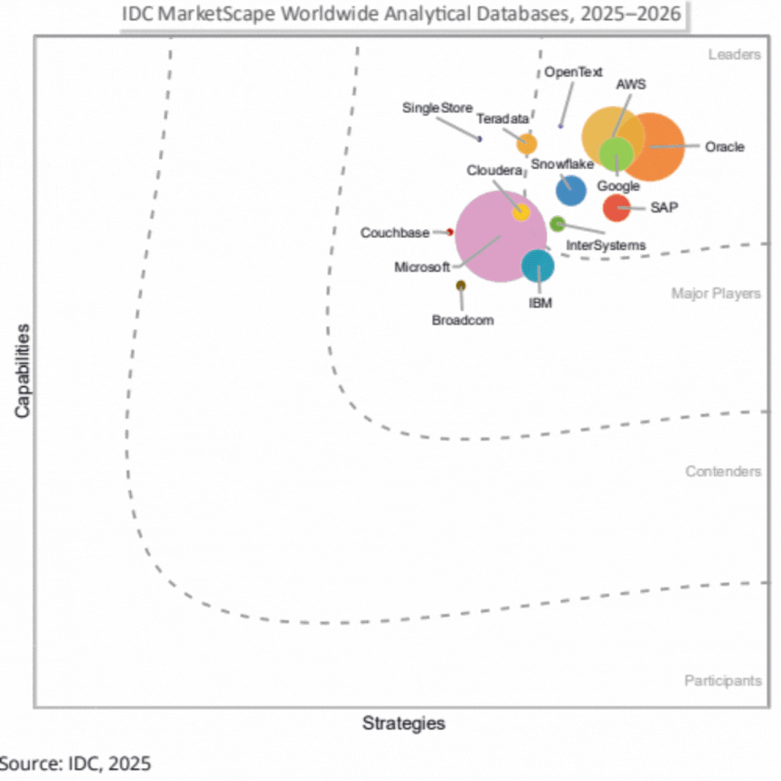

## IDC MarketScape Worldwide Analytical Databases
IDC MarketScape는 글로벌 시장 조사 기관인 IDC(International Data Corporation)가 특정 IT 산업 분야의 공급업체(Vendor)들을 평가하여 시각화한 분석 모델입니다.

'2025 IDC MarketScape Worldwide Analytical Databases' 분야에서 
**Vertica 기술은 OpenText의 포트폴리오 내에서 OpenText Analytics Database(Vertica)** 라는 명칭으로 평가되고 있으며, 
OpenText는 이번 평가에서 **리더(Leaders)** 카테고리에 선정되었습니다.

OpenText Analytics Database(Vertica)는 신생 클라우드 기업들의 거센 도전 속에서도
+ **성능의 안정성**
+ **하이브리드 환경의 유연성**

이라는 독보적인 가치를 지키고 있습니다.
특히 전략(가로축) 면에서 클라우드 최적화를 지속하고 있으며, 역량(세로축) 면에서는 수십 년간 검증된 분산 처리 기술을 보유하고 있습니다.

## Vertica가 리더(Leaders)카테고리에 선정된 핵심 내용

### 1. 개요 및 기술적 특징
+ **핵심 제품**: OpenText Analytics Database(Vertica)는 분산형 컬럼 기반의 MPP(Massively Parallel Processing) 아키텍처를 기반으로 합니다.
+ **지원 데이터**: 정형, 반정형(semi-structured), 시계열(time-series) 워크로드를 지원하며 복잡한 분석 작업에서도 예측 가능한 성능을 제공합니다.
+ **주요 기능**: 고급 인코딩 및 압축 기술을 통한 스토리지 효율화, 컴퓨팅과 스토리지의 분리, 인데이터베이스(in-database) 머신러닝 등을 지원합니다,.
+ **배포 유연성**: 온프레미스, 프라이빗 클라우드, 주요 퍼블릭 클라우드뿐만 아니라 Kubernetes를 통한 컨테이너화된 배포까지 지원하여 하이브리드 및 멀티클라우드 전략에 적합합니다.

### 2. 주요 강점 (Strengths)
+ **엔터프라이즈급 성능 및 확장성**: 페타바이트 규모의 배포 환경에서도 높은 동시성(concurrency)과 복잡한 쿼리 처리를 지원하며 성능 저하 없이 분석 요구사항을 충족합니다.
+ **스토리지 효율성 및 비용 절감**: 고급 압축 기술을 적용하여 스토리지 요구량을 줄이면서도 스캔 성능을 가속화하며, 이는 대규모 데이터셋을 다루는 기업의 총소유비용(TCO) 절감에 기여합니다.
+ **하이브리드 환경 최적화**: 온프레미스와 클라우드 간의 이식성을 제공하여, 규제 준수가 필요한 산업군에서 데이터 거버넌스를 유지하며 점진적으로 현대화할 수 있도록 돕습니다.

### 3. 고려해야 할 과제 (Challenges)
+ **최적화의 복잡성**: 자동화 중심의 클라우드 네이티브 플랫폼과 달리, 최고의 성능을 내기 위해서는 스키마 설계, 파티셔닝, 튜닝 등에 대한 전문적인 지식과 관리가 요구됩니다.
+ **소규모 도입 시 비용 효율성**: 대규모 데이터 처리에 최적화되어 있어, 데이터 요구량이 적거나 변동성이 큰 소규모 조직의 경우 소비 기반(consumption-based) 클라우드 서비스보다 비용 부담이 클 수 있습니다.
+ **피크 부하 관리**: 높은 동시성을 지원하지만, 극한의 접속 상황에서 안정적인 성능을 유지하려면 신중한 워크로드 관리와 리소스 구성이 필요합니다,.

### 4. 도입 권장 대상 
IDC는 대규모의 복잡한 분석 워크로드를 관리해야 하며, 강력한 성능과 효율적인 스토리지 경제성, 그리고 하이브리드 배포의 유연성이 최우선인 기업에게 OpenText Analytics Database를 고려할 것을 권장합니다,. 특히 규제 준수가 중요한 산업이나 대용량 데이터셋을 관리하는 조직에 적합한 선택지입니다.

위 내용은 [IDC MarketScape: Worldwide Analytical Databases 2025–2026 Vendor Assessment] 보고서를 Google NotebookLM을 기반으로 정리하였습니다.
