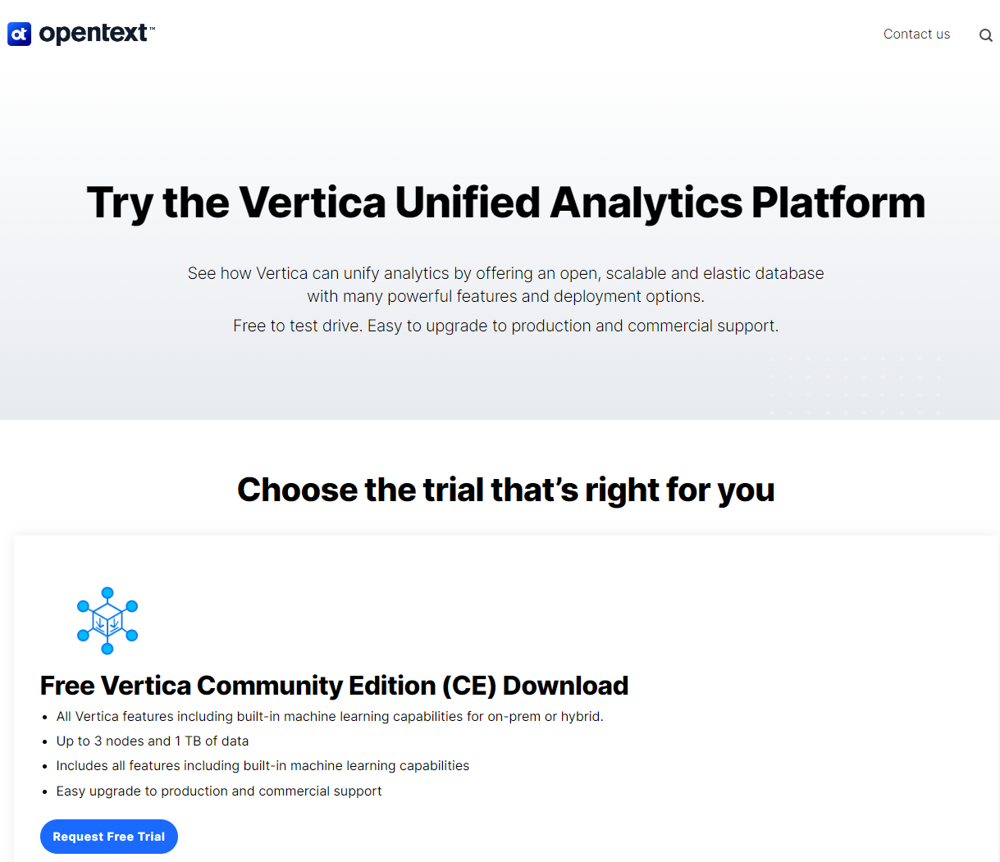
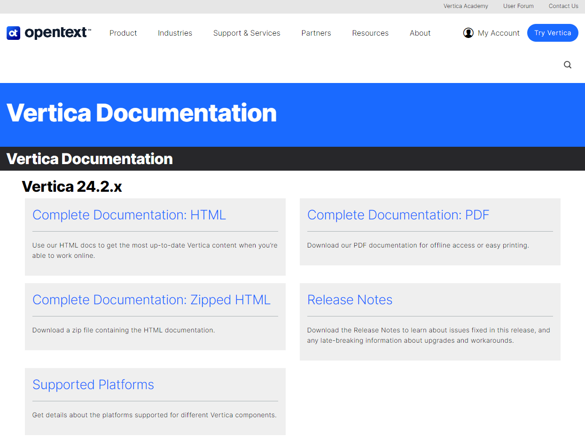

## 버티카 브랜드
버티카는 몇번의 인수합병에도 독자적인 브랜드 이름을 지속적으로 유지하고 있다.  
또한 인수합병이 이루어 지면서도 [www.vertica.com](https://www.vertica.com){:target="_blank"}  이라는 독자적인 홈페이즈를 유지하고 있다.  
  

## 버티카 홈페이지
[www.vertica.com](https://www.vertica.com){:target="_blank"} 버티카에 대한 다양한 정보를 확인 할 수 있다.  
  

## Vertica Community edition  
[www.vertica.com/try/](https://www.vertica.com/try/){:target="_blank"}  
버티카를 직접 설치 또는 설치되어 있는 VM을 다운받아 사용해 볼수 있다.(로그인 필요)  
data size 1TB, 3노드 환경까지는 Community edition으로 테스트 해 볼 수 있다.  
  

## Vertica documentation
[www.vertica.com/documentation/vertica/all/](https://www.vertica.com/documentation/vertica/all/){:target="_blank"}  
버티카 각 버전별 메뉴얼등을 확인 할 수 있다.  
  

## Vertica knowledge base
[www.vertica.com/knowledgebase/](https://www.vertica.com/knowledgebase/){:target="_blank"}  
버티카에 대한 다양한 지식을 얻을 수 있다.  
  

## Vertica blog
[blogs.opentext.com/?s=vertica](https://blogs.opentext.com/?s=vertica){:target="_blank"}  
  

