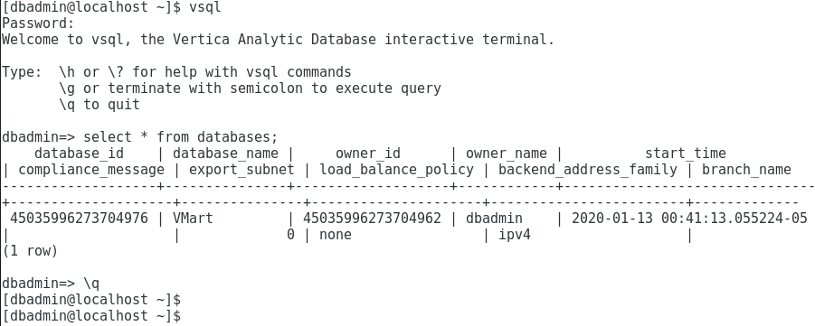
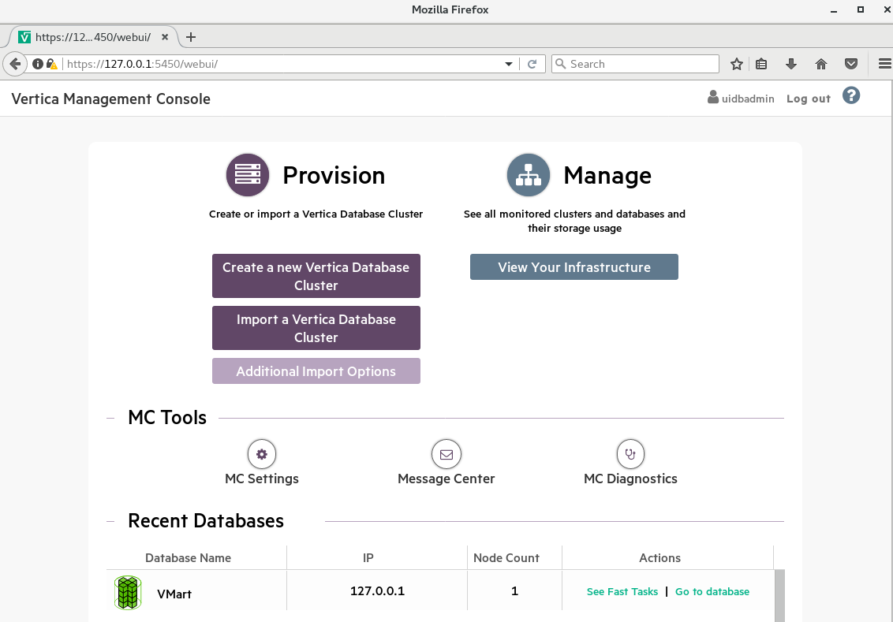
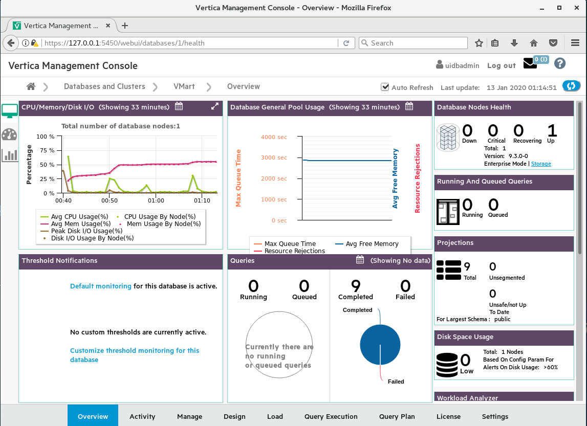

[xxxxx](https://xxxxx){:target="_blank"}

## 버티카 community edition 사용하기  
[www.vertica.com/download/vertica/community-edition/](https://www.vertica.com/download/vertica/community-edition/){:target="_blank"}에 접속해 보면, 아래와 같이 3가지 type으로 community edition을 사용해 볼 수 있다.  
> type1 - 원하는 Linux 운영 체제에서 Vertica Server 다운로드 및 설치  
> type2 - Vertica Community Edition 및 Management Console이 설치 및 구성되고 샘플 데이터베이스 및 예제 쿼리가 사전 로드된 VM 환경  
> type3 - public cloud(AWS, Azure, Google Cloud Platform)에서 사용하기 위한 가이드  

## VM환경에 구성된 버티카 사용
빠른게 vertica를 사용해 보기 위해 type2의 VM환경을 사용해 보겠다. PC에 VMware Workstation Player를 설치하기 바람.  

### 환경 설정
1. vertica.com에 회원 가입 후 로그인(버티카 community edition을 다운 받기 위해서는 로그인이 필요함)  
2. 홈페이지에서 Product > Downloads > Community Edition 에 접속 (https://www.vertica.com/download/vertica/community-edition/)  
3. 화면 중간에 [Community Edition 9.3.0 Virtual Machine]에서 자신이 원하는 VM 파일을 다운로드(여기서는 [VMware VMX file format] 사용)  
4. 다운 받은 파일을 압축 해제  
5. VMware Workstation Player에서 Player > File > Open > [압축 해제한 vmx파일 선택]  
6. VMware Workstation Player 목록에서 선택한 vmx파일을 확인하고 더블 클릭  

위와 같이 설정하면 VM환경에서 버티카를 사용할 수 있는 환경은 구성이 된다.  

### 버티카 접속
VM에 접속하면 로그인을 위해 2가지 계정이 보인다.  
> uidbadmin 사용자(uidbadmin) - Management Console 사용을 위한 계정  
> Vertica DBA 사용자(dbadmin) - Vertica admin계정  

두계정 모두 패스워드는 password 이다.(root계정도 동일함)  

Vertica DBA 사용자(dbadmin)계정에 로그인 후 바탕화면에서 마우스 오른쪽 버튼을 클릭하여 Open Terminal 메뉴를 선택하고, cmd창에 vsql 를  입력한 후 password를 물어보면 password를 입력하면 vertica에 접속이 된다.  
아래와 같이 vsql에서 쿼리를 수행해 보면 결과가 나올 것이다.  

```sql
select * from databases;
--database명과 database 시작 시간등을 확인 할 수 있다.
```
  
vsql을 빠져 나오기 위해서는 \q를 입력하면 된다.  

  


### 버티카 모니터링하는 Management Console(MC) 접속
VM환경의 브라우저에서 https://127.0.0.1:5450 으로 접속하면 MC 로그인 화면이 나온다.
uidbadmin/password로 로그인을 하면 모니터링을 위해 등록되어진 VMart를 볼수 있다.
  

VMart를 클릭하면 모니터링 화면으로 이동한다.
  


