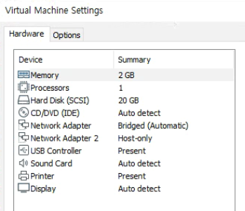
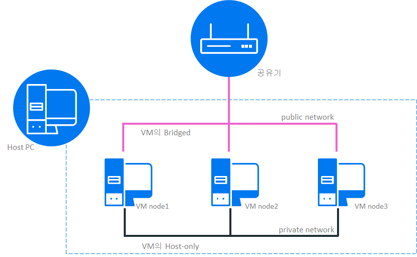

## 버티카 3 node 구성
VMware환경에서 버티카 cluster 구성을 아래와 같이 진행한다.  
**<font color="red">이 구성은 버티카 실습을 위한 목적이므로 최소한에 설정만 했음.</font>**  

+ 리눅스 vm 3대 설치
+ 버티카 설치를 위한 환경 설정  
+ 버티카 rpm설치
+ 버티카 cluster 구성
+ 버티카 DB생성

### 리눅스 vm 3대 설치
버티카는 리눅스 기반에서만 구동되며, 해당 포스트에서는 VMWare Workstation 15 Player를 사용해서 linux centos 7 버전을 설치 했다.  
버티카가 지원하는 OS 및 버전 정보는 [이곳에서](https://www.vertica.com/docs/9.3.x/HTML/Content/Authoring/SupportedPlatforms/MCandServer.htm?tocpath=Vertica%209.3.x%20Supported%20Platforms%7C_____1){:target="_blank"} 확인 가능하다.  
이 포스트에서는 하나의 vm에 리눅스를 설치한 후 vm파일을 복사해서 vm 3대를 준비했다. vm파일 복사 후에는 반드시 network adapter의 MAC Address를 다시 한번 generate하여 MAC Address 충돌이 발생하지 않게 해야한다.  



|H/W       |설정    |
|:--------:|:----------------|
|memory    |2 GB |
|cpu       |1 core  |
|disk      |20GB |
|네트워크 구성 |public network : bridged <br>private network : host-only|
  


버티카 구성시 네트워크 환경은 client를 위한 public network, 버티카 cluster간에 사용되는 private network로 구성된다.
VMWare 네트워크 설정의 Network connection을 [Bridged] - public network, [Host-only] - private network으로 설정한다.


### 버티카 설치를 위한 환경 설정 (각 node별로 작업 필요)
**호스트명(as root)**  
vnode1, vnode2, vnode3로 각각 변경  

**네크워크(as root)**  
private network 인터페이스 IP를 가각 1.1.1.1, 1.1.1.2, 1.1.1.3으로 설정한다.
public network 인터페이스 IP를 DHCP로 자동 할당하여도 무방하나, IP가 변경될 수 있으므로 고정IP 설정을 하기 바란다.

**/etc/hosts파일에 노드 등록(as root)**  
```bash
1.1.1.1 vnode1  
1.1.1.2 vnode2  
1.1.1.3 vnode3  
```
  
  
**SELinux 비활성화(as root)**  
```bash
#[영구반영 제부팅 필요] 
vi /etc/selinux/config
SELINUX=disabled

#[즉시반영]
setenforce 0

#[SELinux 비활성화check]
getenforce
```

**Swappiness 설정(as root)**  
```bash
#[영구반영 제부팅 필요]
vi /etc/sysctl.conf  
vm.swappiness = 1  

#[즉시반영]
sysctl vm.swappiness=1

#[Swappiness 설정check]
sysctl vm.swappiness
```

**방화벽(as root)**  
```bash
#[setting]  
yum install -y firewalld  
systemctl mask firewalld  
systemctl disable firewalld  
systemctl stop firewalld  

#[check]  
rpm -qa | grep firewalld  
systemctl status firewalld.service  
```

**패키지 설치(as root)**  
```bash
yum install gdb
yum install mcelog
yum install sysstat
yum install openssh
yum install which
yum install dialog
```

**각노드별 ssh 연결 확인(as root)**  
```bash
ssh 1.1.1.1
ssh 1.1.1.2
ssh 1.1.1.3
```

**user생성 및 환경변수 등록 및 디렉토리 생성(as root)**  
dbadmin계정의 group및 user를 생성한다.(verticadba/dbadmin)
```bash
/usr/sbin/groupadd -r verticadba
/usr/sbin/useradd -r -m -s /bin/bash -g verticadba dbadmin
passwd dbadmin #dbadmin의 password를 password로 설정
```

**dbadmin계정의 .bash_profile에 환경변수 등록(as dbadmin)**  
```bash
cd ~
echo "export TZ="Asia/Seoul"" >> .bash_profile
echo "export LANG=en_US.UTF-8" >> .bash_profile
```

**디렉토리 생성(as root)**  
버티카 catalog 정보 저장을 위한 /catalog, 데이터 저장을 한 /data 디렉토리 생성 및 dbadmin계정으로 소유자 및 그룹을 변경한다.
```bash
mkdir /data 
mkdir /catalog 
chown dbadmin:verticadba /data
chown dbadmin:verticadba /catalog
```

### 버티카 rpm설치(vnode1에서 진행)
**rpm 설치 (as root)**  
각 노드의 /tmp에 버티카 설치 rpm 복사. 버티카 설치 rpm은 <https://www.vertica.com/download/vertica/community-edition/>{:target="_blank"} 에서 다운 받을 수 있다.  
```bash
rpm -Uvh /tmp/vertica-9.3.1-0.x86_64.RHEL6.rpm
```

### 버티카 cluster 구성
**install vertica 설치 (as root)**  
vnode1에서 아래과 같이 install_vertica를 실행하면, 버티카 rpm이 설치되지 않은 vnode2, vnode3에 rpm이 설치된다.
-u, -p옵션은 버티카는 실행하는 OS의 계정으로 미리 생성되지 않은 경우에는 지정된 옵션으로 생성되며, 미리 생성하였다면 생성한 계정 정보를 입력해야 한다.
자세한 옵션은 [여기](https://www.vertica.com/docs/9.3.x/HTML/Content/Authoring/InstallationGuide/InstallingVertica/InstallVerticaScript.htm?zoom_highlight=admintools%20option){:target="_blank"}에서 확인 할 수 있다. 
```bash
/opt/vertica/sbin/install_vertica -s vnode1,vnode2,vnode3 -r /tmp/vertica-9.3.1-0.x86_64.RHEL6.rpm -u dbadmin -p password --point-to-point
```

### 버티카 DB생성
**버티카 DB 생성(as dbadmin계정)**  
admintools를 이용해서 버티카 클러스터 상태 및 DB 기동/중지등의 DB에 대한 작업을 수행 할수 있다.
자세한 옵션은 [여기](https://www.vertica.com/docs/9.3.x/HTML/Content/Authoring/AdministratorsGuide/AdminTools/WritingAdministrationToolsScripts.htm?tocpath=Administrator%27s%20Guide%7CUsing%20the%20Administration%20Tools%7CAdministration%20Tools%20Reference%7C_____6){:target="_blank"}에서 확인 할 수 있다. 
```bash
/opt/vertica/bin/admintools -t view_cluster
--라이센스 동의 accept

--DB명을 test_db로 지정하고, data저장 디렉토리는 /data, catalog저장 디렉토리는 /catalog, DB접속을 위한 dbadmin계정의 password는 password로 DB생성
admintools -t create_db --database=test_db --data_path=/data --catalog_path=/catalog --password=password --hosts=vnode1,vnode2,vnode3
```

**vsql접속(as dbadmin계정)**  
버티카 DB에 접속하는 vsql 유틸리티는 SQL 문을 입력하고 결과를 볼 수 있는 텍스트 기반의 대화형 front-end 유틸리티다. 또한 스크립트 작성 및 다양한 작업 자동화를 용이하게 하는 여러 가지 메타 명령과 다양한 쉘 유사 기능을 제공합니다. 자세한 옵션은 [여기](https://www.vertica.com/docs/9.3.x/HTML/Content/Authoring/ConnectingToVertica/vsql/CommandLineOptions.htm){:target="_blank"}에서 확인 할 수 있다. 
```bash
vsql -wpassword
```
