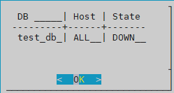
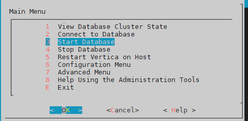
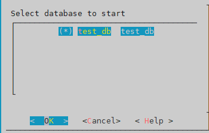
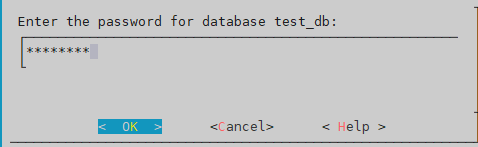
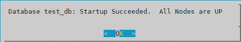
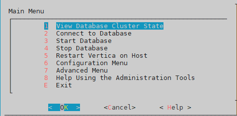
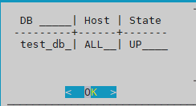
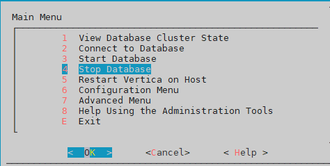
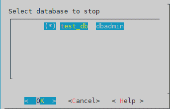
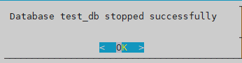

## 버티카 기동 및 중지
버티카 기동 및 중지를 하기 위해서는 dbadmin계정으로 버티카 서버에 접속 후 아래와 같은 방식으로 하는 방식은 아래와 같다.  
+ admintools GUI환경
+ admintools CLI환경
+ shutdown() 함수 사용해서 버티카 중지


## admintools GUI환경

### admintools GUI환경에서 버티카 기동  
**데이터베이스 cluster 상태 확인**  





**버티카 기동**  



**데이터베이스 선택**  



**데이터베이스 패스워드 입력**  


**데이터베이스 기동 완료**  



**데이터베이스 cluster 상태 확인**  





### admintools GUI환경에서 버티카 중지
**버티카 중지**  



**데이터베이스 선택**  






## admintools CLI환경

### admintools CLI환경에서 버티카 기동
```shell
#버티카 cluster 상태 확인
[dbadmin@vnode1 ~]$ admintools -t view_cluster
DB      | Host | State
---------+------+-------
test_db | ALL  | DOWN

#버티카 기동
[dbadmin@vnode1 ~]$ admintools -t start_db -d test_db
Info: no password specified, using none
        Starting nodes:
                v_test_db_node0001 (1.1.1.1)
                v_test_db_node0002 (1.1.1.2)
                v_test_db_node0003 (1.1.1.3)
        Starting Vertica on all nodes. Please wait, databases with a large catalog may take a while to initialize.
        Node Status: v_test_db_node0001: (DOWN) v_test_db_node0002: (DOWN) v_test_db_node0003: (DOWN)
        Node Status: v_test_db_node0001: (DOWN) v_test_db_node0002: (DOWN) v_test_db_node0003: (DOWN)
        Node Status: v_test_db_node0001: (DOWN) v_test_db_node0002: (DOWN) v_test_db_node0003: (DOWN)
        Node Status: v_test_db_node0001: (DOWN) v_test_db_node0002: (DOWN) v_test_db_node0003: (DOWN)
        Node Status: v_test_db_node0001: (UP) v_test_db_node0002: (UP) v_test_db_node0003: (UP)
Database test_db: Startup Succeeded.  All Nodes are UP
```

**데이터베이스 cluster 상태 확인**  
```shell
#버티카 cluster 상태 확인
[dbadmin@vnode1 ~]$ admintools -t view_cluster
DB      | Host | State
---------+------+-------
test_db | ALL  | UP
```

**버티카 접속 확인**  
```shell
#버티카 접속
[dbadmin@vnode1 ~]$ vsql -wpassword
Welcome to vsql, the Vertica Analytic Database interactive terminal.

Type:  \h or \? for help with vsql commands
       \g or terminate with semicolon to execute query
       \q to quit
dbadmin=> \q
```

### admintools CLI환경에서 버티카 중지
```shell
#버티카 중지
[dbadmin@vnode1 ~]$ admintools -t stop_db -d test_db -p password
Database test_db stopped successfully

#버티카 cluster 상태 확인
[dbadmin@vnode1 ~]$ admintools -t view_cluster
DB      | Host | State
---------+------+-------
test_db | ALL  | DOWN
```


## shutdown() 함수 사용해서 버티카 중지
shutdown()함수는 DB admin 사용자(dbadmin) 계정으로만 가능하다.  

**버티카 기동**  
```shell
#버티카 기동
[dbadmin@vnode1 ~]$ admintools -t start_db -d test_db
Info: no password specified, using none
        Starting nodes:
                v_test_db_node0001 (1.1.1.1)
                v_test_db_node0002 (1.1.1.2)
                v_test_db_node0003 (1.1.1.3)
        Starting Vertica on all nodes. Please wait, databases with a large catalog may take a while to initialize.
        Node Status: v_test_db_node0001: (DOWN) v_test_db_node0002: (DOWN) v_test_db_node0003: (DOWN)
        Node Status: v_test_db_node0001: (DOWN) v_test_db_node0002: (DOWN) v_test_db_node0003: (DOWN)
        Node Status: v_test_db_node0001: (DOWN) v_test_db_node0002: (DOWN) v_test_db_node0003: (DOWN)
        Node Status: v_test_db_node0001: (INITIALIZING) v_test_db_node0002: (INITIALIZING) v_test_db_node0003: (INITIALIZING)
        Node Status: v_test_db_node0001: (UP) v_test_db_node0002: (UP) v_test_db_node0003: (UP)
Database test_db: Startup Succeeded.  All Nodes are UP
```

**버티카 접속 후 shutdown()함수로 DB중지**  
```shell
#버티카 접속
[dbadmin@vnode1 ~]$ vsql -w password
Welcome to vsql, the Vertica Analytic Database interactive terminal.

Type:  \h or \? for help with vsql commands
       \g or terminate with semicolon to execute query
       \q to quit

--버티카 중지
dbadmin=> select shutdown();
          shutdown
----------------------------
Shutdown: moveout complete
(1 row)

dbadmin=> \q

#버티카 cluster 상태 확인
[dbadmin@vnode1 ~]$ admintools -t view_cluster
DB      | Host | State
---------+------+-------
test_db | ALL  | DOWN
```

