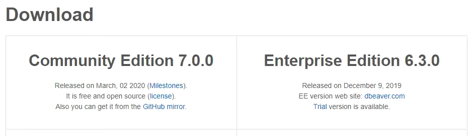
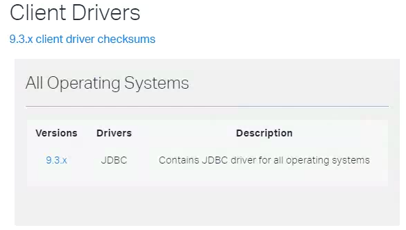
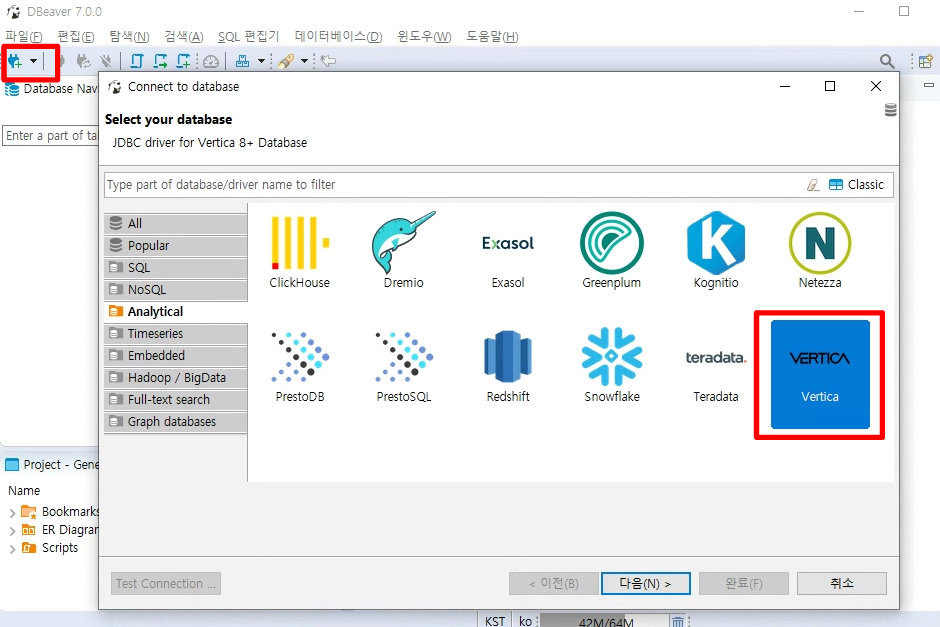
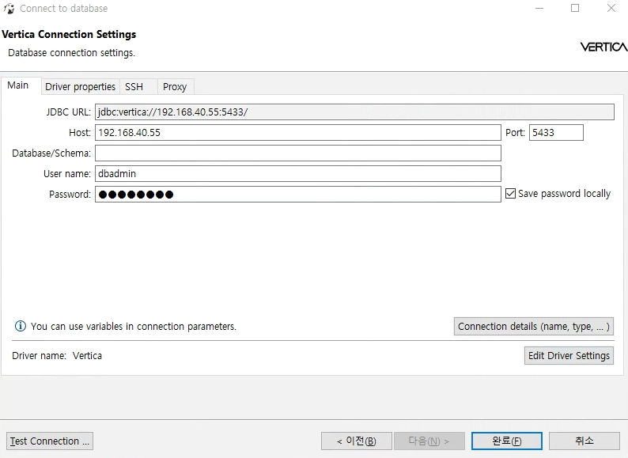
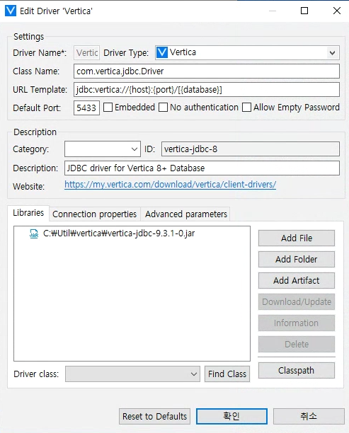
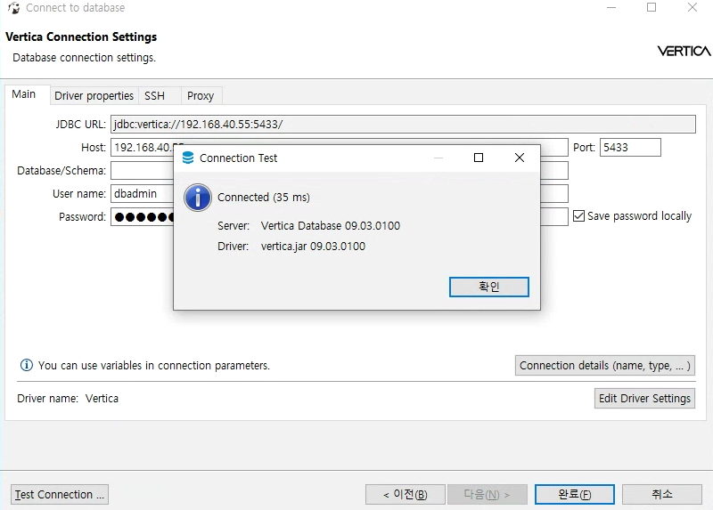
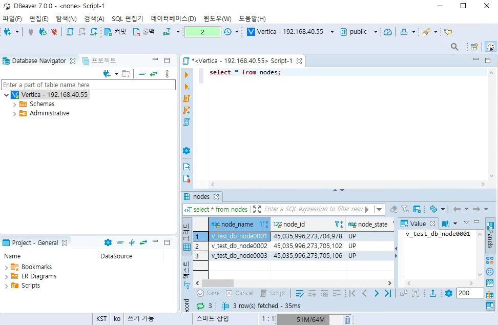
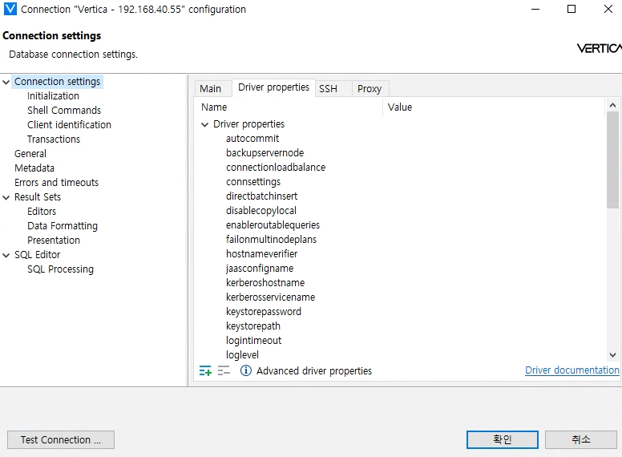

## DBeaver tool 설정
DBeaver는 무료 tool임에도 불구하고 다중 플랫폼 데이터베이스를 지원한다. vertica는 물론 MySQL, PostgreSQL, SQLite, Oracle, DB2, SQL Server, Sybase, MS Access, Teradata, Firebird, Apache Hive, Phoenix, Presto등 널리 사용되는 모든 데이터베이스를 지원한다.  

## DBeaver 다운로드 및 설치
DBeaver는 무료버전인 Community Edition와 상용버전인 Enterprise Edition이 있다. Community Edition 기능만으로도 사용하는데 충분하므로 <https://dbeaver.io/download/>에 접속하여 DBeaver Community Edition(무료)을 다운 받아서 설치를 진행하면 된다.  

## 버티카 jdbc드라이버 다운로드
<https://www.vertica.com/download/vertica/client-drivers/>에 접속하여 버티카 JDBC 드라이버를 다운 받는다.  

## DBeaver 설정
DBeaver에 데이터베이스 연결 설정 방법은 아래와 같다.  

1.새 데이터베이스 연결 버튼을 클릭하면 아래와 같이 데이터베이스 선택하는 화면이 나온다. 좌측에 Analytical에 Vertica를 선택한다.  

2.버티카 연결 설정 창에서 아래와 같은 정보를 입력한다.  
Host : 버티카 접속 IP  
Port : 버티카 기본 port **5433**  
User name : 버티카 접속 사용자 계정  
Password : 패스워드  

3.버티카 연결 설정 창의 하단에 Edit Driver Settings 버튼을 클릭해서 다운 받은 버티카 JDBC드라이버를 설정 후 확인 버튼을 클릭한다.  

4.JDBC드라이버 설정이 완료 되었으면 버티카 연결 설정 창의 하단에 Test Connection버튼을 클릭해서 버티카 접속이 성공적으로 되었는지 확인후 완료 버튼을 클릭해서 설정을 완료한다.  

5.설정이 완료되면 좌측에 등록한 버티카 서버가 보인다. 등록된 버티카 서버에서 우측 마우스 버튼을 클릭해서 SQL편집기를 선택한다.  
우측에 SQL편집기가 열리면, sql쿼리를 입력해서 결과가 나오는지 확인한다.  

6.driver 속성 변경이 필요한 경우 등록된 버티카 서버에서 우측 마우스 버튼을 클릭해서 Edit Connection 버튼을 클릭한 후 Driver properties 탭에 들어가서 driver 속성을 설정하시면 된다.  

