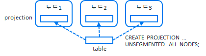
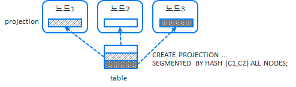

## 정렬(projection order by)
projection 생성시 order by 설정은 데이터 저장시 어떤 정렬로 데이터를 저장 할 것인지를 설정한다. 또한 옵티마이저가 최적에 projection을 선택 할 때 order by 설정이 어떻게 되어 있느냐에 따라서 projection을 선택한다.  
아래 예제는 order by 설정을 다르게 해서 생성한 2개의 projection이 쿼리에 따라서 옵티마이저가 어느 projection을 선택하고 있는지 확인 할 수 있다. 
또한 projection의 order by 설정은 오름차순(asc)으로 만 지정되므로 내림차순(desc)으로 조회하면 옵티마이저는 내림차순으로 정렬하는 단계가 추가 된다.  
get_projection_sort_order()함수 또는 projection_columns테이블에 sort_position컬럼을 통해 projection의 order by 설정을 확인 할 수 있다.  

```sql
dbadmin=> drop table if exists t4 cascade;
DROP TABLE
dbadmin=> create table t4(col1 int, col2 int);
CREATE TABLE

--segment key 지정 col1, order by 지정은 col1
dbadmin=> create projection t4_tune1 as select t4.col1, t4.col2 from t4 order by t4.col1 segmented by hash(t4.col1) all nodes;
CREATE PROJECTION

--segment key 지정 col1, order by 지정은 col1
dbadmin=> create projection t4_tune2 as select t4.col1, t4.col2 from t4 order by t4.col2 segmented by hash(t4.col1) all nodes;
CREATE PROJECTION

--데이터 insert
dbadmin=> insert into t4 values(100, 33);
dbadmin=> insert into t4 values(200, 22);
dbadmin=> insert into t4 values(600, 11);
dbadmin=> commit;
COMMIT

--projection확인 
dbadmin=> select anchor_table_name, projection_name from projections where anchor_table_name = 't4' order by 1, 2;
anchor_table_name | projection_name
-------------------+-----------------
t4                | t4_tune1_b0
t4                | t4_tune1_b1
t4                | t4_tune2_b0
t4                | t4_tune2_b1
(4 rows)

--col1로 정렬해서 t4 테이블 조회시 t4_tune1 projection사용
--t4 테이블 조회를 col1를 오룸차순으로 조회시 t4_tune1 projection사용
dbadmin=> explain select * from t4 order by col1 ;
------------------------------
QUERY PLAN DESCRIPTION:
------------------------------
explain select * from t4 order by col1 ;
Access Path:
+-STORAGE ACCESS for t4 [Cost: 403, Rows: 10K (NO STATISTICS)] (PATH ID: 2)
|  Projection: public.t4_tune1_b0
|  Materialize: t4.col1, t4.col2
|  Execute on: All Nodes

--t4 테이블 조회를 col1를 내림차순으로 조회시 t4_tune1 projection 사용하고, 내림차순으로 다시 정렬하는 처리가 추가됨.
dbadmin=> explain select * from t4 order by col1 desc;
------------------------------
QUERY PLAN DESCRIPTION:
------------------------------
explain select * from t4 order by col1 desc;
Access Path:
+-SORT [Cost: 423, Rows: 10K (NO STATISTICS)] (PATH ID: 1)
|  Order: t4.col1 DESC
|  Execute on: All Nodes
| +---> STORAGE ACCESS for t4 [Cost: 403, Rows: 10K (NO STATISTICS)] (PATH ID: 2)
| |      Projection: public.t4_tune1_b0
| |      Materialize: t4.col1, t4.col2
| |      Execute on: All Nodes

--t4 테이블 조회를 col2를 오룸차순으로 조회시 t4_tune2 projection사용
dbadmin=> explain select * from t4 order by col2;
------------------------------
QUERY PLAN DESCRIPTION:
------------------------------
explain select * from t4 order by col2;
Access Path:
+-STORAGE ACCESS for t4 [Cost: 403, Rows: 10K (NO STATISTICS)] (PATH ID: 2)
|  Projection: public.t4_tune2_b0
|  Materialize: t4.col2, t4.col1
|  Execute on: All Nodes
```

## 복제(Replication - unsegmented projection)
projection의 unsegmented 설정은 모든 노드들이 동일한 데이터 복사본을 가지고 있다는 것이다.
각 노드에 데이터를 저장하므로 join이 로컬에서 일어나 조인 성능을 높일 수 있다.
dimension 테이블과 같은 작은 테이블에 쓰이며, 10만건 이하의 테이블은 unsegmented projection으로 사용하면 조인시 유용하다.



아래 예제는 unsegmented projection과 segmented projection을 비교한다.
unsegmented projection은 각 노드별로 생성되지만, segmented projection은 노드별 생성이 아닌 buddy projection을 가지고 생성이 된다.(k-safety 1적용시)

```sql
dbadmin=> drop table if exists t8, t9;
DROP TABLE

--unsegmented projection 생성
dbadmin=> create table t8 (col1 int , col2 int) unsegmented all nodes;
CREATE TABLE

--segmentd projection 생성
dbadmin=> create table t9(col1 int, col2 int) order by col1 segmented by hash(col1) all nodes;
CREATE TABLE

--projection테이블에서 unsegmented projection와 segmented projection 비교
dbadmin=> select anchor_table_name, projection_name, node_name, is_segmented, segment_expression from projections where anchor_table_name in ('t8', 't9') order by 1,2,3;
anchor_table_name | projection_name |     node_name      | is_segmented | segment_expression
-------------------+-----------------+--------------------+--------------+--------------------
t8                | t8_super        | v_test_db_node0001 | f            |
t8                | t8_super        | v_test_db_node0002 | f            |
t8                | t8_super        | v_test_db_node0003 | f            |
t9                | t9_b0           |                    | t            | hash(t9.col1)
t9                | t9_b1           |                    | t            | hash(t9.col1)
(5 rows)

```


## 분산(Segmentation - segmented projection)
projection의 segmented key설정은 데이터를 분산하는 key를 설정하는 것이다. 동일한 segmented key를 가지고 있다는 것은 데이터가 동일한 노드에 존재하여 테이블간 조인시 local join으로 처리 할 수 있다는 의미이다. 
쿼리 성능을 높이기 위해서는 조인 키를 기준으로 동일하게 segmentation되거나 테이블이 복제(replication)되어 있어야 한다.
조인 키 기준으로 동일한 노드에 데이터가 분산되어 있지 않으면, 옵티마이저는 쿼리 실행시 데이터를 재배포(redistribution)해야 한다. 이렇게 되면 과도한 네트워크 트래픽의 원인과 과도한 메모리 사용을 유발 할 수 있다.
재배포(redistribution)을 확인하기 위해서는 쿼리 실행 계획에서 brodcast, resegmentation이 있는지 확인 하면 된다.



아래 예제는 동일한 segmented key를 가지는 테이블간 join과 동일하지 않는 segmented key를 가지 테이블간 join의 각각의 실행계획을 확인 할 수 있다.

```sql
dbadmin=> drop table if exists t5, t6, t7;
DROP TABLE

--col1을 segment key로 설정한 테이블
dbadmin=> create table t5(col1 int, col2 int) order by col1 segmented by hash(col1) all nodes;
CREATE TABLE
dbadmin=> insert into t5 values(100, 1);
dbadmin=> insert into t5 values(200, 2);
dbadmin=> insert into t5 values(600, 3);

--col1을 segment key로 설정한 테이블
dbadmin=> create table t6(col1 int, col3 int) order by col1 segmented by hash(col1) all nodes;
CREATE TABLE
dbadmin=> insert into t6 values(100, 11);
dbadmin=> insert into t6 values(200, 22);
dbadmin=> insert into t6 values(600, 33);

--col4을 segment key로 설정한 테이블
dbadmin=> create table t7(col1 int, col4 int) order by col1 segmented by hash(col4) all nodes;
CREATE TABLE
dbadmin=> insert into t7 values(100, 111);
dbadmin=> insert into t7 values(200, 222);
dbadmin=> insert into t7 values(600, 333);
dbadmin=> commit;
COMMIT

--동일한 segment key를 가지는 테이블간 join
dbadmin=> explain
dbadmin-> select t5.col1, t5.col2, t6.col1, t6.col3
dbadmin-> from t5
dbadmin-> inner join t6 on (t5.col1=t6.col1)
dbadmin-> ;
------------------------------
QUERY PLAN DESCRIPTION:
------------------------------
explain
select t5.col1, t5.col2, t6.col1, t6.col3
from t5
inner join t6 on (t5.col1=t6.col1)
;

Access Path:
+-JOIN MERGEJOIN(inputs presorted) [Cost: 811, Rows: 10K (NO STATISTICS)] (PATH ID: 1)
|  Join Cond: (t5.col1 = t6.col1)
|  Materialize at Output: t5.col2
|  Execute on: All Nodes
| +-- Outer -> STORAGE ACCESS for t5 [Cost: 202, Rows: 10K (NO STATISTICS)] (PATH ID: 2)
| |      Projection: public.t5_b0
| |      Materialize: t5.col1
| |      Execute on: All Nodes
| |      Runtime Filter: (SIP1(MergeJoin): t5.col1)
| +-- Inner -> STORAGE ACCESS for t6 [Cost: 403, Rows: 10K (NO STATISTICS)] (PATH ID: 3)
| |      Projection: public.t6_b0
| |      Materialize: t6.col1, t6.col3
| |      Execute on: All Nodes


--동일하지 않은 segment key를 가지는 테이블간 join
dbadmin=> explain
dbadmin-> select t5.col1, t5.col2, t7.col1, t7.col4
dbadmin-> from t5
dbadmin-> inner join t7 on (t5.col1=t7.col1)
dbadmin-> ;
------------------------------
QUERY PLAN DESCRIPTION:
------------------------------
explain
select t5.col1, t5.col2, t7.col1, t7.col4
from t5
inner join t7 on (t5.col1=t7.col1)
;

Access Path:
+-JOIN MERGEJOIN(inputs presorted) [Cost: 849, Rows: 10K (NO STATISTICS)] (PATH ID: 1) Inner (RESEGMENT)
|  Join Cond: (t5.col1 = t7.col1)
|  Materialize at Output: t5.col2
|  Execute on: All Nodes
| +-- Outer -> STORAGE ACCESS for t5 [Cost: 202, Rows: 10K (NO STATISTICS)] (PATH ID: 2)
| |      Projection: public.t5_b0
| |      Materialize: t5.col1
| |      Execute on: All Nodes
| |      Runtime Filter: (SIP1(MergeJoin): t5.col1)
| +-- Inner -> STORAGE ACCESS for t7 [Cost: 403, Rows: 10K (NO STATISTICS)] (PATH ID: 3)
| |      Projection: public.t7_b0
| |      Materialize: t7.col1, t7.col4
| |      Execute on: All Nodes
```

&nbsp;  
auto projection의 segment key는 아래와 같은 기준으로 생성된다.  
+ pk가 존재하는 경우 pk를 segmented key로 설정
+ long data type을 제외한 설정 파라미터 MaxAutoSegColumns에 지정된 갯수 만큼 자동으로 설정된다.
  + vertica 9.1까지 auto projection의 segment key는 long data type을 제외한 32개 column을 default로 segmented key로 설정.
  + vertica 9.2부터 auto projection의 segment key는 long data type을 제외한 8개 column을 default로 segmented key로 설정.

