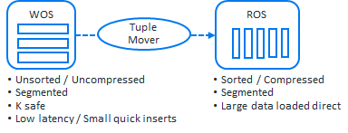
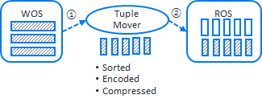
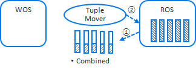

## Tuple mover - moveout task / mergout task
**<font color='red'>Vertica 9.3 이상에서 생성된 데이터베이스의 경우, WOS의 기능이 제거 되었습니다.</font>**  
Tuple Mover는 WOS 및 ROS 데이터 스토리지를 관리하며, 각 노드에서 독립적으로 실행되므로 서로 다른 간격으로 수행된다. 수행되는 간격은 configuration parameter에 의해 설정된 간격으로 백그라운드에서 moveout, mergeout 작업을 자동으로 수행합니다.  




**Moveout : WOS에서 ROS로 데이터를 이동**  
WOS는 일시적으로 메모리에 데이터를 저장하기 때문에 언젠가는 disk(ROS)에 데이터가 저장되어야하며, 메모리 용량에 대한 제약이 있기에 Tuple mover의 moveout을 통해 disk(ROS)에 데이터를 저장해야 한다.  



**Mergeout : 작은 ROS 컨테이너를 더 큰 ROS 컨테이너로 결합, 삭제 된 데이터 PURGE**  
컬럼 데이터가 여러 ROS 컨테이너에서 조각화 될 경우 성능이 저하된다. 또한 projection의 ROS container가 Tuple mover의 처리 속도 보다 빠르게 증가할 경우 ROS pushback현상이 발생하여 오류를 반환하기 시작할 수 있다. ROS pushback이란 노드별 projection당 최대 1024개의 ROS container를 가질 수 있는데, 이 최대 값을 넘어 설 경우 발생하는 오류 현상이다.  
**<font color='red'>버티카에서는 ROS pushback현상을 방지하기 위해 작은 단위의 insert 작업 보다는 bulk insert를 하도록 권장하고 있다.</font>**  



기본적으로 TM(tuple mover)의 moveout task, mergout task는 백그라운드에서 수행되나 명시적으로 do_tm_task()함수를 이용해서 수행 할 수도 있다. 아래 예제에서는 명시적으로 두 task를 수행해서 wos와 ros container가 어떻게 변화 되는지 확인 할 수 있다.  

### Moveout task
```sql
dbadmin=> drop table if exists t;
DROP TABLE
dbadmin=> create table t (col1 int);
CREATE TABLE
dbadmin=> insert into t values(1);
dbadmin=> commit;
dbadmin=> insert into t values(2);
dbadmin=> commit;       
dbadmin=> insert into t values(3);
dbadmin=> commit;

--projection의 wos, ros 확인
dbadmin=> select projection_name, sum(wos_row_count) wos_cnt, sum(ros_count) ros_cnt 
dbadmin=> from projection_storage 
dbadmin=> where anchor_table_name = 't'
dbadmin=> group by 1;
projection_name | wos_cnt | ros_cnt
-----------------+---------+---------
t_super         |       3 |       0
(1 row)

--moveout task 수행
dbadmin=> select do_tm_task('moveout', 't');
                          do_tm_task                           
---------------------------------------------------------------
Task: moveout
(Table: public.t) (Projection: public.t_super)

--projection의 wos, ros 확인
--wos에 있는 데이터가 ros로 이동된것을 확인
dbadmin=> select projection_name, sum(wos_row_count) wos_cnt, sum(ros_count) ros_cnt 
dbadmin=> from projection_storage 
dbadmin=> where anchor_table_name = 't'
dbadmin=> group by 1;
projection_name | wos_cnt | ros_cnt
-----------------+---------+---------
t_super         |       0 |       1
(1 row)
```

### Mergeout task
```sql
dbadmin=> drop table if exists t;
DROP TABLE
dbadmin=> create table t (col1 int);
CREATE TABLE
dbadmin=> insert /*+direct*/ into t values(1);
dbadmin=> commit;
dbadmin=> insert /*+direct*/ into t values(2);
dbadmin=> commit;
dbadmin=> insert /*+direct*/ into t values(3);
dbadmin=> commit;

--projection의 wos, ros 확인
dbadmin=> select projection_name, sum(wos_row_count) wos_cnt, sum(ros_count) ros_cnt
dbadmin-> from projection_storage
dbadmin-> where anchor_table_name = 't'
dbadmin-> group by 1;
projection_name | wos_cnt | ros_cnt
-----------------+---------+---------
t_super         |       0 |       3
(1 row)

--mergeout task 수행
dbadmin=> select do_tm_task('mergeout', 't');
                           do_tm_task                           
----------------------------------------------------------------
Task: mergeout
(Table: public.t) (Projection: public.t_super)

--projection의 wos, ros 확인
--ros가 3개에서 1개로 병합된것을 확인
dbadmin=> select projection_name, sum(wos_row_count) wos_cnt, sum(ros_count) ros_cnt
dbadmin-> from projection_storage
dbadmin-> where anchor_table_name = 't'
dbadmin-> group by 1;
projection_name | wos_cnt | ros_cnt
-----------------+---------+---------
t_super         |       0 |       1
(1 row)
```

## ROS pushback 재현
버티카는 노드별 projection당 최대 1024개의 ROS container를 가져야 한다. 그러나 이 최대 값을 넘어 서게 되면 ROS pushback이 발생하는 오류 현상이다.  
한 건씩 ROS에 insert를 수행하여 1025건을 처리하는 shell을 아래와 같이 작성한다.
```bash
vi t.sh

cnt=0
for cnt in {1..1025}
do
vsql -wpassword -ec "insert /*+ direct */ into t values(${cnt});commit;"
done
```

&nbsp;  
위에서 작성한 shell파일을 수행하면 마지막 1025건에서 ROS pushback 현상이 재현된다.
```sql
insert /*+ direct */ into t values(1);
insert /*+ direct */ into t values(2);
--중략
insert /*+ direct */ into t values(1023);
insert /*+ direct */ into t values(1024);

insert /*+ direct */ into t values(1025);
ERROR 5065:  Too many ROS containers exist for the following projections:
public.t_super (limit = 2048, ROS files = 2048, DV files = 0, new files = 2)
HINT:  Please wait for the tuple mover to catch up.  Use 'select * from v_monitor.tuple_mover_operations;' to monitor


dbadmin=> select projection_name, sum(wos_row_count) wos_cnt, sum(ros_count) ros_cnt from projection_storage where anchor_table_name = 't' group by 1;
projection_name | wos_cnt | ros_cnt
-----------------+---------+---------
t_super         |       0 |    1024
(1 row)
```
위 예제는 vertica 9.1에서 진행하였다.  
&nbsp;    
**<font color='red'>vertica 9.2부터는 ROS pushback 현상 방지를 위해 MergeOutInterval 지정 시간 범위가 경과할 때까지 기다리지 않고 필요에 따라 Tuple mover가 mergeout을 실행하도록 개선되어 ROS pushback현상을 방지하는데 도움이 되고 있다.</font>**  

