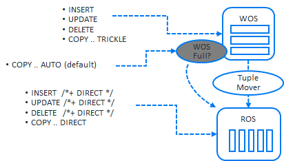

## DIRECT DML 처리
버티카에서 DML수행시 /\*+DIRECT\*/ 힌트, DIRECT 속성 사용 유무에 따라 데이터가 로딩되는 위치가 달라진다.
아래 그림과 같이 DIRECT를 사용하지 않은 DML인 경우 데이터를 WOS에서 처리하고, DIRECT를 사용하는 DML인 경우 데이터를 ROS에서 처리한다.  



WOS의 크기보다 작은 데이터를 처리하는 경우에는 DML이 완료된 후 일정 시간 간격으로 Tuple mover의 moveout task가 백그라운드로 수행되서 데이터를 WOS에서 ROS로 이동하게 된다.  
대량에 데이터를 WOS에서 처리 시 WOS에 할당된 메모리를 추과하는 데이터를 로딩하면 더 이상 WOS에 데이터를 로딩 할 수 없는 시점에 데이터를 디스크로 이동(spillover) 시키고 다시 로딩 작업을 이어가게 되므로 적재 성능이 떨어진다. 이러한 문제를 해결하기 위해서는 DIRECT를 이용한 DML을 수행해야 한다. DIRECT는 큰 데이터 부하(100MB 이상)에 적합하다.  

**DIRECT DML 사용시 주의 사항**  
+ 빈번한 Direct DML 처리는 ROS Container를 급증하게 하므로 대량 데이터 처리시에 사용하도록 주의 해야 한다.
+ Tuple mover가 mergeout으로 ROS Container를 병합하는 속도보다 더 빠르게 ROS Container수가 많아지지 않아도 주의 해야 한다.
+ 노드별 프로젝션당 최대 1024개의 ROS Container를 넘지 않도록 projection_storage 테이블의 ros_count 컬럼을 모니터링 해야 한다.

**DIRECT DML 사용 예시**  
```sql
--데이터 입력 또는 테이블 간 데이터 복사
INSERT /*+ DIRECT */ INTO <table> VALUES ~
INSERT /*+ DIRECT */ INTO <table> SELECT ~

--데이터 변경
UPDATE /*+ DIRECT */ <table> SET ~
DELETE /*+ DIRECT */ FROM <table>

--임시테이블 생성
CREATE TEMP TABLE <table> ~ AS /*+ DIRECT */ SELECT ~
```

&nbsp;  
**DIRECT DML 사용시 WOS와 ROS 확인**  
```sql
dbadmin=> drop table if exists t;
DROP TABLE
dbadmin=> create table t (col1 int, col2 int);
CREATE TABLE

--WOS에 데이터 로딩
dbadmin=> insert into t values(1,1);
OUTPUT
--------
      1
(1 row)

--WOS, ROS 상태 확인
dbadmin=> select node_name, projection_name, wos_used_bytes, ros_count from projection_storage where anchor_table_name = 't';
    node_name     | projection_name | wos_used_bytes | ros_count
------------------+-----------------+----------------+-----------
v_vmart_node0001 | t_super         |          16384 |         0
(1 row)

--ROS에 데이터 로딩
dbadmin=> insert /*+direct*/ into t values(2,2);
OUTPUT
--------
      1
(1 row)

--WOS, ROS 상태 확인
dbadmin=> select node_name, projection_name, wos_used_bytes, ros_count from projection_storage where anchor_table_name = 't';
    node_name     | projection_name | wos_used_bytes | ros_count
------------------+-----------------+----------------+-----------
v_vmart_node0001 | t_super         |          16384 |         1
(1 row)

```

**<font color='red'>Vertica 9.2 이전에 작성된 데이터베이스의 경우, DML수행시 /*+DIRECT*/ 힌트, DIRECT 속성을 지정되지 않는 경우 버티카는 WOS에 데이터를 로드합니다.</font>**  
**<font color='red'>Vertica 9.3 이상에서 생성된 데이터베이스의 경우, 더이상 WOS에 대한 기능을 지원하지 않으므로 ROS 컨테이너에 직접 데이터를 로드한다.</font>**  


